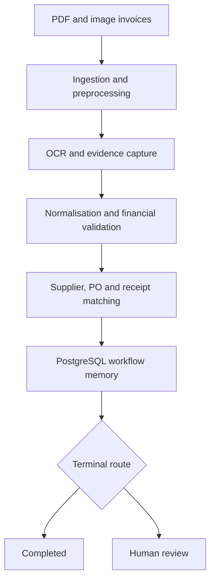

# Accounts Payable Agent

[](https://www.python.org/)
[](https://github.com/AIanumel2025/accounts-payable-agent/actions/workflows/m8-postgres-acceptance.yml)
[](LICENSE)

A modular, audit-friendly accounts payable agent that processes invoice PDFs and images from ingestion through financial validation, reference matching, PostgreSQL persistence, and workflow routing.

The system extracts invoice data, validates financial relationships, matches invoices against supplier, purchase-order, and goods-receipt records, and routes each invoice either to automatic completion or human review.

> **Project status:** Deployed hosted MVP. The authenticated Next.js dashboard, FastAPI API, Neon PostgreSQL memory, private S3 document storage, SQS queue, and on-demand PaddleOCR worker are live on AWS in `eu-west-2`. Infrastructure smoke tests and the authenticated dashboard path are green; the first production invoice acceptance run is the remaining go-live check.

## What the system does

The agent currently supports:

- PDF, PNG, and JPEG invoice ingestion.
- Content hashing and deterministic document identities.
- Image enhancement, deskewing, and quality assessment.
- PaddleOCR as the primary OCR provider.
- Tesseract as an OCR fallback.
- Evidence-linked field extraction.
- Normalisation into a unified invoice schema.
- Decimal-safe financial validation.
- Supplier-master resolution.
- Purchase-order retrieval.
- Goods-receipt retrieval.
- Two-way and three-way invoice matching.
- PostgreSQL workflow memory.
- Tenant-aware data isolation.
- Append-only audit and review records.
- Deterministic workflow orchestration.
- Bounded concurrent batch processing.
- Automatic completion or human-review routing.
- Clerk organization authentication and database-backed tenant/role mapping.
- A hosted Next.js dashboard, review queue, invoice detail, and operations console.
- Direct-to-private-S3 uploads with server-side validation before processing.
- SQS FIFO dispatch to a scale-to-zero ECS Fargate PaddleOCR worker.
- Controlled reviewer corrections and restart-stage workflow resumption.

The agent does **not** currently initiate payments, post invoices into an ERP, or make an irreversible financial decision.

## Architecture



The orchestration engine executes seven processing stages for each invoice:

1. Ingestion
2. Preprocessing
3. OCR
4. Normalisation
5. Financial validation
6. Reference matching
7. Memory persistence

It then assigns a terminal route of `COMPLETED` or `HUMAN_REVIEW`.

## Pipeline phases

| Phase | Capability | Main responsibility |
|---|---|---|
| 1 | Ingestion | Inspect files, calculate hashes, detect duplicates, and preserve originals |
| 2 | Preprocessing | Render PDFs, improve images, deskew pages, and evaluate image quality |
| 3 | OCR | Extract tokens, lines, bounding boxes, confidence, and evidence |
| 4 | Normalisation | Convert OCR output into a unified invoice schema |
| 5 | Financial validation | Check required values, arithmetic, subtotals, tax, and totals |
| 6 | Reference matching | Resolve suppliers and match purchase orders and goods receipts |
| 7 | Memory | Persist workflow state, invoice data, audit events, and review records |
| 8 | Orchestration | Execute the complete workflow with routing, retry, and failure isolation |

## Safety and reliability principles

The project deliberately follows fail-closed financial-processing policies.

### Missing-value non-inference

The agent does not invent missing invoice values.

For example, when a total is absent or unreadable, the result remains missing and the invoice is routed for review. A calculated value may be retained as validation evidence, but it is not silently substituted for the missing source value.

### Review propagation

An invoice requiring review in an earlier phase cannot be silently upgraded to automatic success by a later phase.

### Deterministic identities

Document, result, event, check, workflow, and correlation identifiers are reproducible from stable inputs. Timestamps do not affect deterministic identity generation.

### Integrity verification

The pipeline uses SHA-256 hashes to verify:

- Uploaded documents.
- Preserved source files.
- Phase artifacts.
- Persisted payloads.
- Cross-phase handoffs.

Missing, stale, tampered, or cross-document artifacts fail closed.

### Tenant isolation

PostgreSQL row-level security and explicit tenant identifiers protect tenant-scoped workflow data. Tests use a non-owner, least-privilege runtime role to exercise RLS behaviour.

### Append-only audit history

Audit events and human-review decisions are append-only. Database triggers reject unauthorised modification or deletion.

### Per-invoice failure isolation

A failure in one invoice does not terminate the remaining batch. Each document produces its own workflow result.

## Validated reference results

The controlled four-invoice fixture suite currently produces:

| Fixture | Workflow status | Terminal route | Stages |
|---|---|---:|---:|
| `Template1_Instance90.jpg` | `REVIEW_REQUIRED` | `HUMAN_REVIEW` | 7 |
| `08181_flat_document.png` | `SUCCEEDED` | `COMPLETED` | 7 |
| `invoice_Aaron Bergman_36258.pdf` | `REVIEW_REQUIRED` | `HUMAN_REVIEW` | 7 |
| `08181_warped_document_perspective_shadow.jpg` | `REVIEW_REQUIRED` | `HUMAN_REVIEW` | 7 |

Aggregate result:

- 4 invoices orchestrated.
- 1 invoice completed automatically.
- 3 invoices routed to human review.
- 0 failed workflows.
- 4 PostgreSQL memory writes.
- 0 unhandled exceptions.

These fixtures are regression controls, not a general invoice-accuracy benchmark.

## Validation status

The final orchestration acceptance run produced:

```text
881 passed
0 failed
0 errors
0 skipped
0 deselected
```

This included:

- Real PaddleOCR execution.
- Real PostgreSQL execution against Neon.
- PostgreSQL migration and checksum validation.
- Row-level security tests.
- Append-only trigger tests.
- Payload-integrity verification.
- Connection-pool tenant-context tests.
- Phase 1–8 integration tests.
- Deterministic-ID tests.
- Retry and recovery tests.
- Cross-document isolation tests.
- Per-invoice failure-isolation tests.
- Controlled four-invoice golden-baseline tests.

The bounded batch engine has also been validated with a synthetic batch of 200 documents. The default configuration permits up to 1,000 documents per batch with four concurrent invoice workflows.

Real production throughput still depends on invoice complexity, OCR hardware, model latency, database capacity, and deployment configuration.

## Technology stack

- Python 3.11+
- Pydantic
- PaddleOCR
- Tesseract OCR
- OpenCV
- Pillow
- NumPy
- PyMuPDF
- PostgreSQL
- Psycopg 3
- Neon PostgreSQL
- Pytest
- Docker and Docker Compose
- GitHub Actions
- FastAPI
- Next.js 16 and TypeScript
- Clerk Organizations
- AWS Lambda and Lambda Function URLs
- Amazon S3, SQS FIFO, ECS Fargate, ECR, SSM and CloudWatch
- AWS SAM and CloudFormation

## Repository structure

```text
accounts-payable-agent/
├── src/ap_agent/
│   ├── adapters/          # OCR and external-provider adapters
│   ├── artifacts/         # Artifact filesystem and persistence helpers
│   ├── config/            # Application and phase configuration
│   ├── db/                # PostgreSQL migrations and role management
│   ├── models/            # Typed contracts and result models
│   ├── orchestration/     # Workflow engine, routing, handlers and batching
│   ├── repositories/      # PostgreSQL repository operations
│   ├── serialization/     # Canonical payload serialization
│   ├── services/          # Memory and application services
│   └── tools/             # Phase 1–6 processing tools
├── tests/
│   ├── fixtures/          # Controlled invoice and reference-data fixtures
│   ├── golden/            # Expected deterministic outcomes
│   ├── integration/       # Cross-phase and provider integration tests
│   ├── support/           # Shared testing utilities
│   └── unit/              # Isolated unit tests
├── scripts/               # Migration, verification and operational commands
├── frontend/              # Next.js dashboard, review and operations interface
├── deploy/aws/            # SAM/CloudFormation stack and deployment scripts
├── notebooks/             # Original development and validation notebook
├── docs/                  # Milestone, deployment and acceptance reports
├── docker/                # Local and hosted container definitions
├── .github/workflows/     # Continuous-integration workflows
├── docker-compose.yml
├── Dockerfile
└── pyproject.toml
```

## Getting started

### Prerequisites

You will need:

- Python 3.11 or newer.
- Git.
- PostgreSQL 16 or a compatible managed PostgreSQL service.
- Tesseract if using the fallback OCR provider.
- Docker and Docker Compose for the containerised PostgreSQL setup.

### Clone the repository

```bash
git clone https://github.com/AIanumel2025/accounts-payable-agent.git
cd accounts-payable-agent
```

### Create a virtual environment

```bash
python3.11 -m venv .venv
source .venv/bin/activate
```

On Windows:

```powershell
.venv\Scripts\activate
```

### Install the project

Install the full development environment:

```bash
python -m pip install --upgrade pip
pip install -e ".[dev,preprocessing,ocr-tesseract,ocr-paddle,postgres]"
```

To install only selected capabilities, use the relevant extras:

```bash
pip install -e ".[dev]"
pip install -e ".[preprocessing]"
pip install -e ".[ocr-tesseract]"
pip install -e ".[ocr-paddle]"
pip install -e ".[postgres]"
```

### Install the Tesseract binary

macOS:

```bash
brew install tesseract
```

Ubuntu or Debian:

```bash
sudo apt-get update
sudo apt-get install -y tesseract-ocr
```

PaddleOCR downloads its model files the first time its engine is constructed. The initial run may therefore take longer and requires access to a supported model host.

## PostgreSQL setup

Copy the example configuration:

```bash
cp .env.example .env
```

The main database variables are:

```text
AP_AGENT_POSTGRES_DSN
AP_AGENT_POSTGRES_MIGRATION_DSN
AP_AGENT_POSTGRES_RUNTIME_ROLE
AP_AGENT_TEST_POSTGRES_DSN
```

Never commit actual database credentials.

### Start local PostgreSQL

```bash
docker compose up -d postgres
```

### Apply migrations

```bash
docker compose run --rm migrate
```

Alternatively:

```bash
python scripts/migrate.py
```

### Run the memory smoke test

```bash
docker compose --profile smoke-test run --rm memory-smoke-test
```

### Stop the local database

```bash
docker compose down
```

Add `-v` only when you deliberately want to remove the local database volume:

```bash
docker compose down -v
```

## Running the tests

### Fast suite

Runs tests that do not require PaddleOCR model execution or a live PostgreSQL instance:

```bash
pytest -m "not requires_paddle and not requires_postgres" -q
```

### PaddleOCR acceptance suite

```bash
pytest -m requires_paddle -vv
```

### PostgreSQL acceptance suite

Configure a dedicated disposable test database:

```bash
export AP_AGENT_TEST_POSTGRES_DSN="postgresql://..."
pytest -m requires_postgres -vv
```

The PostgreSQL acceptance suite applies migrations and exercises role, RLS, transaction, and persistence behaviour. Do not point it at a production database.

### Full regression suite

```bash
pytest -vv
```

## Reference data

Phase 6 uses supplier, purchase-order, and goods-receipt repositories.

The repository includes controlled JSON reference fixtures for testing. Production deployments should replace these fixtures with adapters for the client’s authoritative systems, such as:

- ERP supplier master.
- Procurement or purchase-order system.
- Goods-receipt system.
- Accounting platform.
- Document-management system.
- Object storage.
- Email or invoice-ingestion service.

Supplier, purchase-order, and goods-receipt values must come from authoritative client data. They should not be inferred by an LLM.

## Human review

Invoices are routed to human review when the system encounters conditions such as:

- Missing supplier identity.
- Missing invoice number.
- Missing or unreadable total.
- Unapproved or unresolved supplier.
- Missing referenced purchase order.
- Financial reconciliation failure.
- Quantity or price discrepancy.
- Missing line-item evidence.
- Inherited review status from an earlier phase.
- Artifact-integrity failure.

The Phase 9 review API (M10) lets an authorised user:

- View the review queue and per-invoice detail (normalised fields, evidence
  references, financial checks, supplier/PO/goods-receipt matches, audit
  timeline, prior decisions).
- Claim and release a review case.
- Submit an evidence-backed correction to a supported field.
- Accept, reject, or record a review decision (append-only).
- Request a controlled workflow-resume handoff for a resolved case.

The hosted Next.js interface exposes these review operations to authorised
users. Payment execution and ERP posting remain deliberately outside the
system boundary (see "Current limitations").

## Review API (M10)

Install the API dependencies:

```bash
pip install -e ".[api,postgres]"
```

Set the PostgreSQL DSN the API should use (its production runtime DSN, read
only when `create_app()` is called with no arguments — never at import time):

```bash
export AP_AGENT_POSTGRES_DSN="postgresql://..."
```

Launch it locally:

```bash
uvicorn ap_agent.api.app:create_app --factory --host 127.0.0.1 --port 8000
```

Then open `http://127.0.0.1:8000/docs` (Swagger UI) or `/redoc`.

Every request must carry four development/test authentication headers —
**not** production authentication; see `ap_agent/api/dependencies.py` for what
production requires instead:

```text
X-Tenant-ID: <uuid>
X-Actor-ID: <string>
X-Actor-Role: AP_OPERATOR | AP_REVIEWER | TENANT_ADMIN | READ_ONLY_AUDITOR
X-Authenticated-At: <ISO-8601 timestamp>
```

### Validation-only vs. write-enabled mode

By default (`AP_AGENT_ENABLE_REVIEW_COMMAND_WRITES` unset or `false`), `POST
.../commands` validates a command and returns `"status": "VALIDATED"` without
touching the database. Set it to `true` only where you intend commands to
execute for real:

```bash
export AP_AGENT_ENABLE_REVIEW_COMMAND_WRITES=true
```

### Running the API tests

```bash
pytest tests/api -vv                                    # TestClient + real Uvicorn
pytest tests/integration/test_review_postgres_integration.py -vv   # repository/service, real PostgreSQL
```

The PostgreSQL-backed tests need the same `AP_AGENT_TEST_POSTGRES_DSN` as the
rest of the PostgreSQL acceptance suite above — never a production DSN.

## Frontend (M11A/M11B/M11C)

`frontend/` is a Next.js (App Router, TypeScript strict) human-review
interface that consumes the M10 FastAPI application through its published
`/openapi.json` contract: the application shell, design system,
server-side API boundary, a live dashboard (M11A), a review queue and
invoice/review-case detail page (M11B), and — since M11C — **controlled,
opt-in review actions** (claim, release, approve, correct, reject and a
workflow-resume handoff). It is **read-only by default**. There is no
payment execution, bank transfer or ERP posting anywhere.

```text
Browser → Next.js server-side boundary → FastAPI → PostgreSQL
```

The browser never connects to FastAPI or PostgreSQL directly — every
request passes through server-only code (`frontend/src/lib`, the
`app/api/backend/[...path]` route handler).

### Review queue and invoice detail (M11B)

- `/review-queue` — server-driven pagination and filters (status,
  priority, assigned reviewer, batch id — status is scoped to the 4
  `ReviewCaseStatus` values the backend's filter actually supports; see
  `docs/m11b_review_queue_detail_report.md` §3). Filter/page state lives
  in the URL, so a reload or a browser-back from a detail page restores
  it. A real `<table>` on wider viewports, an accessible card list on
  narrower ones — the same fields on both, review reasons/status/priority
  never hidden.
- `/review-cases/[reviewCaseId]` — reached only from the queue (each row
  has one explicit "Open review case for ..." link, never a clickable
  row), with a breadcrumb back to the queue that preserves whatever
  filters were active. Eight sections: identity/status, normalized
  fields, evidence references, financial validation, supplier/PO
  matching, line matches, timeline, and previous review decisions — all
  read-only, no replay/edit/delete of anything. A missing value is always
  an explicit "not available" marker, never zero; low and missing
  confidence are visually distinguished.

See `docs/m11b_review_queue_detail_report.md` for the full milestone
report, including the backend-contract findings this UI is built against
and the exact per-fixture acceptance baseline.

### Review actions (M11C)

The invoice-detail page carries an action workspace for the six actions that
have a transactional backend executor: `CLAIM`, `RELEASE`, `ACCEPT` (labelled
"Approve"), `CORRECT`, `REJECT` and `RESUME_WORKFLOW`. `CONFIRM_SUPPLIER`,
`CONFIRM_PURCHASE_ORDER`, `REQUEST_INFORMATION` and `ESCALATE` have no
executor yet and are never offered.

**Command modes.** A server-only variable (never `NEXT_PUBLIC_`), matched
against the backend's `/health` `command_mode`:

| `AP_AGENT_FRONTEND_REVIEW_COMMAND_MODE` | Behaviour |
|---|---|
| `disabled` (**default**) | Read-only, exactly like M11B. No command can be forwarded. |
| `validation_only` | Commands are validated by FastAPI but **never executed**; the UI says "Validated — no database changes were made." Workflow resume is unavailable. Needs a validation-only backend. |
| `commit` | Commands execute transactionally; the UI re-reads PostgreSQL afterwards. Needs `AP_AGENT_ENABLE_REVIEW_COMMAND_WRITES=true` on the backend. |

A frontend/backend mismatch fails closed (no submission). Writes are never
enabled by a committed default — set them explicitly, per process.

**Isolated write-enabled demonstration** (needs `AP_AGENT_TEST_POSTGRES_DSN`
naming the `ap_agent_m8_test` database; the launcher refuses anything else):

```bash
cd frontend
npm install
npm run build
npm run demo:m11c        # seeds a fresh tenant, starts FastAPI + Next.js, prints a localhost URL
# ... explore: Dashboard -> Review queue -> open an invoice -> Claim -> Correct/Approve -> Request workflow resume
# Ctrl+C to stop: both servers exit and the tenant's removable rows are deleted.
npm run demo:m11c -- --check   # start, confirm the workspace renders, stop (smoke test)
```

Append-only rows (decisions, audit events, invoice memory and the cases that
reference decisions) intentionally remain after cleanup — that is the schema's
immutability guarantee, not a leak.

**Tests:** `npm run test` (unit + component), `npm run test:e2e:actions`
(stateful mocked backend, four Next.js servers), `npm run test:e2e:real-actions`
(real FastAPI + PostgreSQL + Next.js, write-enabled, followed by direct database
verification); backend: `python -m pytest tests/api/test_m11c_review_actions_postgres.py`.

**Important:**

- M11C originally created a controlled resume handoff; M11D added the worker
  that executes it from the recorded restart stage (see below).
- Local demonstrations may still use the clearly labelled prototype-header
  adapter. The hosted deployment uses Clerk JWTs, active organizations and
  database identity mappings; FastAPI verifies every session token independently.

See `docs/m11c_review_actions_report.md` for the full report.

### Operations console (M11D Core)

Upload a PDF/PNG/JPEG invoice at `/operations`; it is **queued** (no OCR runs in
the HTTP request) and a **separate single worker** runs the existing Phase 1–8
pipeline. The job ends *Completed* or *Review required*; a review case can then
be claimed, approved or corrected (M11C) and **resumed** — the worker re-enters
the pipeline at the recorded restart stage and never reruns ingestion,
preprocessing, OCR or normalization. The original `invoice_memory_records` row is
never updated; the result is an append-only `invoice_memory_versions` row.

Everything is **off by default** and fails closed on a mode mismatch:

| Variable | Purpose |
|---|---|
| `AP_AGENT_ENABLE_OPERATIONS` / `AP_AGENT_ARTIFACT_ROOT` | Backend accepts uploads; controlled local artifact directory (outside the frontend) |
| `AP_AGENT_ENABLE_WORKER_EXECUTION` | Lets `python -m ap_agent.worker` execute jobs (exit 3 if not set) |
| `AP_AGENT_WORKER_OCR_PROVIDER` | `paddleocr` or `tesseract` (Tesseract always routes to review by design) |
| `AP_AGENT_FRONTEND_OPERATIONS_MODE` | Frontend operations mode, matched against `/health.operations_mode` |

```bash
cd frontend && npm run build
npm run demo:m11d             # seeds a tenant, starts FastAPI + worker + Next.js
npm run demo:m11d -- --check  # smoke test
npm run test:e2e:real-operations
```

The original M11D Core demonstration supported one active local worker. The
hosted AWS deployment now uses an SQS FIFO queue, dead-letter queue, a dispatcher
Lambda and one on-demand ECS Fargate task per invoice, while preserving the
atomic job claim and append-only resume guarantees. No payment, bank or ERP
action exists. See `docs/m11d_operations_console_report.md`.

### Local development

```bash
cd frontend
npm install
cp .env.example .env.local   # fill in AP_AGENT_API_BASE_URL etc.
npm run dev
```

Requires a running M10 FastAPI instance (`uvicorn ap_agent.api.app:create_app
--factory ...`, see above) reachable at `AP_AGENT_API_BASE_URL`.

### Scripts

```bash
npm run lint             # ESLint
npm run typecheck        # tsc --noEmit
npm run test             # Vitest (unit + component)
npm run build             # production build
npm run test:e2e         # Playwright, mocked backend (no PostgreSQL needed)
npm run test:e2e:integration  # real FastAPI + PostgreSQL + Next.js acceptance
npm run test:e2e:actions      # M11C review actions, stateful mocked backend
npm run test:e2e:real-actions # M11C write-enabled real FastAPI + PostgreSQL + Next.js
npm run demo:m11c             # isolated, write-enabled local demonstration
npm run test:e2e:real-operations # M11D upload -> worker -> review -> resume (real stack)
npm run demo:m11d             # isolated operations-console demonstration
npm run api:generate     # regenerate TypeScript types from FastAPI's OpenAPI schema
npm run api:check        # fail if the generated contract is stale (CI)
npm run check:build-secrets   # scan .next/static for leaked server-only values
```

See `docs/m11a_frontend_foundation_report.md` for the M11A foundation
report (architecture, design system, initial test results) and
`docs/m11b_review_queue_detail_report.md` for the M11B report (review
queue, invoice detail, the exact per-fixture acceptance baseline, and
readiness for M11C).

## Live AWS deployment

The current hosted MVP is available at:

**[Open the Accounts Payable Agent dashboard](https://q25m7xmapbqehe5nh3qvg4cfka0zpxru.lambda-url.eu-west-2.on.aws/dashboard)**

```text
Browser
  → public Next.js Lambda Function URL
  → server-side Clerk session + AWS SigV4 boundary
  → IAM-protected FastAPI Lambda Function URL
  → Neon PostgreSQL (least-privilege runtime role + RLS)

Invoice upload
  → presigned POST to private S3
  → API validation/finalisation
  → SQS FIFO
  → dispatcher Lambda
  → one on-demand ECS Fargate PaddleOCR task
  → PostgreSQL workflow memory
  → completed or human review
```

Deployment characteristics:

- AWS region: `eu-west-2`.
- Public surface: the Next.js Function URL only; the FastAPI Function URL requires AWS IAM/SigV4.
- Authentication: Clerk Organizations; FastAPI independently verifies the Clerk JWT.
- Authorization: external organization/user mappings resolve to an internal tenant and role in PostgreSQL.
- Documents: private S3 bucket with Block Public Access and tenant-scoped, content-addressed keys.
- Processing: SQS FIFO plus a scale-to-zero Fargate worker (4 vCPU / 8 GB) running baked PaddleOCR models.
- Database: Neon PostgreSQL through a least-privilege pooled runtime role; migrations use a separate owner/direct DSN.
- Secrets: SSM SecureStrings loaded at runtime; no DSN or Clerk secret is included in the browser bundle or templates.
- Cost controls: no NAT gateway, load balancer, RDS instance, always-on ECS service or provisioned concurrency.
- Observability: CloudWatch logs, queue/DLQ inspection, alarms and deployment smoke checks.

Verified live on 7 October 2026:

- CloudFormation stack update completed successfully.
- Every unauthenticated infrastructure/security smoke check passed.
- The authenticated dashboard resolved the Clerk organization and `TENANT_ADMIN` role.
- The Next.js-to-FastAPI SigV4 request path succeeded.
- Neon pooled runtime queries succeeded with transaction-local statement and lock timeouts.
- Dashboard health reported **Backend connected** and **Commands enabled**.
- The first real uploaded-invoice run remains the final production acceptance check before PR #16 is merged.

## Current limitations

This is a hosted MVP, not yet an enterprise AP platform. Current boundaries include:

- The live deployment has one active OCR task at a time; horizontal worker scaling, leases and enterprise capacity testing are deferred.
- Reference suppliers, purchase orders and goods receipts are controlled sample data and must be replaced with client-authoritative integrations.
- No ERP posting, payment execution, bank transfer or irreversible financial action exists.
- OCR/extraction quality is validated against controlled fixtures, not yet against a client-specific production evaluation set.
- The Lambda Function URL is operational but a custom domain, WAF and enterprise edge controls are not yet configured.
- Disaster-recovery exercises, formal penetration testing, retention-policy sign-off and sustained load testing remain outstanding.
- The first real hosted invoice still needs to complete the final upload → S3 → queue → Fargate → review/resume acceptance run.

The system must remain human-supervised and client-configured before it is used for consequential financial operations.

## Roadmap

1. ~~Build the FastAPI application layer.~~ Done (M10).
2. ~~Build the Next.js human-review interface.~~ Done (M11A–M11C).
3. ~~Add asynchronous upload, worker and workflow-resume operations.~~ Done (M11D).
4. ~~Add production identity, private object storage and hosted deployment.~~ Done (M11E/M11E.1–M11E.3).
5. Complete the first real hosted invoice acceptance run and merge PR #16.
6. Replace sample reference data with supplier, PO, receipt, email and ERP connectors.
7. Add client-specific evaluation datasets, extraction-quality reporting and acceptance thresholds.
8. Add custom domain/WAF controls, tracing, operational dashboards and tested recovery procedures.
9. Validate sustained batch throughput and introduce controlled horizontal worker scaling.
10. Add a bounded LLM reasoning layer only where deterministic evidence is insufficient.

Any LLM reasoning layer will remain subordinate to deterministic financial policies. It must not fabricate financial values, suppliers, purchase orders, or approval evidence.

## Documentation

Detailed milestone reports are available in the `docs/` directory:

- [Modularisation map](docs/modularisation_map.md)
- [Phase 1 ingestion](docs/m3_phase_1_ingestion_report.md)
- [Phase 2 preprocessing](docs/m4_phase_2_preprocessing_report.md)
- [Phase 3 OCR](docs/m4_phase_3_ocr_report.md)
- [Phase 4 normalisation](docs/m5_phase_4_normalization_report.md)
- [Phase 5 financial validation](docs/m6_phase_5_financial_validation_report.md)
- [Phase 6 reference matching](docs/m7_phase_6_reference_matching_report.md)
- [Phase 7 PostgreSQL memory](docs/m8_phase_7_postgres_memory_report.md)
- [Phase 8 orchestration](docs/m9_phase_8_orchestration_report.md)
- [Phase 9 human-review API](docs/m10_phase_9_review_api_report.md)
- [M11A frontend foundation](docs/m11a_frontend_foundation_report.md)
- [M11B review queue and invoice detail](docs/m11b_review_queue_detail_report.md)
- [M11C interactive review actions](docs/m11c_review_actions_report.md)
- [M11D operations console](docs/m11d_operations_console_report.md)
- [M11E hosted deployment](docs/m11e_hosted_deployment_report.md)
- [M11E deployment runbook](docs/m11e_deployment_runbook.md)
- [M11E.1 AWS go-live architecture](docs/m11e1_aws_go_live_report.md)
- [M11E.1 AWS deployment runbook](docs/m11e1_aws_deployment_runbook.md)
- [M11E.2/M11E.3 Fargate and Neon-pooler corrections](docs/m11e2_fargate_ocr_correction.md)

## Contributing

Issues and pull requests are welcome.

When contributing:

1. Preserve deterministic output and identifier behaviour.
2. Do not weaken fail-closed integrity checks.
3. Do not infer missing financial values.
4. Add tests for every behavioural change.
5. Run the relevant provider and database acceptance suites.
6. Keep credentials, generated artifacts, and model caches out of Git.

## Licence

This project is licensed under the [MIT License](LICENSE).

## Author

Created by [Tony Anumel](https://github.com/AIanumel2025).

## Alternative Render/R2 deployment path (M11E)

The repository retains a second deployment option based on Render, Cloudflare
R2, Neon and Clerk. Its hosted-mode acceptance path is tested, but the live
instance documented above currently runs on AWS. See
[the M11E deployment runbook](docs/m11e_deployment_runbook.md) and
[hosted deployment report](docs/m11e_hosted_deployment_report.md).

## AWS deployment implementation (M11E.1–M11E.3)

The AWS stack is managed with SAM/CloudFormation under `deploy/aws/`. It contains
the public Next.js Lambda, IAM-protected FastAPI Lambda, private S3 bucket,
SQS FIFO queue and DLQ, dispatcher and migration Lambdas, on-demand ECS Fargate
OCR task, ECR repositories, SSM secret references, CloudWatch logs and alarms.

Operational documentation:

- [AWS deployment runbook](docs/m11e1_aws_deployment_runbook.md)
- [AWS go-live architecture and security report](docs/m11e1_aws_go_live_report.md)
- [Fargate OCR and Neon pooled-connection corrections](docs/m11e2_fargate_ocr_correction.md)

PR #16 remains open until the first real invoice completes the live end-to-end
acceptance path. The public URL exposes no payment-execution capability.
