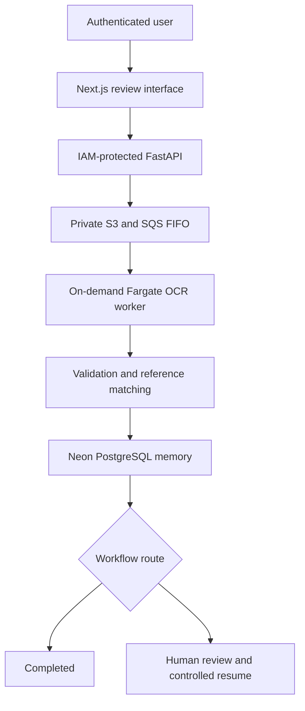

# Accounts Payable Agent

[](https://www.python.org/)
[](https://github.com/AIanumel2025/accounts-payable-agent/actions/workflows/m8-postgres-acceptance.yml)
[](LICENSE)

An audit-friendly accounts payable agent that turns invoice PDFs and images into validated, traceable workflows.

The system ingests an invoice, improves the document image, runs OCR, extracts and normalises financial fields, checks arithmetic, matches supplier and purchasing records, and then chooses one of two explicit outcomes:

- **Complete automatically** when the evidence and validation rules agree.
- **Route to human review** when a value is missing, uncertain or inconsistent.

Reviewers can inspect the evidence, correct supported fields, approve or reject a case, and resume the workflow from the correct downstream stage. The original invoice record and decision history remain append-only.

> **Status:** AWS-hosted MVP, deployed and accepted through live invoice tests. The project does not execute payments or post invoices into an ERP.

## Live deployment

**[Open the authenticated Accounts Payable Agent dashboard](https://q25m7xmapbqehe5nh3qvg4cfka0zpxru.lambda-url.eu-west-2.on.aws/dashboard)**

The hosted release runs in AWS `eu-west-2` and uses:

- Clerk Organizations for authentication.
- A public Next.js Lambda Function URL as the only browser-facing surface.
- An IAM-protected FastAPI Lambda reached through a server-side AWS SigV4 boundary.
- Private, tenant-scoped S3 storage for invoice documents.
- SQS FIFO and a dead-letter queue for asynchronous dispatch.
- A scale-to-zero ECS Fargate worker with baked PaddleOCR models.
- Neon PostgreSQL with least-privilege runtime access, row-level security and append-only audit records.
- SSM SecureString parameters and CloudWatch logs, alarms and queue inspection.

The live acceptance path has demonstrated both intended outcomes: a clean invoice completed automatically, while a difficult invoice entered review, accepted evidence-backed corrections, resumed without repeating OCR and then completed.

## Architecture



The processing engine keeps each stage independently testable and diagnosable:

1. **Ingestion** — validates the file, calculates hashes, detects duplicates and preserves the source.
2. **Preprocessing** — renders PDFs, improves image quality and corrects orientation or skew.
3. **OCR** — extracts tokens, lines, confidence, bounding boxes and source evidence.
4. **Normalisation** — maps OCR output into a consistent invoice schema.
5. **Financial validation** — checks required fields, subtotals, tax and totals using decimal-safe arithmetic.
6. **Reference matching** — resolves suppliers and performs two-way or three-way matching against purchase orders and goods receipts.
7. **Workflow memory** — persists state, decisions, evidence and audit events.
8. **Orchestration** — routes the invoice, isolates failures and resumes reviewed cases from the recorded restart stage.

## Core capabilities

- PDF, PNG and JPEG invoice ingestion.
- PaddleOCR with Tesseract available as a fallback.
- Evidence-linked field extraction and confidence tracking.
- Deterministic document, result, workflow and event identities.
- SHA-256 integrity verification across stored documents and phase hand-offs.
- Decimal-safe financial validation.
- Supplier, purchase-order and goods-receipt matching.
- Automatic completion or explicit human-review routing.
- Authenticated dashboard, review queue, invoice detail and operations console.
- Evidence-backed corrections with optimistic concurrency and idempotency controls.
- Controlled workflow resume without repeating ingestion, preprocessing, OCR or normalisation.
- PostgreSQL row-level security and database-backed tenant/role mapping.
- Append-only invoice memory, decisions and audit history.
- Per-invoice failure isolation.
- Direct-to-private-S3 uploads and asynchronous scale-to-zero processing.

## Safety boundaries

The agent is designed to fail closed around consequential financial data:

- Missing values are never silently invented.
- An earlier review requirement cannot be overwritten by a later successful stage.
- Stale, tampered or cross-document artifacts are rejected.
- Tenant identity and permissions are resolved server-side, not trusted from browser headers.
- Human corrections require recognised evidence references.
- Payment execution, bank transfers and ERP posting remain outside the system boundary.

## Technology stack

| Layer | Technologies |
|---|---|
| Processing | Python 3.11, Pydantic, PaddleOCR, Tesseract, OpenCV, PyMuPDF |
| API and UI | FastAPI, Next.js 16, TypeScript, Clerk Organizations |
| Data | PostgreSQL, Psycopg 3, Neon, S3 |
| AWS runtime | Lambda, Lambda Function URLs, SQS FIFO, ECS Fargate, ECR, SSM, CloudWatch |
| Delivery | Docker, AWS SAM, CloudFormation, GitHub Actions, Pytest, Vitest, Playwright |

## Quick start

### Prerequisites

- Python 3.11+
- Git
- Docker and Docker Compose
- Node.js and npm for the frontend
- Tesseract only if you want to use the fallback OCR provider locally

### Install the backend

```bash
git clone https://github.com/AIanumel2025/accounts-payable-agent.git
cd accounts-payable-agent

python3.11 -m venv .venv
source .venv/bin/activate
python -m pip install --upgrade pip
pip install -e ".[dev,api,preprocessing,ocr-tesseract,ocr-paddle,postgres,s3]"
```

### Start PostgreSQL and apply migrations

```bash
cp .env.example .env
docker compose up -d postgres
docker compose run --rm migrate
```

Never place real credentials in `.env` files committed to Git, and never point the test suite at a production database.

### Start the API

```bash
export AP_AGENT_POSTGRES_DSN="postgresql://..."
uvicorn ap_agent.api.app:create_app --factory --host 127.0.0.1 --port 8000
```

API documentation is then available at `http://127.0.0.1:8000/docs`.

### Start the frontend

```bash
cd frontend
npm install
cp .env.example .env.local
npm run dev
```

Set the server-side values in `frontend/.env.local`, including `AP_AGENT_API_BASE_URL`. Do not expose database credentials or server secrets through `NEXT_PUBLIC_` variables.

### Run the tests

```bash
# Fast backend suite
pytest -m "not requires_paddle and not requires_postgres" -q

# PostgreSQL acceptance — disposable test database only
export AP_AGENT_TEST_POSTGRES_DSN="postgresql://..."
pytest -m requires_postgres -vv

# Frontend checks
cd frontend
npm run lint
npm run typecheck
npm run test
npm run test:e2e
```

Provider, real-stack and deployment acceptance commands are documented in the milestone reports and deployment runbooks below.

## Repository structure

```text
accounts-payable-agent/
├── src/ap_agent/       # Processing, API, persistence and orchestration code
├── frontend/           # Next.js dashboard, review and operations interface
├── deploy/aws/         # SAM/CloudFormation templates and deployment scripts
├── tests/              # Unit, integration, provider and PostgreSQL acceptance tests
├── scripts/            # Migration, verification and operational commands
├── docs/               # Architecture, milestone, deployment and acceptance reports
├── docker/             # Local and hosted container definitions
└── .github/workflows/  # CI and image-build workflows
```

## Current limitations

This is a production-accepted MVP, not yet an enterprise AP platform:

- The hosted release processes one active OCR task at a time; batch upload and controlled horizontal scaling remain future work.
- Supplier, purchase-order and goods-receipt data are controlled samples and must be replaced with each client’s authoritative systems.
- OCR and extraction quality have not yet been benchmarked against a client-specific production dataset.
- No ERP posting, payment execution, bank transfer or other irreversible financial action exists.
- A custom domain, WAF, formal penetration test, tested recovery plan and signed-off retention policy remain outstanding.
- Sustained-load, multi-worker and disaster-recovery exercises have not yet been completed.

The system should remain human-supervised and client-configured before it is used in a consequential financial workflow.

## Documentation

Start with these documents:

- [Architecture](docs/architecture.md)
- [AWS go-live architecture and security report](docs/m11e1_aws_go_live_report.md)
- [AWS deployment runbook](docs/m11e1_aws_deployment_runbook.md)
- [Fargate OCR and Neon pooled-connection corrections](docs/m11e2_fargate_ocr_correction.md)

Detailed implementation and evaluation history:

- [Ingestion](docs/m3_phase_1_ingestion_report.md)
- [Preprocessing](docs/m4_phase_2_preprocessing_report.md)
- [OCR](docs/m4_phase_3_ocr_report.md)
- [Normalisation](docs/m5_phase_4_normalization_report.md)
- [Financial validation](docs/m6_phase_5_financial_validation_report.md)
- [Reference matching](docs/m7_phase_6_reference_matching_report.md)
- [PostgreSQL workflow memory](docs/m8_phase_7_postgres_memory_report.md)
- [Orchestration](docs/m9_phase_8_orchestration_report.md)
- [Human-review API](docs/m10_phase_9_review_api_report.md)
- [Frontend foundation](docs/m11a_frontend_foundation_report.md)
- [Review queue and invoice detail](docs/m11b_review_queue_detail_report.md)
- [Interactive review actions](docs/m11c_review_actions_report.md)
- [Operations console and workflow resume](docs/m11d_operations_console_report.md)
- [Hosted deployment](docs/m11e_hosted_deployment_report.md)

The repository also retains a tested alternative Render/Cloudflare R2 deployment path in the [hosted deployment runbook](docs/m11e_deployment_runbook.md). The live instance documented here runs on AWS.

## Contributing

Issues and pull requests are welcome. Changes should preserve deterministic behaviour, fail-closed integrity checks, tenant isolation and the rule against inferring missing financial values. Add tests for every behavioural change and keep credentials, generated artifacts and model caches out of Git.

## License

Licensed under the [MIT License](LICENSE).

## Author

Created by [Tony Anumel](https://github.com/AIanumel2025).
