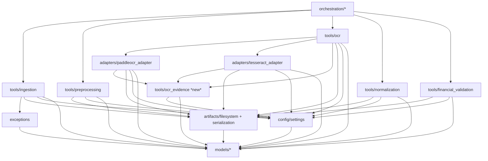

# Modularisation Map — M1 (Notebook Inspection)

**Source of truth:** `notebooks/accounts_payable_pipeline.ipynb` (Phases 1–5, validated in Google Colab)
**Scope:** analysis only. No production code was moved, rewritten or deleted. The notebook was not modified, OCR models were not downloaded, and the OCR pipeline was not run.
**Target package:** `src/ap_agent/` (`config/`, `models/`, `tools/`, `adapters/`, `artifacts/`, `orchestration/`) and `tests/` (`unit/`, `integration/`, `fixtures/invoices/`, `golden/`).

---

## 0. Summary

| Item | Result |
|---|---|
| Notebook present and parsed | Yes. 76 cells: **51 code**, **25 Markdown**. 20,356 code lines. Every code cell parses with `ast` once IPython `%`/`!` magics are masked. |
| Kernel | Colab, Python 3.13 (from the PaddlePaddle install path in cell 40). Metadata requests a T4 GPU, but the whole OCR stack runs on CPU. |
| Execution counts | 1–29 and 32–52, in cell order. **Counts 30 and 31 are missing**: two executed cells were later deleted (see R-02). The final code cell (75) is empty and never ran. |
| Top-level definitions (functions + classes) | **263** (238 unique names) |
| ACTIVE_PRODUCTION | **224** (218 are reachable from the validated entry points; 6 marked † are production contracts or helpers with no caller) |
| SUPERSEDED | **24** |
| TEST_ONLY / DIAGNOSTIC_ONLY / NOTEBOOK_ORCHESTRATION | **12 / 2 / 1** (15 in total) |
| Duplicate names | **23 names** carry **25 redefinitions**. See §3. |
| Names whose **end-of-notebook** binding differs from the binding used when the phase was validated | **3**: `write_json_atomically`, `append_unique_reason`, `calculate_file_sha256`. See §3.2. |
| Four invoice fixtures in the repository | **Yes (resolved at M1 close).** All four originals and the three renamed duplicate controls are in `tests/fixtures/invoices/` (added on `main` in `bc76c4e`). Manifest: `tests/fixtures/invoices/manifest.json`. See §0.1 and R-01. |
| Existing `src/` and `tests/` scaffold | Present but every file is **0 bytes**. `pyproject.toml`, `.env.example`, `tests/golden/phase_5_expected_results.json` and the other docs are empty too. |

### 0.1 The four invoice fixtures

| Source file | Dataset label (cell 22) | Expected Phase 1 disposition | Renamed exact-duplicate control |
|---|---|---|---|
| `Template1_Instance90.jpg` | FATURA | ACCEPTED | `fatura_renamed_exact_duplicate.jpg` |
| `08181_flat_document.png` | Inv3DReal | ACCEPTED | `inv3d_renamed_exact_duplicate.png` |
| `invoice_Aaron Bergman_36258.pdf` | Sample PDF Invoices | ACCEPTED | `pdf_renamed_exact_duplicate.pdf` |
| `08181_warped_document_perspective_shadow.jpg` | Inv3DReal | ACCEPTED | — |

**Resolved at M1 close.** The fixtures are committed under `tests/fixtures/invoices/` with their original notebook filenames (no renames). The fixture manifest is **`tests/fixtures/invoices/manifest.json`**. Its hashes, sizes and media types were calculated from the committed bytes; media types come from magic-byte sniffing, the same signatures Phase 1 uses, and were cross-checked with `file --mime-type`.

| Repository filename (= notebook filename) | SHA-256 | Size (bytes) | Media type |
|---|---|---:|---|
| `08181_flat_document.png` | `4d8b79e7843f7acb42947da9ef7e2bb7d0989943ceffb7035257edfcbc156083` | 185412 | image/png |
| `08181_warped_document_perspective_shadow.jpg` | `9e6a3234447f2898c47db7d8de280933cb9081f822dae7858bb492b7c2a53b69` | 419891 | image/jpeg |
| `Template1_Instance90.jpg` | `7df0650a9eb3a4370b8236ba283195eee4bdf7bc7e884e5f4c03a7b4d997dcff` | 55284 | image/jpeg |
| `invoice_Aaron Bergman_36258.pdf` | `2e8206cd45c73701246757a641013aac483b4d58a9ee7ac3695c6f4b167c0101` | 15813 | application/pdf |

All four hashes match the notebook's recorded Phase 1 SHA-256 values: the full values for the flat and warped files, and the displayed prefixes for the other two. The three renamed duplicate controls are also committed. Each is byte-identical to its original (same SHA-256 and size), so they are not listed as separate fixtures in the manifest: `fatura_renamed_exact_duplicate.jpg` = Template, `inv3d_renamed_exact_duplicate.png` = flat, `pdf_renamed_exact_duplicate.pdf` = Aaron.

`tests/unit/test_fixture_manifest.py` (standard library only) checks the manifest: 4 entries, `fixture_count` equals the entry count, filenames and hashes are unique, entries are sorted, every declared file exists, and each file's SHA-256, size and extension match. The content review found only synthetic or public sample data (`example.net` addresses, generated names, the public "SuperStore" sample), so `contains_known_real_financial_data` is `false` for all four. No third-party licence is claimed; the status is `PROJECT_TEST_FIXTURE`.

---

## 1. Notebook inventory

### 1.1 Cell-level inventory (execution order = cell order)

Role codes: **PROD** = production definitions · **ORCH** = notebook glue that carries data between phases · **TEST** = assertions or fixtures · **DIAG** = inspection, plots or prints · **COLAB** = installs, paths or environment setup.

| Cell | Type | Exec | Lines | Role | Content |
|---:|---|---:|---:|---|---|
| 0 | md | – | 16 | – | Title; 9-stage architecture; per-document independence |
| 1 | code | 1 | 1 | COLAB | `%pip install "pydantic>=2,<3" -q` |
| 2 | code | 2 | 7 | PROD | Core imports (pydantic, uuid, datetime) |
| 3 | code | 3 | 3 | PROD | `utc_now` |
| 4 | code | 4 | 35 | PROD | `ProcessingStage`, `ProcessingStatus`, `ReviewReason` |
| 5 | code | 5 | 59 | PROD | `BatchRecord`, `DocumentRecord`, `ProcessingEvent`, `ReviewRequest` |
| 6 | md | – | 1 | – | "Testing the schemas below" |
| 7 | code | 6 | 31 | TEST | Constructs sample schema objects (`sample_invoice.pdf`) |
| 8 | code | 7 | 10 | TEST | Schema assertions ("PHASE 1 PASSED: Core schemas") |
| 9 | md | – | 12 | – | Phase 1 description |
| 10 | code | 8 | 124 | PROD | UUID namespaces, supported types, ingestion enums, error and contracts |
| 11 | md | – | 1 | – | |
| 12 | code | 9 | 220 | PROD | Batch ID, media-type sniffing, intake validation, SHA-256, identities, duplicate check |
| 13 | md | – | 1 | – | |
| 14 | code | 10 | 215 | PROD | `preserve_original_document`, `build_document_record`, `ingest_document` |
| 15 | md | – | 1 | – | "Tests" |
| 16 | code | 11 | 47 | TEST | Synthetic temp-dir environment (`invoice_1001.pdf`, …) |
| 17–19 | code | 12–14 | 12/8/23 | TEST | Accept, duplicate and different-content tests |
| 20 | md | – | 1 | – | |
| 21 | code | 15 | 104 | TEST | `capture_ingestion_error`; failure-code and Phase 1 assertions |
| 22 | code | 16 | 122 | TEST + ORCH + COLAB | Ingests the 7 real files from `/content`. Produces `test_results`, `batch_id`, `config` and `known_hashes`, which later phases consume. |
| 23 | code | 17 | 86 | TEST | Byte-for-byte persistence validation (`sha256_file`) |
| 24 | md | – | 11 | – | Phase 2 description |
| 25 | code | 18 | 1 | COLAB | `!pip install pymupdf` |
| 26 | code | 19 | 499 | PROD + COLAB | Phase 2 contracts and utilities. Creates `/content/phase_2_preprocessing_artifacts` at import time. |
| 27 | md | – | 1 | – | |
| 28 | code | 20 | 399 | PROD | Phase 2 serialisers and `preprocess_document` |
| 29 | code | 21 | 97 | PROD (correction) + ORCH | **Replaces** `assess_page_quality` and rebuilds `preprocessing_config` |
| 30 | md | – | 1 | – | |
| 31 | code | 22 | 291 | ORCH + TEST + DIAG + COLAB | **Rebuilds `preprocessing_config` again** with root `/content/phase_2_test_artifacts`, runs Phase 2 on 4 documents, asserts, plots |
| 32–33 | md | – | 16/1 | – | Phase 3 description |
| 34 | code | 23 | 308 | COLAB + PROD + TEST | apt/pip installs Tesseract and pytesseract; `TESSERACT_VERSION`; OCR contracts; config assertions |
| 35 | md | – | 1 | – | |
| 36 | code | 24 | 614 | PROD | Evidence IDs, bbox utilities, Tesseract adapter, `extract_ocr_page` (later superseded) |
| 37 | md | – | 1 | – | |
| 38 | code | 25 | 581 | PROD (partly superseded) | v1 persistence and `process_ocr_document` v1 |
| 39 | md | – | 1 | – | |
| 40 | code | 26 | 88 | COLAB + PROD | pip-installs paddlepaddle and paddleocr; versions; `paddle.set_device("cpu")`; first `PaddleOCR(...)` engine (superseded) |
| 41 | code | 27 | 731 | PROD | **Redefines `OCRPageResult`**; PaddleOCR adapter |
| 42 | md | – | 1 | – | |
| 43 | code | 28 | 733 | PROD + ORCH | `phase_3_paddle_config`; routed OCR; v2 persistence; `process_ocr_document` v2 |
| 44 | code | 29 | 188 | PROD (correction) + TEST | Rebuilds the Paddle engine without oneDNN; **replaces** `extract_routed_ocr_page`; smoke test |
| 45 | md | – | 1 | – | |
| 46 | code | **32** | 162 | DIAG | Warped-invoice diagnostic. **Reads `ocr_document_results` before cell 48 defines it** (see R-02). |
| 47 | code | 33 | 325 | PROD (replacement) | TOTAL-value completeness guard; **wraps** `process_ocr_document` |
| 48 | code | 34 | 849 | ORCH + TEST + DIAG | Builds OCR inputs, runs Phase 3, runs anchor, determinism and invalid-hash tests, plots |
| 49–50 | md | – | 55/2 | – | Phase 4 description |
| 51 | code | 35 | 370 | PROD + COLAB | Phase 4 contracts; `normalization_config` global; creates `/content/phase_4_normalization_artifacts` at import time |
| 52 | md | – | 2 | – | |
| 53 | code | 36 | 896 | PROD (partly superseded) + TEST | IDs, text, evidence index, number, currency and date normalisation; self-asserts |
| 54 | code | 37 | 372 | PROD (correction) | Evidence-reference alignment (`reference_id`) |
| 55 | code | 38 | 1029 | PROD (partly superseded) + TEST | Header-field candidate extraction ("Replacement Cell 3"; the original Cell 3 is not in the notebook) |
| 56 | md | – | 3 | – | |
| 57 | code | 39 | 1581 | PROD + TEST | Parties, terms and line items; **mutates `FIELD_LABELS`** |
| 58 | md | – | 3 | – | |
| 59 | code | 40 | 50 | DIAG | Contract preflight printout |
| 60 | code | 41 | 797 | PROD (correction) + TEST | Monetary, invoice-number, spatial, currency and ranking corrections |
| 61 | code | 42 | 734 | PROD (correction) + TEST | Line columns, due dates, addresses, payment terms; **wraps** `extract_labelled_text_candidates` |
| 62 | md | – | 2 | – | |
| 63 | code | 43 | 1143 | PROD + ORCH + DIAG | Phase 4 orchestrator and persistence; **redefines `write_json_atomically`**; converts the 4 documents |
| 64 | md | – | 2 | – | |
| 65 | code | 44 | 251 | DIAG | Record inspection |
| 66 | code | 45 | 1155 | TEST | Phase 4 final validation (expected records, determinism, isolation, artifacts, invalid-hash test with monkeypatch) |
| 67 | md | – | 32 | – | Phase 5 description |
| 68 | code | 46 | 411 | PROD + COLAB + TEST | Phase 5 contracts; `financial_validation_config` global; `create_validation_id`; creates the artifact root at import time |
| 69 | code | 47 | 608 | PROD + ORCH + TEST | Decimal utilities, operands, check builder, `build_validation_input`; `validation_inputs` |
| 70 | code | 48 | 968 | PROD + TEST | Header checks; **redefines `append_unique_reason`**; preview |
| 71 | code | 49 | 979 | PROD + TEST | Arithmetic checks; preview assertions |
| 72 | code | 50 | 604 | PROD + ORCH + TEST | Status and routing orchestration; runs the 4 documents |
| 73 | code | 51 | 657 | PROD + ORCH + TEST | Phase 5 persistence; **redefines `calculate_file_sha256`**; persists the 4 documents |
| 74 | code | 52 | 779 | TEST | Phase 5 final validation |
| 75 | code | – | 0 | – | Empty cell; never executed |

### 1.2 Definition inventory (all 263, execution order)

Status values: ACTIVE_PRODUCTION, SUPERSEDED, TEST_ONLY, DIAGNOSTIC_ONLY, NOTEBOOK_ORCHESTRATION. The Target column is relative to `src/ap_agent/` unless it starts with `tests/`.

**How the classification was derived.** The notebook resolves global names when a function *runs*, not when it is defined. A cell-55 function that calls `value_is_compatible` therefore runs the cell-60 replacement. Each validated entry point was traced at the cell where the notebook actually called it:

| Phase | Root(s) | Call cell |
|---|---|---|
| P1 | `ingest_document`, `create_batch_id` | 22 |
| P2 | `preprocess_document` | 31 |
| P3 | `process_ocr_document@47`, `extract_routed_ocr_page@44` | 48 |
| P4 | `normalize_invoice_document` | 63 (re-run in 66) |
| P5 | `build_validation_input`, `process_financial_validation`, `persist_financial_validation_result`, `validate_persisted_phase_5_artifacts` | 69–74 |

The two wrapper captures (`_phase_3_process_before_total_guard` → `process_ocr_document@43` and `_phase_4_labelled_text_before_4b` → `extract_labelled_text_candidates@57`) were followed explicitly. Anything reachable is ACTIVE_PRODUCTION. Anything replaced by a later same-name definition, or left without callers because its only callers were replaced, is SUPERSEDED.

<details><summary>Full definition inventory (263 rows)</summary>

| # | Cell | Exec | Phase | Name | Kind | Status | Target | Notes |
|---:|---:|---:|---|---|---|---|---|---|
| 1 | 3 | 3 | Core | `utc_now` | function | ACTIVE_PRODUCTION | models/common.py |  |
| 2 | 4 | 4 | Core | `ProcessingStage` | enum | ACTIVE_PRODUCTION | models/common.py |  |
| 3 | 4 | 4 | Core | `ProcessingStatus` | enum | ACTIVE_PRODUCTION | models/common.py |  |
| 4 | 4 | 4 | Core | `ReviewReason` | enum | ACTIVE_PRODUCTION | models/common.py | † no caller in the validated call graph. Core contract validated in cells 7–8; not yet consumed by Phases 1–5. |
| 5 | 5 | 5 | Core | `BatchRecord` | pydantic model | ACTIVE_PRODUCTION | models/common.py | † no caller in the validated call graph. Core contract validated in cells 7–8; not yet consumed by Phases 1–5. |
| 6 | 5 | 5 | Core | `DocumentRecord` | pydantic model | ACTIVE_PRODUCTION | models/common.py |  |
| 7 | 5 | 5 | Core | `ProcessingEvent` | pydantic model | ACTIVE_PRODUCTION | models/common.py |  |
| 8 | 5 | 5 | Core | `ReviewRequest` | pydantic model | ACTIVE_PRODUCTION | models/common.py | † no caller in the validated call graph. Core contract validated in cells 7–8; not yet consumed by Phases 1–5. |
| 9 | 10 | 8 | P1 | `IngestionDisposition` | enum | ACTIVE_PRODUCTION | models/ingestion.py |  |
| 10 | 10 | 8 | P1 | `IngestionErrorCode` | enum | ACTIVE_PRODUCTION | models/ingestion.py |  |
| 11 | 10 | 8 | P1 | `IngestionValidationError` | exception | ACTIVE_PRODUCTION | exceptions.py |  |
| 12 | 10 | 8 | P1 | `IngestionConfig` | pydantic model | ACTIVE_PRODUCTION | config/settings.py |  |
| 13 | 10 | 8 | P1 | `IntakeInspection` | pydantic model | ACTIVE_PRODUCTION | models/ingestion.py |  |
| 14 | 10 | 8 | P1 | `DocumentIdentity` | pydantic model | ACTIVE_PRODUCTION | models/ingestion.py |  |
| 15 | 10 | 8 | P1 | `IngestionResult` | pydantic model | ACTIVE_PRODUCTION | models/ingestion.py |  |
| 16 | 12 | 9 | P1 | `create_batch_id` | function | ACTIVE_PRODUCTION | tools/ingestion.py |  |
| 17 | 12 | 9 | P1 | `detect_document_media_type` | function | ACTIVE_PRODUCTION | tools/ingestion.py |  |
| 18 | 12 | 9 | P1 | `validate_intake` | function | ACTIVE_PRODUCTION | tools/ingestion.py |  |
| 19 | 12 | 9 | P1 | `calculate_sha256` | function | ACTIVE_PRODUCTION | tools/ingestion.py |  |
| 20 | 12 | 9 | P1 | `validate_sha256` | function | ACTIVE_PRODUCTION | tools/ingestion.py |  |
| 21 | 12 | 9 | P1 | `build_document_identity` | function | ACTIVE_PRODUCTION | tools/ingestion.py |  |
| 22 | 12 | 9 | P1 | `is_exact_duplicate` | function | ACTIVE_PRODUCTION | tools/ingestion.py |  |
| 23 | 14 | 10 | P1 | `preserve_original_document` | function | ACTIVE_PRODUCTION | tools/ingestion.py |  |
| 24 | 14 | 10 | P1 | `build_document_record` | function | ACTIVE_PRODUCTION | tools/ingestion.py |  |
| 25 | 14 | 10 | P1 | `ingest_document` | function | ACTIVE_PRODUCTION | tools/ingestion.py | Public Phase 1 entry point. |
| 26 | 21 | 15 | P1 | `capture_ingestion_error` | function | TEST_ONLY | tests/unit/test_ingestion.py | Phase 1 rejected-document test helper (reads notebook globals). |
| 27 | 23 | 17 | P1 | `sha256_file` | function | TEST_ONLY | tests/integration/test_phase_1_to_5_pipeline.py | Duplicate hash helper used only by the persistence assertion. |
| 28 | 26 | 19 | P2 | `PreprocessingStatus` | enum | ACTIVE_PRODUCTION | models/preprocessing.py |  |
| 29 | 26 | 19 | P2 | `PreprocessingConfig` | dataclass(frozen) | ACTIVE_PRODUCTION | config/settings.py |  |
| 30 | 26 | 19 | P2 | `PreprocessingInput` | dataclass(frozen) | ACTIVE_PRODUCTION | models/preprocessing.py |  |
| 31 | 26 | 19 | P2 | `PageQuality` | dataclass(frozen) | ACTIVE_PRODUCTION | models/preprocessing.py |  |
| 32 | 26 | 19 | P2 | `PreprocessedPage` | dataclass(frozen) | ACTIVE_PRODUCTION | models/preprocessing.py |  |
| 33 | 26 | 19 | P2 | `PreprocessingEvent` | dataclass(frozen) | ACTIVE_PRODUCTION | models/preprocessing.py |  |
| 34 | 26 | 19 | P2 | `PreprocessingResult` | dataclass(frozen) | ACTIVE_PRODUCTION | models/preprocessing.py |  |
| 35 | 26 | 19 | P2 | `calculate_file_sha256` | function | ACTIVE_PRODUCTION | artifacts/filesystem.py | Phase 2–3 binding. Globally shadowed by @73 (identical behaviour), so one implementation serves both. |
| 36 | 26 | 19 | P2 | `write_json_atomically` | function | ACTIVE_PRODUCTION | artifacts/filesystem.py | **Phase 2–3 byte format** (`json.dumps(indent=2, default=str)`, ASCII-escaped). Globally shadowed by @63 at end of notebook. |
| 37 | 26 | 19 | P2 | `save_png_atomically` | function | ACTIVE_PRODUCTION | artifacts/filesystem.py |  |
| 38 | 26 | 19 | P2 | `load_image_with_orientation` | function | ACTIVE_PRODUCTION | tools/preprocessing.py |  |
| 39 | 26 | 19 | P2 | `render_pdf_pages` | function | ACTIVE_PRODUCTION | tools/preprocessing.py |  |
| 40 | 26 | 19 | P2 | `load_document_pages` | function | ACTIVE_PRODUCTION | tools/preprocessing.py |  |
| 41 | 26 | 19 | P2 | `detect_skew_angle` | function | ACTIVE_PRODUCTION | tools/preprocessing.py |  |
| 42 | 26 | 19 | P2 | `rotate_without_cropping` | function | ACTIVE_PRODUCTION | tools/preprocessing.py |  |
| 43 | 26 | 19 | P2 | `deskew_image` | function | ACTIVE_PRODUCTION | tools/preprocessing.py |  |
| 44 | 26 | 19 | P2 | `enhance_page_image` | function | ACTIVE_PRODUCTION | tools/preprocessing.py |  |
| 45 | 26 | 19 | P2 | `assess_page_quality` | function | SUPERSEDED | — (not extracted) | Replaced by cell 29 quality-gate correction. |
| 46 | 28 | 20 | P2 | `page_quality_to_dict` | function | ACTIVE_PRODUCTION | artifacts/serialization.py |  |
| 47 | 28 | 20 | P2 | `preprocessing_event_to_dict` | function | ACTIVE_PRODUCTION | artifacts/serialization.py |  |
| 48 | 28 | 20 | P2 | `preprocessed_page_to_dict` | function | ACTIVE_PRODUCTION | artifacts/serialization.py |  |
| 49 | 28 | 20 | P2 | `build_preprocessing_directory` | function | ACTIVE_PRODUCTION | tools/preprocessing.py |  |
| 50 | 28 | 20 | P2 | `preprocess_document` | function | ACTIVE_PRODUCTION | tools/preprocessing.py | Public Phase 2 entry point. |
| 51 | 29 | 21 | P2 | `assess_page_quality` | function | ACTIVE_PRODUCTION | tools/preprocessing.py | Hard-codes 500/700 resolution thresholds; ignores config.minimum_width/height. |
| 52 | 34 | 23 | P3 | `OCRStatus` | enum | ACTIVE_PRODUCTION | models/ocr.py |  |
| 53 | 34 | 23 | P3 | `OCRConfig` | dataclass(frozen) | ACTIVE_PRODUCTION | config/settings.py |  |
| 54 | 34 | 23 | P3 | `OCRPageInput` | dataclass(frozen) | ACTIVE_PRODUCTION | models/ocr.py |  |
| 55 | 34 | 23 | P3 | `OCRDocumentInput` | dataclass(frozen) | ACTIVE_PRODUCTION | models/ocr.py |  |
| 56 | 34 | 23 | P3 | `BoundingBox` | dataclass(frozen) | ACTIVE_PRODUCTION | models/ocr.py |  |
| 57 | 34 | 23 | P3 | `OCRToken` | dataclass(frozen) | ACTIVE_PRODUCTION | models/ocr.py |  |
| 58 | 34 | 23 | P3 | `EvidenceLine` | dataclass(frozen) | ACTIVE_PRODUCTION | models/ocr.py |  |
| 59 | 34 | 23 | P3 | `OCRPageResult` | dataclass(frozen) | SUPERSEDED | — (not extracted) | Replaced by cell 41 (adds evidence_image_path/sha256). |
| 60 | 34 | 23 | P3 | `OCREvent` | dataclass(frozen) | ACTIVE_PRODUCTION | models/ocr.py |  |
| 61 | 34 | 23 | P3 | `OCRDocumentResult` | dataclass(frozen) | ACTIVE_PRODUCTION | models/ocr.py | Annotation refers to OCRPageResult; resolves to @41 at runtime. |
| 62 | 36 | 24 | P3 | `create_token_evidence_id` | function | ACTIVE_PRODUCTION | tools/ocr_evidence.py *(new)* |  |
| 63 | 36 | 24 | P3 | `create_line_evidence_id` | function | ACTIVE_PRODUCTION | tools/ocr_evidence.py *(new)* |  |
| 64 | 36 | 24 | P3 | `combine_bounding_boxes` | function | ACTIVE_PRODUCTION | tools/ocr_evidence.py *(new)* |  |
| 65 | 36 | 24 | P3 | `validate_bounding_box` | function | ACTIVE_PRODUCTION | tools/ocr_evidence.py *(new)* |  |
| 66 | 36 | 24 | P3 | `run_tesseract_page` | function | ACTIVE_PRODUCTION | adapters/tesseract_adapter.py |  |
| 67 | 36 | 24 | P3 | `build_ocr_tokens` | function | ACTIVE_PRODUCTION | adapters/tesseract_adapter.py |  |
| 68 | 36 | 24 | P3 | `build_evidence_lines` | function | ACTIVE_PRODUCTION | adapters/tesseract_adapter.py |  |
| 69 | 36 | 24 | P3 | `build_raw_ocr_rows` | function | ACTIVE_PRODUCTION | adapters/tesseract_adapter.py |  |
| 70 | 36 | 24 | P3 | `extract_ocr_page` | function | SUPERSEDED | — (not extracted) | Orphaned: only caller was process_ocr_document@38. Would raise TypeError after cell 41 (missing evidence_image_* fields). |
| 71 | 38 | 25 | P3 | `write_text_atomically` | function | ACTIVE_PRODUCTION | artifacts/filesystem.py |  |
| 72 | 38 | 25 | P3 | `bounding_box_to_dict` | function | ACTIVE_PRODUCTION | artifacts/serialization.py |  |
| 73 | 38 | 25 | P3 | `ocr_token_to_dict` | function | ACTIVE_PRODUCTION | artifacts/serialization.py |  |
| 74 | 38 | 25 | P3 | `evidence_line_to_dict` | function | ACTIVE_PRODUCTION | artifacts/serialization.py |  |
| 75 | 38 | 25 | P3 | `ocr_page_result_to_dict` | function | SUPERSEDED | — (not extracted) | Replaced by cell 43 (adds evidence_image fields). |
| 76 | 38 | 25 | P3 | `ocr_event_to_dict` | function | ACTIVE_PRODUCTION | artifacts/serialization.py |  |
| 77 | 38 | 25 | P3 | `ocr_document_result_to_dict` | function | ACTIVE_PRODUCTION | artifacts/serialization.py |  |
| 78 | 38 | 25 | P3 | `build_ocr_document_directory` | function | ACTIVE_PRODUCTION | tools/ocr.py |  |
| 79 | 38 | 25 | P3 | `persist_ocr_page` | function | SUPERSEDED | — (not extracted) | Orphaned: replaced functionally by persist_routed_ocr_page@43. |
| 80 | 38 | 25 | P3 | `process_ocr_document` | function | SUPERSEDED | — (not extracted) | Replaced by cell 43 routed orchestrator. |
| 81 | 41 | 27 | P3 | `OCRPageResult` | dataclass(frozen) | ACTIVE_PRODUCTION | models/ocr.py |  |
| 82 | 41 | 27 | P3 | `make_json_compatible` | function | ACTIVE_PRODUCTION | artifacts/serialization.py |  |
| 83 | 41 | 27 | P3 | `save_pil_image_atomically` | function | ACTIVE_PRODUCTION | artifacts/filesystem.py |  |
| 84 | 41 | 27 | P3 | `extract_paddle_result_payload` | function | ACTIVE_PRODUCTION | adapters/paddleocr_adapter.py |  |
| 85 | 41 | 27 | P3 | `extract_paddle_preprocessed_image` | function | ACTIVE_PRODUCTION | adapters/paddleocr_adapter.py |  |
| 86 | 41 | 27 | P3 | `paddle_box_to_bounding_box` | function | ACTIVE_PRODUCTION | adapters/paddleocr_adapter.py |  |
| 87 | 41 | 27 | P3 | `polygon_to_bounding_box` | function | ACTIVE_PRODUCTION | adapters/paddleocr_adapter.py |  |
| 88 | 41 | 27 | P3 | `build_paddle_evidence` | function | ACTIVE_PRODUCTION | adapters/paddleocr_adapter.py | Evidence IDs use `config.ocr_version + "-paddle"` (i.e. `ocr-v2-paddle-paddle`). |
| 89 | 41 | 27 | P3 | `extract_paddle_ocr_page` | function | ACTIVE_PRODUCTION | adapters/paddleocr_adapter.py | Reads globals `paddle_ocr_engine` (@44) and `PADDLEOCR_VERSION`. |
| 90 | 43 | 28 | P3 | `ocr_page_result_to_dict` | function | ACTIVE_PRODUCTION | artifacts/serialization.py |  |
| 91 | 43 | 28 | P3 | `extract_tesseract_fallback_page` | function | ACTIVE_PRODUCTION | adapters/tesseract_adapter.py | Reads global `TESSERACT_VERSION`. |
| 92 | 43 | 28 | P3 | `extract_routed_ocr_page` | function | SUPERSEDED | — (not extracted) | Replaced by cell 44 (fallback evidence-image persistence). |
| 93 | 43 | 28 | P3 | `persist_routed_ocr_page` | function | ACTIVE_PRODUCTION | tools/ocr.py |  |
| 94 | 43 | 28 | P3 | `process_ocr_document` | function | ACTIVE_PRODUCTION | tools/ocr.py | Still executes: captured as `_phase_3_process_before_total_guard` and called by @47. |
| 95 | 44 | 29 | P3 | `extract_routed_ocr_page` | function | ACTIVE_PRODUCTION | tools/ocr.py | PaddleOCR primary, Tesseract fallback. |
| 96 | 47 | 33 | P3 | `_box_coordinates` | function | ACTIVE_PRODUCTION | tools/ocr.py |  |
| 97 | 47 | 33 | P3 | `_append_reason` | function | ACTIVE_PRODUCTION | tools/ocr.py |  |
| 98 | 47 | 33 | P3 | `_safe_replace` | function | ACTIVE_PRODUCTION | tools/ocr.py |  |
| 99 | 47 | 33 | P3 | `page_has_total_without_value` | function | ACTIVE_PRODUCTION | tools/ocr.py |  |
| 100 | 47 | 33 | P3 | `apply_total_completeness_guard` | function | ACTIVE_PRODUCTION | tools/ocr.py |  |
| 101 | 47 | 33 | P3 | `process_ocr_document` | function | ACTIVE_PRODUCTION | tools/ocr.py | Public Phase 3 entry point. Wrapper: inner @43 + TOTAL completeness guard. Guard result is **not** re-persisted. |
| 102 | 48 | 34 | P3 | `normalize_anchor_text` | function | TEST_ONLY | tests/integration/test_phase_1_to_5_pipeline.py | Anchor-matching helper for expected_anchors. |
| 103 | 48 | 34 | P3 | `load_coordinate_aligned_evidence` | function | DIAGNOSTIC_ONLY | — (not extracted) | Crops a three-panel visualisation for overlay plots. |
| 104 | 51 | 35 | P4 | `normalization_utc_now` | function | ACTIVE_PRODUCTION | tools/normalization.py |  |
| 105 | 51 | 35 | P4 | `NormalizationStatus` | enum | ACTIVE_PRODUCTION | models/normalization.py |  |
| 106 | 51 | 35 | P4 | `InvoiceFieldName` | enum | ACTIVE_PRODUCTION | models/normalization.py |  |
| 107 | 51 | 35 | P4 | `NormalizedValueType` | enum | ACTIVE_PRODUCTION | models/normalization.py |  |
| 108 | 51 | 35 | P4 | `EvidenceReferenceType` | enum | ACTIVE_PRODUCTION | models/normalization.py |  |
| 109 | 51 | 35 | P4 | `ExtractionMethod` | enum | ACTIVE_PRODUCTION | models/normalization.py |  |
| 110 | 51 | 35 | P4 | `NormalizationConfig` | dataclass(frozen) | ACTIVE_PRODUCTION | config/settings.py |  |
| 111 | 51 | 35 | P4 | `NormalizationInput` | dataclass(frozen) | ACTIVE_PRODUCTION | models/normalization.py |  |
| 112 | 51 | 35 | P4 | `EvidenceReference` | dataclass(frozen) | ACTIVE_PRODUCTION | models/normalization.py | `bounding_box` is annotated BoundingBox but receives a 4-tuple at runtime (extract_bounding_box). |
| 113 | 51 | 35 | P4 | `InvoiceFieldCandidate` | dataclass(frozen) | ACTIVE_PRODUCTION | models/normalization.py |  |
| 114 | 51 | 35 | P4 | `NormalizedInvoiceField` | dataclass(frozen) | ACTIVE_PRODUCTION | models/normalization.py |  |
| 115 | 51 | 35 | P4 | `NormalizedLineItem` | dataclass(frozen) | ACTIVE_PRODUCTION | models/normalization.py |  |
| 116 | 51 | 35 | P4 | `NormalizedInvoiceRecord` | dataclass(frozen) | ACTIVE_PRODUCTION | models/normalization.py |  |
| 117 | 51 | 35 | P4 | `NormalizationEvent` | dataclass(frozen) | ACTIVE_PRODUCTION | models/normalization.py |  |
| 118 | 51 | 35 | P4 | `NormalizationResult` | dataclass(frozen) | ACTIVE_PRODUCTION | models/normalization.py |  |
| 119 | 53 | 36 | P4 | `create_normalization_id` | function | ACTIVE_PRODUCTION | tools/normalization.py | Reads global `normalization_config.normalization_version` (part of the ID formula). |
| 120 | 53 | 36 | P4 | `clean_ocr_text` | function | ACTIVE_PRODUCTION | tools/normalization.py |  |
| 121 | 53 | 36 | P4 | `create_comparison_key` | function | ACTIVE_PRODUCTION | tools/normalization.py |  |
| 122 | 53 | 36 | P4 | `extract_bounding_box` | function | ACTIVE_PRODUCTION | tools/normalization.py |  |
| 123 | 53 | 36 | P4 | `token_to_evidence_reference` | function | SUPERSEDED | — (not extracted) | Replaced by cell 54; @53 passes evidence_id= which EvidenceReference does not accept. |
| 124 | 53 | 36 | P4 | `line_to_evidence_reference` | function | SUPERSEDED | — (not extracted) | Replaced by cell 54 (same defect as token variant). |
| 125 | 53 | 36 | P4 | `OCREvidenceIndex` | dataclass(frozen) | SUPERSEDED | — (not extracted) | Replaced by cell 54 (reference_id keyed). |
| 126 | 53 | 36 | P4 | `build_ocr_evidence_index` | function | SUPERSEDED | — (not extracted) | Replaced by cell 54. |
| 127 | 53 | 36 | P4 | `_standardize_number_text` | function | ACTIVE_PRODUCTION | tools/normalization.py |  |
| 128 | 53 | 36 | P4 | `parse_decimal_value` | function | ACTIVE_PRODUCTION | tools/normalization.py |  |
| 129 | 53 | 36 | P4 | `normalize_monetary_value` | function | SUPERSEDED | — (not extracted) | Replaced by cell 60 (percentage exclusion, last-amount selection). |
| 130 | 53 | 36 | P4 | `normalize_currency_code` | function | ACTIVE_PRODUCTION | tools/normalization.py |  |
| 131 | 53 | 36 | P4 | `normalize_date_value` | function | ACTIVE_PRODUCTION | tools/normalization.py |  |
| 132 | 53 | 36 | P4 | `calculate_combined_confidence` | function | SUPERSEDED | — (not extracted) | Replaced by cell 54 (reference_id keyed). |
| 133 | 54 | 37 | P4 | `token_to_evidence_reference` | function | ACTIVE_PRODUCTION | tools/normalization.py |  |
| 134 | 54 | 37 | P4 | `line_to_evidence_reference` | function | ACTIVE_PRODUCTION | tools/normalization.py |  |
| 135 | 54 | 37 | P4 | `OCREvidenceIndex` | dataclass(frozen) | ACTIVE_PRODUCTION | models/normalization.py |  |
| 136 | 54 | 37 | P4 | `build_ocr_evidence_index` | function | ACTIVE_PRODUCTION | tools/normalization.py |  |
| 137 | 54 | 37 | P4 | `calculate_combined_confidence` | function | ACTIVE_PRODUCTION | tools/normalization.py |  |
| 138 | 55 | 38 | P4 | `CandidateSelection` | dataclass(frozen) | ACTIVE_PRODUCTION | models/normalization.py |  |
| 139 | 55 | 38 | P4 | `_reference_geometry` | function | ACTIVE_PRODUCTION | tools/normalization.py |  |
| 140 | 55 | 38 | P4 | `_same_visual_row` | function | ACTIVE_PRODUCTION | tools/normalization.py |  |
| 141 | 55 | 38 | P4 | `_horizontal_distance` | function | SUPERSEDED | — (not extracted) | Orphaned: only caller find_spatial_value_references@55 is superseded. |
| 142 | 55 | 38 | P4 | `reference_matches_label` | function | ACTIVE_PRODUCTION | tools/normalization.py | † no caller in the validated call graph. Never called by any cell. |
| 143 | 55 | 38 | P4 | `reference_is_valid_label` | function | ACTIVE_PRODUCTION | tools/normalization.py |  |
| 144 | 55 | 38 | P4 | `locate_label_references` | function | ACTIVE_PRODUCTION | tools/normalization.py |  |
| 145 | 55 | 38 | P4 | `extract_inline_value` | function | ACTIVE_PRODUCTION | tools/normalization.py |  |
| 146 | 55 | 38 | P4 | `normalize_candidate_value` | function | SUPERSEDED | — (not extracted) | Replaced by cell 60 (invoice-number normaliser). |
| 147 | 55 | 38 | P4 | `value_is_compatible` | function | SUPERSEDED | — (not extracted) | Replaced by cell 60. |
| 148 | 55 | 38 | P4 | `create_field_candidate` | function | SUPERSEDED | — (not extracted) | Replaced by cell 60 (candidate ID uses str(proposed_value) instead of raw text). |
| 149 | 55 | 38 | P4 | `extract_inline_candidates` | function | ACTIVE_PRODUCTION | tools/normalization.py |  |
| 150 | 55 | 38 | P4 | `find_spatial_value_references` | function | SUPERSEDED | — (not extracted) | Replaced by cell 60, then cell 61. |
| 151 | 55 | 38 | P4 | `extract_spatial_candidates` | function | ACTIVE_PRODUCTION | tools/normalization.py |  |
| 152 | 55 | 38 | P4 | `extract_currency_candidates` | function | SUPERSEDED | — (not extracted) | Replaced by cell 60 (context-weighted confidence). |
| 153 | 55 | 38 | P4 | `deduplicate_candidates` | function | ACTIVE_PRODUCTION | tools/normalization.py |  |
| 154 | 55 | 38 | P4 | `select_best_candidate` | function | SUPERSEDED | — (not extracted) | Replaced by cell 60 (extraction-method priority). |
| 155 | 55 | 38 | P4 | `extract_document_field_candidates` | function | ACTIVE_PRODUCTION | tools/normalization.py |  |
| 156 | 57 | 39 | P4 | `LineItemCandidateGroup` | dataclass(frozen) | ACTIVE_PRODUCTION | models/normalization.py |  |
| 157 | 57 | 39 | P4 | `create_text_candidate` | function | ACTIVE_PRODUCTION | tools/normalization.py |  |
| 158 | 57 | 39 | P4 | `find_value_below_label` | function | ACTIVE_PRODUCTION | tools/normalization.py |  |
| 159 | 57 | 39 | P4 | `extract_labelled_text_candidates` | function | ACTIVE_PRODUCTION | tools/normalization.py | Still executes: captured as `_phase_4_labelled_text_before_4b`, delegated to by @61 for SUPPLIER_NAME / CUSTOMER_NAME. |
| 160 | 57 | 39 | P4 | `_looks_like_party_name` | function | ACTIVE_PRODUCTION | tools/normalization.py |  |
| 161 | 57 | 39 | P4 | `extract_header_party_candidates` | function | ACTIVE_PRODUCTION | tools/normalization.py |  |
| 162 | 57 | 39 | P4 | `_reference_matches_any_alias` | function | ACTIVE_PRODUCTION | tools/normalization.py |  |
| 163 | 57 | 39 | P4 | `find_line_item_headers` | function | SUPERSEDED | — (not extracted) | Replaced by cell 61 (Description-header priority). |
| 164 | 57 | 39 | P4 | `_find_table_bottom` | function | ACTIVE_PRODUCTION | tools/normalization.py |  |
| 165 | 57 | 39 | P4 | `_group_references_by_row` | function | ACTIVE_PRODUCTION | tools/normalization.py |  |
| 166 | 57 | 39 | P4 | `_assign_row_columns` | function | SUPERSEDED | — (not extracted) | Replaced by cell 61 (left-edge boundaries, item-code exclusion). |
| 167 | 57 | 39 | P4 | `create_line_field_candidate` | function | ACTIVE_PRODUCTION | tools/normalization.py |  |
| 168 | 57 | 39 | P4 | `extract_page_line_item_candidates` | function | ACTIVE_PRODUCTION | tools/normalization.py |  |
| 169 | 57 | 39 | P4 | `extract_document_line_item_candidates` | function | ACTIVE_PRODUCTION | tools/normalization.py |  |
| 170 | 57 | 39 | P4 | `extract_all_invoice_candidates` | function | ACTIVE_PRODUCTION | tools/normalization.py |  |
| 171 | 60 | 41 | P4 | `normalize_monetary_value` | function | ACTIVE_PRODUCTION | tools/normalization.py |  |
| 172 | 60 | 41 | P4 | `normalize_invoice_number_value` | function | ACTIVE_PRODUCTION | tools/normalization.py |  |
| 173 | 60 | 41 | P4 | `normalize_candidate_value` | function | ACTIVE_PRODUCTION | tools/normalization.py |  |
| 174 | 60 | 41 | P4 | `value_is_compatible` | function | ACTIVE_PRODUCTION | tools/normalization.py |  |
| 175 | 60 | 41 | P4 | `create_field_candidate` | function | ACTIVE_PRODUCTION | tools/normalization.py |  |
| 176 | 60 | 41 | P4 | `find_spatial_value_references` | function | SUPERSEDED | — (not extracted) | Replaced by cell 61. |
| 177 | 60 | 41 | P4 | `extract_currency_candidates` | function | ACTIVE_PRODUCTION | tools/normalization.py |  |
| 178 | 60 | 41 | P4 | `candidate_ranking_key` | function | ACTIVE_PRODUCTION | tools/normalization.py |  |
| 179 | 60 | 41 | P4 | `select_best_candidate` | function | ACTIVE_PRODUCTION | tools/normalization.py |  |
| 180 | 61 | 42 | P4 | `is_standalone_monetary_reference` | function | ACTIVE_PRODUCTION | tools/normalization.py |  |
| 181 | 61 | 42 | P4 | `find_spatial_value_references` | function | ACTIVE_PRODUCTION | tools/normalization.py |  |
| 182 | 61 | 42 | P4 | `description_header_priority` | function | ACTIVE_PRODUCTION | tools/normalization.py |  |
| 183 | 61 | 42 | P4 | `find_line_item_headers` | function | ACTIVE_PRODUCTION | tools/normalization.py |  |
| 184 | 61 | 42 | P4 | `_assign_row_columns` | function | ACTIVE_PRODUCTION | tools/normalization.py |  |
| 185 | 61 | 42 | P4 | `extract_labelled_text_candidates` | function | ACTIVE_PRODUCTION | tools/normalization.py | Wrapper: handles PAYMENT_TERMS and addresses, otherwise delegates to @57. |
| 186 | 63 | 43 | P4 | `append_unique_reason` | function | ACTIVE_PRODUCTION | tools/normalization.py | Phase 4 binding (skips falsy reasons). Globally shadowed by @70. |
| 187 | 63 | 43 | P4 | `status_text` | function | ACTIVE_PRODUCTION | tools/normalization.py |  |
| 188 | 63 | 43 | P4 | `convert_to_json_safe` | function | ACTIVE_PRODUCTION | artifacts/serialization.py |  |
| 189 | 63 | 43 | P4 | `write_json_atomically` | function | ACTIVE_PRODUCTION | artifacts/filesystem.py | **Phase 4 byte format** (`convert_to_json_safe`, `ensure_ascii=False`). Shadows @26: must get a distinct name. |
| 190 | 63 | 43 | P4 | `candidate_to_normalized_field` | function | ACTIVE_PRODUCTION | tools/normalization.py |  |
| 191 | 63 | 43 | P4 | `select_document_fields` | function | ACTIVE_PRODUCTION | tools/normalization.py |  |
| 192 | 63 | 43 | P4 | `convert_line_item_group` | function | ACTIVE_PRODUCTION | tools/normalization.py |  |
| 193 | 63 | 43 | P4 | `get_selected_currency` | function | ACTIVE_PRODUCTION | tools/normalization.py |  |
| 194 | 63 | 43 | P4 | `phase_4_document_directory` | function | ACTIVE_PRODUCTION | tools/normalization.py |  |
| 195 | 63 | 43 | P4 | `persist_normalization_result` | function | ACTIVE_PRODUCTION | tools/normalization.py |  |
| 196 | 63 | 43 | P4 | `collect_inherited_ocr_reasons` | function | ACTIVE_PRODUCTION | tools/normalization.py |  |
| 197 | 63 | 43 | P4 | `normalize_invoice_document` | function | ACTIVE_PRODUCTION | tools/normalization.py | Public Phase 4 entry point. Persists artifacts. Reads global normalization_config. |
| 198 | 63 | 43 | P4 | `normalized_field_value` | function | NOTEBOOK_ORCHESTRATION | — (not extracted) | Builds the conversion_report DataFrame rows. |
| 199 | 65 | 44 | P4 | `printable_value` | function | DIAGNOSTIC_ONLY | — (not extracted) | Record inspection printout. |
| 200 | 66 | 45 | P4 | `get_normalized_field` | function | TEST_ONLY | tests/integration/test_phase_1_to_5_pipeline.py |  |
| 201 | 66 | 45 | P4 | `get_normalized_value` | function | TEST_ONLY | tests/integration/test_phase_1_to_5_pipeline.py |  |
| 202 | 66 | 45 | P4 | `get_line_values` | function | TEST_ONLY | tests/integration/test_phase_1_to_5_pipeline.py |  |
| 203 | 66 | 45 | P4 | `canonical_record_payload` | function | TEST_ONLY | tests/integration/test_phase_1_to_5_pipeline.py | Timestamp-free payload for determinism check. |
| 204 | 66 | 45 | P4 | `assert_expected_value` | function | TEST_ONLY | tests/integration/test_phase_1_to_5_pipeline.py |  |
| 205 | 66 | 45 | P4 | `_skip_invalid_test_persistence` | function | TEST_ONLY | tests/integration/test_phase_1_to_5_pipeline.py | Monkeypatch stub for persist_normalization_result. |
| 206 | 68 | 46 | P5 | `validation_utc_now` | function | ACTIVE_PRODUCTION | tools/financial_validation.py |  |
| 207 | 68 | 46 | P5 | `ValidationStatus` | enum | ACTIVE_PRODUCTION | models/validation.py |  |
| 208 | 68 | 46 | P5 | `ValidationCheckStatus` | enum | ACTIVE_PRODUCTION | models/validation.py |  |
| 209 | 68 | 46 | P5 | `ValidationCheckType` | enum | ACTIVE_PRODUCTION | models/validation.py |  |
| 210 | 68 | 46 | P5 | `ValidationSeverity` | enum | ACTIVE_PRODUCTION | models/validation.py |  |
| 211 | 68 | 46 | P5 | `FinancialValidationConfig` | dataclass(frozen) | ACTIVE_PRODUCTION | config/settings.py |  |
| 212 | 68 | 46 | P5 | `ValidationInput` | dataclass(frozen) | ACTIVE_PRODUCTION | models/validation.py |  |
| 213 | 68 | 46 | P5 | `ValidationOperand` | dataclass(frozen) | ACTIVE_PRODUCTION | models/validation.py |  |
| 214 | 68 | 46 | P5 | `ValidationCheckResult` | dataclass(frozen) | ACTIVE_PRODUCTION | models/validation.py |  |
| 215 | 68 | 46 | P5 | `FinancialValidationSummary` | dataclass(frozen) | ACTIVE_PRODUCTION | models/validation.py |  |
| 216 | 68 | 46 | P5 | `ValidationEvent` | dataclass(frozen) | ACTIVE_PRODUCTION | models/validation.py |  |
| 217 | 68 | 46 | P5 | `FinancialValidationResult` | dataclass(frozen) | ACTIVE_PRODUCTION | models/validation.py |  |
| 218 | 68 | 46 | P5 | `create_validation_id` | function | ACTIVE_PRODUCTION | tools/financial_validation.py | Reads global `financial_validation_config.validation_version` (part of the ID formula). Uses NAMESPACE_URL. |
| 219 | 69 | 47 | P5 | `canonical_decimal_text` | function | ACTIVE_PRODUCTION | artifacts/serialization.py |  |
| 220 | 69 | 47 | P5 | `to_decimal_or_none` | function | ACTIVE_PRODUCTION | tools/financial_validation.py |  |
| 221 | 69 | 47 | P5 | `quantize_money` | function | ACTIVE_PRODUCTION | tools/financial_validation.py |  |
| 222 | 69 | 47 | P5 | `decimal_difference` | function | ACTIVE_PRODUCTION | tools/financial_validation.py |  |
| 223 | 69 | 47 | P5 | `values_within_tolerance` | function | ACTIVE_PRODUCTION | tools/financial_validation.py |  |
| 224 | 69 | 47 | P5 | `get_invoice_field` | function | ACTIVE_PRODUCTION | tools/financial_validation.py |  |
| 225 | 69 | 47 | P5 | `get_invoice_field_value` | function | ACTIVE_PRODUCTION | tools/financial_validation.py | † no caller in the validated call graph. Only caller is get_invoice_decimal@69. |
| 226 | 69 | 47 | P5 | `get_invoice_decimal` | function | ACTIVE_PRODUCTION | tools/financial_validation.py | † no caller in the validated call graph. Never called by any cell. |
| 227 | 69 | 47 | P5 | `evidence_ids_from_field` | function | ACTIVE_PRODUCTION | tools/financial_validation.py |  |
| 228 | 69 | 47 | P5 | `canonical_operand_value` | function | ACTIVE_PRODUCTION | tools/financial_validation.py |  |
| 229 | 69 | 47 | P5 | `build_field_operand` | function | ACTIVE_PRODUCTION | tools/financial_validation.py |  |
| 230 | 69 | 47 | P5 | `build_line_item_operand` | function | ACTIVE_PRODUCTION | tools/financial_validation.py |  |
| 231 | 69 | 47 | P5 | `build_validation_check` | function | ACTIVE_PRODUCTION | tools/financial_validation.py |  |
| 232 | 69 | 47 | P5 | `summarize_validation_checks` | function | SUPERSEDED | — (not extracted) | Functionally replaced by summarize_checks_fail_closed@72 (which also treats SKIPPED as review). Used only by the cell-69 self-test. |
| 233 | 69 | 47 | P5 | `build_validation_input` | function | ACTIVE_PRODUCTION | tools/financial_validation.py |  |
| 234 | 70 | 48 | P5 | `append_unique_reason` | function | ACTIVE_PRODUCTION | tools/financial_validation.py | Phase 5 binding (does not skip falsy reasons). End-of-notebook binding. |
| 235 | 70 | 48 | P5 | `validate_inherited_review` | function | ACTIVE_PRODUCTION | tools/financial_validation.py |  |
| 236 | 70 | 48 | P5 | `validate_required_financial_fields` | function | ACTIVE_PRODUCTION | tools/financial_validation.py |  |
| 237 | 70 | 48 | P5 | `validate_monetary_values` | function | ACTIVE_PRODUCTION | tools/financial_validation.py |  |
| 238 | 70 | 48 | P5 | `normalized_date_or_none` | function | ACTIVE_PRODUCTION | tools/financial_validation.py |  |
| 239 | 70 | 48 | P5 | `validate_date_consistency` | function | ACTIVE_PRODUCTION | tools/financial_validation.py |  |
| 240 | 70 | 48 | P5 | `extract_currency_signals` | function | ACTIVE_PRODUCTION | tools/financial_validation.py |  |
| 241 | 70 | 48 | P5 | `validate_currency_consistency` | function | ACTIVE_PRODUCTION | tools/financial_validation.py |  |
| 242 | 70 | 48 | P5 | `run_header_validation_checks` | function | ACTIVE_PRODUCTION | tools/financial_validation.py |  |
| 243 | 71 | 49 | P5 | `validate_line_item_arithmetic` | function | ACTIVE_PRODUCTION | tools/financial_validation.py |  |
| 244 | 71 | 49 | P5 | `validate_line_items_to_subtotal` | function | ACTIVE_PRODUCTION | tools/financial_validation.py |  |
| 245 | 71 | 49 | P5 | `validate_invoice_total` | function | ACTIVE_PRODUCTION | tools/financial_validation.py |  |
| 246 | 71 | 49 | P5 | `run_arithmetic_validation_checks` | function | ACTIVE_PRODUCTION | tools/financial_validation.py |  |
| 247 | 71 | 49 | P5 | `find_preview_check` | function | TEST_ONLY | tests/unit/test_financial_validation.py | Preview assertion helper. |
| 248 | 72 | 50 | P5 | `validate_phase_5_input_integrity` | function | ACTIVE_PRODUCTION | tools/financial_validation.py |  |
| 249 | 72 | 50 | P5 | `summarize_checks_fail_closed` | function | ACTIVE_PRODUCTION | tools/financial_validation.py |  |
| 250 | 72 | 50 | P5 | `collect_validation_review_reasons` | function | ACTIVE_PRODUCTION | tools/financial_validation.py |  |
| 251 | 72 | 50 | P5 | `determine_validation_status` | function | ACTIVE_PRODUCTION | tools/financial_validation.py |  |
| 252 | 72 | 50 | P5 | `build_failed_validation_summary` | function | ACTIVE_PRODUCTION | tools/financial_validation.py |  |
| 253 | 72 | 50 | P5 | `process_financial_validation` | function | ACTIVE_PRODUCTION | tools/financial_validation.py | Public Phase 5 entry point (does not persist). |
| 254 | 73 | 51 | P5 | `phase_5_json_safe` | function | ACTIVE_PRODUCTION | artifacts/serialization.py |  |
| 255 | 73 | 51 | P5 | `write_text_atomic` | function | ACTIVE_PRODUCTION | artifacts/filesystem.py |  |
| 256 | 73 | 51 | P5 | `write_json_atomic` | function | ACTIVE_PRODUCTION | artifacts/filesystem.py |  |
| 257 | 73 | 51 | P5 | `write_jsonl_atomic` | function | ACTIVE_PRODUCTION | artifacts/filesystem.py |  |
| 258 | 73 | 51 | P5 | `calculate_file_sha256` | function | ACTIVE_PRODUCTION | artifacts/filesystem.py | Identical behaviour to @26. |
| 259 | 73 | 51 | P5 | `phase_5_artifact_directory` | function | ACTIVE_PRODUCTION | tools/financial_validation.py |  |
| 260 | 73 | 51 | P5 | `persist_financial_validation_result` | function | ACTIVE_PRODUCTION | tools/financial_validation.py |  |
| 261 | 73 | 51 | P5 | `validate_persisted_phase_5_artifacts` | function | ACTIVE_PRODUCTION | tools/financial_validation.py |  |
| 262 | 74 | 52 | P5 | `canonical_validation_payload` | function | TEST_ONLY | tests/integration/test_phase_1_to_5_pipeline.py | Timestamp-free payload for determinism check. |
| 263 | 74 | 52 | P5 | `get_single_validation_check` | function | TEST_ONLY | tests/integration/test_phase_1_to_5_pipeline.py |  |

</details>

### 1.3 Module-level configuration objects and constants

Active constants with a fixed value move verbatim. Config *instances* are notebook orchestration and must not become module globals in `src/`.

| Name | Cell | Kind | Status | Target |
|---|---:|---|---|---|
| `BATCH_NAMESPACE`, `CONTENT_NAMESPACE`, `DOCUMENT_NAMESPACE` | 10 | UUID constants (**ID formula**) | ACTIVE | `tools/ingestion.py` |
| `SUPPORTED_DOCUMENT_TYPES`, `CANONICAL_EXTENSION_BY_MEDIA_TYPE` | 10 | dict constants | ACTIVE | `tools/ingestion.py` |
| `PHASE_2_ARTIFACT_ROOT` | 26, 31 | Colab path; created with `mkdir` at import | NOTEBOOK_ORCHESTRATION | caller-supplied `artifact_root` |
| `preprocessing_config` | 29, **31** | `PreprocessingConfig` instance. The cell-31 instance is the one validated: all defaults, `pdf_dpi=300`, root `/content/phase_2_test_artifacts`. | NOTEBOOK_ORCHESTRATION | explicit argument |
| `TESSERACT_VERSION` | 34 | runtime probe (`pytesseract.get_tesseract_version()`) | ACTIVE (hidden global) | lazy attribute of the Tesseract adapter |
| `phase_3_test_config` | 34 | `OCRConfig` instance (assertions only) | TEST_ONLY | `tests/unit/test_ocr.py` |
| `PADDLE_VERSION`, `PADDLEOCR_VERSION` | 40 | runtime probes | ACTIVE (hidden global; only `PADDLEOCR_VERSION` is read) | lazy attribute of the Paddle adapter |
| `paddle_ocr_engine` | 40 → **44** | heavy engine singleton. Cell 44: `lang="en"`, `device="cpu"`, `use_doc_orientation_classify=False`, `use_doc_unwarping=True`, `use_textline_orientation=True`, `enable_mkldnn=False`, `enable_hpi=False`, `cpu_threads=4` | ACTIVE (hidden global); the cell-40 instance is SUPERSEDED | injected engine created by an adapter factory; options in `config/settings.py` |
| `phase_3_paddle_config` | 43 | `OCRConfig` instance. **Validated Phase 3 configuration**: `ocr_version="ocr-v2-paddle"`, `ocr_engine_name="paddleocr"`, other thresholds at their defaults | NOTEBOOK_ORCHESTRATION | explicit argument (golden config in tests) |
| `MONEY_PATTERN`, `TOTAL_PATTERN`, `TOTAL_VALUE_MISSING_REASON` | 47 | regex and reason constants | ACTIVE | `tools/ocr.py` |
| `NormalizedValue` | 51 | type alias `str \| date \| Decimal \| None` | ACTIVE | `models/normalization.py` |
| `PHASE_4_ARTIFACT_ROOT` | 51 | Colab path; created with `mkdir` at import | NOTEBOOK_ORCHESTRATION | caller-supplied |
| `normalization_config` | 51 | `NormalizationConfig` instance, **read as a hidden global by 11 production functions** (§5.1) | NOTEBOOK_ORCHESTRATION | explicit argument |
| `PHASE_4_NAMESPACE` | 53 | UUID constant (**ID formula**) | ACTIVE | `tools/normalization.py` |
| `WHITESPACE_PATTERN`, `NON_ALPHANUMERIC_PATTERN`, `NUMBER_PATTERN`, `CURRENCY_CODES`, `CURRENCY_ALIASES`, `CURRENCY_SYMBOLS`, `UNAMBIGUOUS_DATE_FORMATS`, `NUMERIC_DATE_PATTERN` | 53 | constants | ACTIVE | `tools/normalization.py` |
| `FIELD_LABELS` | 55, **mutated in 57** by `FIELD_LABELS.update(PARTY_AND_TERMS_LABELS)` | dict constant | ACTIVE (merged value) | `tools/normalization.py`, as one literal holding the merged content |
| `INVOICE_NUMBER_PATTERN` | 55 | regex | SUPERSEDED (only `value_is_compatible@55` read it) | not extracted |
| `PURCHASE_ORDER_PATTERN`, `EXPLICIT_CURRENCY_PATTERN`, `MONETARY_FIELDS`, `DATE_FIELDS`, `EXTRACTABLE_LABELLED_FIELDS` | 55 | constants | ACTIVE | `tools/normalization.py` |
| `PARTY_AND_TERMS_LABELS`, `HEADER_EXCLUSION_MARKERS`, `LINE_COLUMN_ALIASES`, `TABLE_END_MARKERS` | 57 | constants | ACTIVE | `tools/normalization.py` |
| `contracts_to_inspect`, `enums_to_inspect` | 59 | preflight tuples | DIAGNOSTIC_ONLY | not extracted |
| `INVOICE_NUMBER_LABEL_PATTERN`, `STRICT_ROW_FIELDS`, `CURRENCY_CODE_PATTERN`, `EXTRACTION_METHOD_PRIORITY` | 60 | constants | ACTIVE | `tools/normalization.py` |
| `ITEM_CODE_PATTERN`, `OTHER_FIELD_LABEL_MARKERS` | 61 | constants | ACTIVE | `tools/normalization.py` |
| `DOCUMENT_LEVEL_FIELDS` | 63 | constant | ACTIVE | `tools/normalization.py` |
| `PHASE_5_ARTIFACT_ROOT` | 68 | Colab path; created with `mkdir` at import | NOTEBOOK_ORCHESTRATION | caller-supplied |
| `financial_validation_config` | 68 | `FinancialValidationConfig` instance, **read as a hidden global by 10 production functions** (§5.1) | NOTEBOOK_ORCHESTRATION | explicit argument |
| `HEADER_MONETARY_FIELDS`, `CURRENCY_SYMBOL_MAP`, `SUPPORTED_CURRENCY_CODES` | 70 | constants | ACTIVE | `tools/financial_validation.py` |

### 1.4 Deterministic identifier formulas (locked; must not change)

| Identifier | Formula (verbatim from the active definition) | Cell |
|---|---|---:|
| `batch_id` | `uuid5(BATCH_NAMESPACE, f"{source.strip().lower()}:{external_reference.strip().lower()}")`, or `uuid4()` when no reference is given | 12 |
| `content_id` | `uuid5(CONTENT_NAMESPACE, sha256)` | 12 |
| `document_id` | `uuid5(DOCUMENT_NAMESPACE, f"{batch_id}:{sha256}")` | 12 |
| OCR token ID | `uuid5(NAMESPACE_URL, "ocr-token\|doc\|page\|reading_order\|text\|x\|y\|w\|h\|image_sha256\|ocr_version")` | 36 |
| OCR line ID | Same as the token ID, with the prefix `"ocr-line"` | 36 |
| Paddle token and line IDs | As above, but `image_sha256 = evidence_image_sha256` (the unwarped image) and `ocr_version = config.ocr_version + "-paddle"`, which gives **`"ocr-v2-paddle-paddle"`** | 41 |
| Tesseract-fallback token and line IDs | Processed-image SHA and `config.ocr_version` (`"ocr-v2-paddle"`) | 36/43 |
| Phase 4 IDs | `uuid5(PHASE_4_NAMESPACE, "\|".join([normalization_config.normalization_version, entity_type.strip().lower(), str(document_id), *[str(p).strip() for p in parts]]))`. Entity types: `field-candidate`, `text-field-candidate`, `line-field-candidate`, `line-item-group`, `normalized-field`, `normalized-line-item`, `invoice-record`. | 53 |
| Phase 5 IDs | `uuid5(NAMESPACE_URL, "\|".join([financial_validation_config.validation_version, entity_type.strip().lower(), str(document_id), *parts]))`. The entity type used is `validation-check`, with parts `(check_type.value, scope_key)`. | 68 |

I re-derived the Phase 1 formulas locally with `uuid5` and `hashlib` on the notebook's synthetic byte strings (no production code involved). They reproduce the recorded IDs exactly: batch `2e982b5f-16e5-525b-9f05-aa3bef9e78aa`, documents `65edbfaf-e250-5163-bda3-a5b4e0220465` and `8af7823a-6b04-5469-b9f5-0849c21fd95c`, content `71f61c11-f36f-54b4-8357-d45c55d661a6`. For the real fixtures they reproduce batch `bbf21ffd-b3e9-5086-b331-15b2138b74a3` and documents `765ed1ee-aa8a-5de0-9342-94fbd87607f6` and `df6c0b65-80fd-548e-a8f6-9f221eceea3a` from the two full SHA-256 values that survive in the outputs.

---

## 2. Active-definition table (224, grouped by target module)

Every ACTIVE_PRODUCTION definition, with its target file. † = no caller in the validated call graph; extract it anyway, because it is part of the validated contract or utility surface and nothing replaces it.

#### `src/ap_agent/adapters/paddleocr_adapter.py` (6)

| Definition | Cell | Kind | Notes |
|---|---:|---|---|
| `extract_paddle_result_payload` | 41 | function |  |
| `extract_paddle_preprocessed_image` | 41 | function |  |
| `paddle_box_to_bounding_box` | 41 | function |  |
| `polygon_to_bounding_box` | 41 | function |  |
| `build_paddle_evidence` | 41 | function | Evidence IDs use `config.ocr_version + "-paddle"` (i.e. `ocr-v2-paddle-paddle`). |
| `extract_paddle_ocr_page` | 41 | function | Reads globals `paddle_ocr_engine` (@44) and `PADDLEOCR_VERSION`. |

#### `src/ap_agent/adapters/tesseract_adapter.py` (5)

| Definition | Cell | Kind | Notes |
|---|---:|---|---|
| `run_tesseract_page` | 36 | function |  |
| `build_ocr_tokens` | 36 | function |  |
| `build_evidence_lines` | 36 | function |  |
| `build_raw_ocr_rows` | 36 | function |  |
| `extract_tesseract_fallback_page` | 43 | function | Reads global `TESSERACT_VERSION`. |

#### `src/ap_agent/artifacts/filesystem.py` (10)

| Definition | Cell | Kind | Notes |
|---|---:|---|---|
| `calculate_file_sha256` | 26 | function | Phase 2–3 binding. Globally shadowed by @73 (identical behaviour), so one implementation serves both. |
| `write_json_atomically` | 26 | function | **Phase 2–3 byte format** (`json.dumps(indent=2, default=str)`, ASCII-escaped). Globally shadowed by @63 at end of notebook. |
| `save_png_atomically` | 26 | function |  |
| `write_text_atomically` | 38 | function |  |
| `save_pil_image_atomically` | 41 | function |  |
| `write_json_atomically` | 63 | function | **Phase 4 byte format** (`convert_to_json_safe`, `ensure_ascii=False`). Shadows @26: must get a distinct name. |
| `write_text_atomic` | 73 | function |  |
| `write_json_atomic` | 73 | function |  |
| `write_jsonl_atomic` | 73 | function |  |
| `calculate_file_sha256` | 73 | function | Identical behaviour to @26. |

#### `src/ap_agent/artifacts/serialization.py` (13)

| Definition | Cell | Kind | Notes |
|---|---:|---|---|
| `page_quality_to_dict` | 28 | function |  |
| `preprocessing_event_to_dict` | 28 | function |  |
| `preprocessed_page_to_dict` | 28 | function |  |
| `bounding_box_to_dict` | 38 | function |  |
| `ocr_token_to_dict` | 38 | function |  |
| `evidence_line_to_dict` | 38 | function |  |
| `ocr_event_to_dict` | 38 | function |  |
| `ocr_document_result_to_dict` | 38 | function |  |
| `make_json_compatible` | 41 | function |  |
| `ocr_page_result_to_dict` | 43 | function |  |
| `convert_to_json_safe` | 63 | function |  |
| `canonical_decimal_text` | 69 | function |  |
| `phase_5_json_safe` | 73 | function |  |

#### `src/ap_agent/config/settings.py` (5)

| Definition | Cell | Kind | Notes |
|---|---:|---|---|
| `IngestionConfig` | 10 | pydantic model |  |
| `PreprocessingConfig` | 26 | dataclass(frozen) |  |
| `OCRConfig` | 34 | dataclass(frozen) |  |
| `NormalizationConfig` | 51 | dataclass(frozen) |  |
| `FinancialValidationConfig` | 68 | dataclass(frozen) |  |

#### `src/ap_agent/exceptions.py` (1)

| Definition | Cell | Kind | Notes |
|---|---:|---|---|
| `IngestionValidationError` | 10 | exception |  |

#### `src/ap_agent/models/common.py` (8)

| Definition | Cell | Kind | Notes |
|---|---:|---|---|
| `utc_now` | 3 | function |  |
| `ProcessingStage` | 4 | enum |  |
| `ProcessingStatus` | 4 | enum |  |
| `ReviewReason` | 4 | enum | † no caller in the validated call graph. Core contract validated in cells 7–8; not yet consumed by Phases 1–5. |
| `BatchRecord` | 5 | pydantic model | † no caller in the validated call graph. Core contract validated in cells 7–8; not yet consumed by Phases 1–5. |
| `DocumentRecord` | 5 | pydantic model |  |
| `ProcessingEvent` | 5 | pydantic model |  |
| `ReviewRequest` | 5 | pydantic model | † no caller in the validated call graph. Core contract validated in cells 7–8; not yet consumed by Phases 1–5. |

#### `src/ap_agent/models/ingestion.py` (5)

| Definition | Cell | Kind | Notes |
|---|---:|---|---|
| `IngestionDisposition` | 10 | enum |  |
| `IngestionErrorCode` | 10 | enum |  |
| `IntakeInspection` | 10 | pydantic model |  |
| `DocumentIdentity` | 10 | pydantic model |  |
| `IngestionResult` | 10 | pydantic model |  |

#### `src/ap_agent/models/normalization.py` (16)

| Definition | Cell | Kind | Notes |
|---|---:|---|---|
| `NormalizationStatus` | 51 | enum |  |
| `InvoiceFieldName` | 51 | enum |  |
| `NormalizedValueType` | 51 | enum |  |
| `EvidenceReferenceType` | 51 | enum |  |
| `ExtractionMethod` | 51 | enum |  |
| `NormalizationInput` | 51 | dataclass(frozen) |  |
| `EvidenceReference` | 51 | dataclass(frozen) | `bounding_box` is annotated BoundingBox but receives a 4-tuple at runtime (extract_bounding_box). |
| `InvoiceFieldCandidate` | 51 | dataclass(frozen) |  |
| `NormalizedInvoiceField` | 51 | dataclass(frozen) |  |
| `NormalizedLineItem` | 51 | dataclass(frozen) |  |
| `NormalizedInvoiceRecord` | 51 | dataclass(frozen) |  |
| `NormalizationEvent` | 51 | dataclass(frozen) |  |
| `NormalizationResult` | 51 | dataclass(frozen) |  |
| `OCREvidenceIndex` | 54 | dataclass(frozen) |  |
| `CandidateSelection` | 55 | dataclass(frozen) |  |
| `LineItemCandidateGroup` | 57 | dataclass(frozen) |  |

#### `src/ap_agent/models/ocr.py` (9)

| Definition | Cell | Kind | Notes |
|---|---:|---|---|
| `OCRStatus` | 34 | enum |  |
| `OCRPageInput` | 34 | dataclass(frozen) |  |
| `OCRDocumentInput` | 34 | dataclass(frozen) |  |
| `BoundingBox` | 34 | dataclass(frozen) |  |
| `OCRToken` | 34 | dataclass(frozen) |  |
| `EvidenceLine` | 34 | dataclass(frozen) |  |
| `OCREvent` | 34 | dataclass(frozen) |  |
| `OCRDocumentResult` | 34 | dataclass(frozen) | Annotation refers to OCRPageResult; resolves to @41 at runtime. |
| `OCRPageResult` | 41 | dataclass(frozen) |  |

#### `src/ap_agent/models/preprocessing.py` (6)

| Definition | Cell | Kind | Notes |
|---|---:|---|---|
| `PreprocessingStatus` | 26 | enum |  |
| `PreprocessingInput` | 26 | dataclass(frozen) |  |
| `PageQuality` | 26 | dataclass(frozen) |  |
| `PreprocessedPage` | 26 | dataclass(frozen) |  |
| `PreprocessingEvent` | 26 | dataclass(frozen) |  |
| `PreprocessingResult` | 26 | dataclass(frozen) |  |

#### `src/ap_agent/models/validation.py` (10)

| Definition | Cell | Kind | Notes |
|---|---:|---|---|
| `ValidationStatus` | 68 | enum |  |
| `ValidationCheckStatus` | 68 | enum |  |
| `ValidationCheckType` | 68 | enum |  |
| `ValidationSeverity` | 68 | enum |  |
| `ValidationInput` | 68 | dataclass(frozen) |  |
| `ValidationOperand` | 68 | dataclass(frozen) |  |
| `ValidationCheckResult` | 68 | dataclass(frozen) |  |
| `FinancialValidationSummary` | 68 | dataclass(frozen) |  |
| `ValidationEvent` | 68 | dataclass(frozen) |  |
| `FinancialValidationResult` | 68 | dataclass(frozen) |  |

#### `src/ap_agent/tools/financial_validation.py` (37)

| Definition | Cell | Kind | Notes |
|---|---:|---|---|
| `validation_utc_now` | 68 | function |  |
| `create_validation_id` | 68 | function | Reads global `financial_validation_config.validation_version` (part of the ID formula). Uses NAMESPACE_URL. |
| `to_decimal_or_none` | 69 | function |  |
| `quantize_money` | 69 | function |  |
| `decimal_difference` | 69 | function |  |
| `values_within_tolerance` | 69 | function |  |
| `get_invoice_field` | 69 | function |  |
| `get_invoice_field_value` | 69 | function | † no caller in the validated call graph. Only caller is get_invoice_decimal@69. |
| `get_invoice_decimal` | 69 | function | † no caller in the validated call graph. Never called by any cell. |
| `evidence_ids_from_field` | 69 | function |  |
| `canonical_operand_value` | 69 | function |  |
| `build_field_operand` | 69 | function |  |
| `build_line_item_operand` | 69 | function |  |
| `build_validation_check` | 69 | function |  |
| `build_validation_input` | 69 | function |  |
| `append_unique_reason` | 70 | function | Phase 5 binding (does not skip falsy reasons). End-of-notebook binding. |
| `validate_inherited_review` | 70 | function |  |
| `validate_required_financial_fields` | 70 | function |  |
| `validate_monetary_values` | 70 | function |  |
| `normalized_date_or_none` | 70 | function |  |
| `validate_date_consistency` | 70 | function |  |
| `extract_currency_signals` | 70 | function |  |
| `validate_currency_consistency` | 70 | function |  |
| `run_header_validation_checks` | 70 | function |  |
| `validate_line_item_arithmetic` | 71 | function |  |
| `validate_line_items_to_subtotal` | 71 | function |  |
| `validate_invoice_total` | 71 | function |  |
| `run_arithmetic_validation_checks` | 71 | function |  |
| `validate_phase_5_input_integrity` | 72 | function |  |
| `summarize_checks_fail_closed` | 72 | function |  |
| `collect_validation_review_reasons` | 72 | function |  |
| `determine_validation_status` | 72 | function |  |
| `build_failed_validation_summary` | 72 | function |  |
| `process_financial_validation` | 72 | function | Public Phase 5 entry point (does not persist). |
| `phase_5_artifact_directory` | 73 | function |  |
| `persist_financial_validation_result` | 73 | function |  |
| `validate_persisted_phase_5_artifacts` | 73 | function |  |

#### `src/ap_agent/tools/ingestion.py` (10)

| Definition | Cell | Kind | Notes |
|---|---:|---|---|
| `create_batch_id` | 12 | function |  |
| `detect_document_media_type` | 12 | function |  |
| `validate_intake` | 12 | function |  |
| `calculate_sha256` | 12 | function |  |
| `validate_sha256` | 12 | function |  |
| `build_document_identity` | 12 | function |  |
| `is_exact_duplicate` | 12 | function |  |
| `preserve_original_document` | 14 | function |  |
| `build_document_record` | 14 | function |  |
| `ingest_document` | 14 | function | Public Phase 1 entry point. |

#### `src/ap_agent/tools/normalization.py` (59)

| Definition | Cell | Kind | Notes |
|---|---:|---|---|
| `normalization_utc_now` | 51 | function |  |
| `create_normalization_id` | 53 | function | Reads global `normalization_config.normalization_version` (part of the ID formula). |
| `clean_ocr_text` | 53 | function |  |
| `create_comparison_key` | 53 | function |  |
| `extract_bounding_box` | 53 | function |  |
| `_standardize_number_text` | 53 | function |  |
| `parse_decimal_value` | 53 | function |  |
| `normalize_currency_code` | 53 | function |  |
| `normalize_date_value` | 53 | function |  |
| `token_to_evidence_reference` | 54 | function |  |
| `line_to_evidence_reference` | 54 | function |  |
| `build_ocr_evidence_index` | 54 | function |  |
| `calculate_combined_confidence` | 54 | function |  |
| `_reference_geometry` | 55 | function |  |
| `_same_visual_row` | 55 | function |  |
| `reference_matches_label` | 55 | function | † no caller in the validated call graph. Never called by any cell. |
| `reference_is_valid_label` | 55 | function |  |
| `locate_label_references` | 55 | function |  |
| `extract_inline_value` | 55 | function |  |
| `extract_inline_candidates` | 55 | function |  |
| `extract_spatial_candidates` | 55 | function |  |
| `deduplicate_candidates` | 55 | function |  |
| `extract_document_field_candidates` | 55 | function |  |
| `create_text_candidate` | 57 | function |  |
| `find_value_below_label` | 57 | function |  |
| `extract_labelled_text_candidates` | 57 | function | Still executes: captured as `_phase_4_labelled_text_before_4b`, delegated to by @61 for SUPPLIER_NAME / CUSTOMER_NAME. |
| `_looks_like_party_name` | 57 | function |  |
| `extract_header_party_candidates` | 57 | function |  |
| `_reference_matches_any_alias` | 57 | function |  |
| `_find_table_bottom` | 57 | function |  |
| `_group_references_by_row` | 57 | function |  |
| `create_line_field_candidate` | 57 | function |  |
| `extract_page_line_item_candidates` | 57 | function |  |
| `extract_document_line_item_candidates` | 57 | function |  |
| `extract_all_invoice_candidates` | 57 | function |  |
| `normalize_monetary_value` | 60 | function |  |
| `normalize_invoice_number_value` | 60 | function |  |
| `normalize_candidate_value` | 60 | function |  |
| `value_is_compatible` | 60 | function |  |
| `create_field_candidate` | 60 | function |  |
| `extract_currency_candidates` | 60 | function |  |
| `candidate_ranking_key` | 60 | function |  |
| `select_best_candidate` | 60 | function |  |
| `is_standalone_monetary_reference` | 61 | function |  |
| `find_spatial_value_references` | 61 | function |  |
| `description_header_priority` | 61 | function |  |
| `find_line_item_headers` | 61 | function |  |
| `_assign_row_columns` | 61 | function |  |
| `extract_labelled_text_candidates` | 61 | function | Wrapper: handles PAYMENT_TERMS and addresses, otherwise delegates to @57. |
| `append_unique_reason` | 63 | function | Phase 4 binding (skips falsy reasons). Globally shadowed by @70. |
| `status_text` | 63 | function |  |
| `candidate_to_normalized_field` | 63 | function |  |
| `select_document_fields` | 63 | function |  |
| `convert_line_item_group` | 63 | function |  |
| `get_selected_currency` | 63 | function |  |
| `phase_4_document_directory` | 63 | function |  |
| `persist_normalization_result` | 63 | function |  |
| `collect_inherited_ocr_reasons` | 63 | function |  |
| `normalize_invoice_document` | 63 | function | Public Phase 4 entry point. Persists artifacts. Reads global normalization_config. |

#### `src/ap_agent/tools/ocr.py` (10)

| Definition | Cell | Kind | Notes |
|---|---:|---|---|
| `build_ocr_document_directory` | 38 | function |  |
| `persist_routed_ocr_page` | 43 | function |  |
| `process_ocr_document` | 43 | function | Still executes: captured as `_phase_3_process_before_total_guard` and called by @47. |
| `extract_routed_ocr_page` | 44 | function | PaddleOCR primary, Tesseract fallback. |
| `_box_coordinates` | 47 | function |  |
| `_append_reason` | 47 | function |  |
| `_safe_replace` | 47 | function |  |
| `page_has_total_without_value` | 47 | function |  |
| `apply_total_completeness_guard` | 47 | function |  |
| `process_ocr_document` | 47 | function | Public Phase 3 entry point. Wrapper: inner @43 + TOTAL completeness guard. Guard result is **not** re-persisted. |

#### `src/ap_agent/tools/ocr_evidence.py` *(new file)* (4)

| Definition | Cell | Kind | Notes |
|---|---:|---|---|
| `create_token_evidence_id` | 36 | function |  |
| `create_line_evidence_id` | 36 | function |  |
| `combine_bounding_boxes` | 36 | function |  |
| `validate_bounding_box` | 36 | function |  |

#### `src/ap_agent/tools/preprocessing.py` (10)

| Definition | Cell | Kind | Notes |
|---|---:|---|---|
| `load_image_with_orientation` | 26 | function |  |
| `render_pdf_pages` | 26 | function |  |
| `load_document_pages` | 26 | function |  |
| `detect_skew_angle` | 26 | function |  |
| `rotate_without_cropping` | 26 | function |  |
| `deskew_image` | 26 | function |  |
| `enhance_page_image` | 26 | function |  |
| `build_preprocessing_directory` | 28 | function |  |
| `preprocess_document` | 28 | function | Public Phase 2 entry point. |
| `assess_page_quality` | 29 | function | Hard-codes 500/700 resolution thresholds; ignores config.minimum_width/height. |

---

## 3. Superseded definitions and duplicate-name resolution

### 3.1 Superseded-definition table (24)

| Superseded definition | Replaced by | Why | Consequence for extraction |
|---|---|---|---|
| `assess_page_quality@26` | `assess_page_quality@29` | Quality-gate correction: `LOW_RESOLUTION` (500×700), foreground-aware `POSSIBLY_BLANK_OR_OVEREXPOSED` | Extract @29 only |
| `OCRPageResult@34` | `OCRPageResult@41` | Adds `evidence_image_path` and `evidence_image_sha256` | Extract @41 only |
| `extract_ocr_page@36` | — (orphaned) | Only caller was `process_ocr_document@38`. After cell 41 it would raise `TypeError`. | Do not extract |
| `ocr_page_result_to_dict@38` | `@43` | Serialises the evidence-image fields | Extract @43 |
| `persist_ocr_page@38` | `persist_routed_ocr_page@43` (different name) | v1 layout (`raw_tesseract_output.json`) | Do not extract |
| `process_ocr_document@38` | `@43` (and then wrapped by `@47`) | Routed provider orchestration | Extract @43 (private) and @47 (public) |
| `extract_routed_ocr_page@43` | `@44` | Tesseract fallback now also writes `evidence_image.png` and re-hashes it | Extract @44 |
| `token_to_evidence_reference@53`, `line_to_evidence_reference@53` | `@54` | @53 passes `evidence_id=`, which `EvidenceReference` does not accept | Extract @54 |
| `OCREvidenceIndex@53`, `build_ocr_evidence_index@53`, `calculate_combined_confidence@53` | `@54` | Keyed by `reference_id` | Extract @54 |
| `normalize_monetary_value@53` | `@60` | Skips percentages; selects the final amount; sign detection from prefix | Extract @60 |
| `_horizontal_distance@55` | — (orphaned) | Only used by `find_spatial_value_references@55` | Do not extract |
| `normalize_candidate_value@55`, `value_is_compatible@55` | `@60` | Adds `normalize_invoice_number_value`; PO number rejects dates | Extract @60 |
| `create_field_candidate@55` | `@60` | **Candidate-ID identity part changes** from raw text to `str(proposed_value)` | Extract @60. Keep the @60 formula. |
| `find_spatial_value_references@55`, `@60` | `@61` | Strict-row fields, due-date direction, standalone-money filter, positioned-after ranking | Extract @61 |
| `extract_currency_candidates@55` | `@60` | Code (+6) and summary-line (+4) confidence adjustments | Extract @60 |
| `select_best_candidate@55` | `@60` | Ranking by extraction-method priority; ambiguity only within the same priority | Extract @60 |
| `find_line_item_headers@57` | `@61` | Description-header priority ranking | Extract @61 |
| `_assign_row_columns@57` | `@61` | Left-edge boundaries; skips a standalone item code | Extract @61 |
| `summarize_validation_checks@69` | `summarize_checks_fail_closed@72` (functional) | @69 does not treat `SKIPPED` as review; only the cell-69 self-test calls it | Do not extract. Move the self-test to `tests/unit` against @72 semantics if wanted. |

### 3.2 Duplicate-name resolution (23 names)

"End-of-notebook binding" is what a name points to after cell 74. "Validated binding" is what the phase actually executed.

| Name | Definitions (cells) | End-of-notebook binding | Validated binding | Resolution |
|---|---|---|---|---|
| `calculate_file_sha256` | 26, 73 | @73 | P2/P3 → @26; P5 → @73 | Behaviour is identical (1 MiB chunked SHA-256): **one implementation** in `artifacts/filesystem.py` |
| `write_json_atomically` | 26, 63 | @63 | **P2/P3 → @26**; P4 → @63 | **Different bytes.** @26 writes `json.dumps(payload, indent=2, default=str)` with ASCII escaping. @63 writes `json.dumps(convert_to_json_safe(payload), indent=2, ensure_ascii=False)`. **Keep both, under distinct names** (proposed: `write_json_atomically` for P2/P3 and `write_json_safe_atomically` for P4). Re-running Phase 2 or 3 after cell 63 in the notebook would already change the artifact bytes. |
| `append_unique_reason` | 63, 70 | @70 | **P4 → @63**; P5 → @70 | @63 skips falsy reasons; @70 does not. **Keep both** as private helpers of their own tool modules. |
| `assess_page_quality` | 26, 29 | @29 | @29 | Extract @29 |
| `OCRPageResult` | 34, 41 | @41 | @41 | Extract @41 |
| `ocr_page_result_to_dict` | 38, 43 | @43 | @43 | Extract @43 |
| `process_ocr_document` | 38, 43, 47 | @47 (wraps @43) | @47 → @43 | Extract @43 as `_process_ocr_document_unguarded` and @47 as the public `process_ocr_document` |
| `extract_routed_ocr_page` | 43, 44 | @44 | @44 | Extract @44 |
| `token_to_evidence_reference`, `line_to_evidence_reference`, `OCREvidenceIndex`, `build_ocr_evidence_index`, `calculate_combined_confidence` | 53, 54 | @54 | @54 | Extract @54 |
| `normalize_monetary_value` | 53, 60 | @60 | @60 | Extract @60 |
| `normalize_candidate_value`, `value_is_compatible`, `create_field_candidate`, `extract_currency_candidates`, `select_best_candidate` | 55, 60 | @60 | @60 | Extract @60 |
| `find_spatial_value_references` | 55, 60, 61 | @61 | @61 | Extract @61 |
| `extract_labelled_text_candidates` | 57, 61 | @61 (delegates to @57) | @61 → @57 | Extract @57 as `_extract_labelled_text_candidates_base` and @61 as the public name |
| `find_line_item_headers`, `_assign_row_columns` | 57, 61 | @61 | @61 | Extract @61 |

**Late-binding note.** Several cell-55 and cell-57 definitions that were *not* redefined still call names that were (`extract_inline_candidates@55` calls `value_is_compatible@60` and `create_field_candidate@60`; `extract_spatial_candidates@55` calls `find_spatial_value_references@61`; `extract_page_line_item_candidates@57` calls `find_line_item_headers@61` and `_assign_row_columns@61`; `select_best_candidate@60` calls `append_unique_reason@63`, which is defined *later*). Putting only the final definitions into one module (`tools/normalization.py`) reproduces the validated resolution exactly. Splitting that module in M2 would require explicit imports that preserve the same targets.

**Self-test drift.** The self-asserts at the ends of cells 53 and 55 were validated against the *superseded* @53 and @55 implementations. Once they move to `tests/unit`, they run against @54, @60 and @61. They are expected to pass (the cell-60 asserts cover the same inputs), but that must be confirmed in M2. A failure there is a finding to report, not a regression to fix silently.

---

## 4. Dependency map

### 4.1 Phase-level data flow (validated run)

```mermaid
flowchart LR
  F[7 uploaded files<br/>/content] -->|ingest_document ×7| P1[Phase 1<br/>IngestionResult<br/>4 ACCEPTED + 3 DUPLICATE]
  P1 -->|test_results rows: file, sha256, document_id<br/>+ batch_id + UPLOAD_ROOT| P2in[PreprocessingInput ×4]
  P2in -->|preprocess_document| P2[PreprocessingResult ×4]
  P2 -->|pages + preprocessing_config.preprocessing_version| P3in[OCRDocumentInput ×4]
  P3in -->|process_ocr_document@47| P3[OCRDocumentResult ×4<br/>in-memory, TOTAL guard applied]
  P3 -->|source_name from P2 source_path.name<br/>ocr_version = 'phase-3:' + engines| P4in[NormalizationInput ×4]
  P4in -->|normalize_invoice_document| P4[NormalizationResult ×4]
  P4 -->|build_validation_input| P5in[ValidationInput ×4]
  P5in -->|process_financial_validation| P5[FinancialValidationResult ×4]
  P5 -->|persist_financial_validation_result<br/>+ validate_persisted_phase_5_artifacts| A5[(Phase 5 artifacts)]
```

The notebook's bridging logic (cells 31, 48, 63 and 69) is orchestration that production must reproduce exactly. It moves to `orchestration/process_document.py` (§6.2).

### 4.2 Active call trees (entry points)

```
P1 ingest_document@14
 ├─ validate_intake@12 ─ detect_document_media_type@12 ─ IngestionValidationError@10
 ├─ calculate_sha256@12
 ├─ build_document_identity@12 ─ validate_sha256@12            [CONTENT_/DOCUMENT_NAMESPACE]
 ├─ is_exact_duplicate@12 ─ validate_sha256@12
 ├─ preserve_original_document@14 ─ calculate_sha256@12        [CANONICAL_EXTENSION_BY_MEDIA_TYPE]
 ├─ build_document_record@14 ─ DocumentRecord@5
 └─ ProcessingEvent@5, IngestionResult@10
P1 create_batch_id@12                                          [BATCH_NAMESPACE]

P2 preprocess_document@28
 ├─ build_preprocessing_directory@28
 ├─ calculate_file_sha256@26
 ├─ load_document_pages@26 ─ render_pdf_pages@26 (PyMuPDF) | load_image_with_orientation@26 (Pillow)
 ├─ save_png_atomically@26 (cv2.imwrite)
 ├─ deskew_image@26 ─ detect_skew_angle@26, rotate_without_cropping@26
 ├─ enhance_page_image@26 (cv2 denoise + CLAHE)
 ├─ assess_page_quality@29
 ├─ page_quality_to_dict@28, preprocessed_page_to_dict@28, preprocessing_event_to_dict@28
 └─ write_json_atomically@26

P3 process_ocr_document@47
 ├─ _phase_3_process_before_total_guard = process_ocr_document@43
 │   ├─ build_ocr_document_directory@38
 │   ├─ extract_routed_ocr_page@44
 │   │   ├─ extract_paddle_ocr_page@41                     [paddle_ocr_engine@44, PADDLEOCR_VERSION]
 │   │   │   ├─ calculate_file_sha256@26, extract_paddle_result_payload@41 ─ make_json_compatible@41
 │   │   │   ├─ extract_paddle_preprocessed_image@41, save_pil_image_atomically@41
 │   │   │   └─ build_paddle_evidence@41 ─ paddle_box_to_bounding_box@41 ─ validate_bounding_box@36
 │   │   │                                ├─ polygon_to_bounding_box@41
 │   │   │                                └─ create_token_evidence_id@36, create_line_evidence_id@36
 │   │   └─ (on exception) extract_tesseract_fallback_page@43           [TESSERACT_VERSION]
 │   │       ├─ run_tesseract_page@36 (pytesseract)
 │   │       ├─ build_ocr_tokens@36 ─ validate_bounding_box@36, create_token_evidence_id@36
 │   │       ├─ build_evidence_lines@36 ─ combine_bounding_boxes@36, create_line_evidence_id@36
 │   │       └─ build_raw_ocr_rows@36 ; then save_pil_image_atomically@41 + calculate_file_sha256@26
 │   ├─ persist_routed_ocr_page@43 ─ write_text_atomically@38, write_json_atomically@26,
 │   │                                ocr_token_to_dict@38, evidence_line_to_dict@38,
 │   │                                ocr_page_result_to_dict@43, make_json_compatible@41
 │   └─ ocr_document_result_to_dict@38 ─ ocr_page_result_to_dict@43, ocr_event_to_dict@38
 └─ apply_total_completeness_guard@47 ─ page_has_total_without_value@47 ─ _box_coordinates@47
                                       ├─ _append_reason@47, _safe_replace@47

P4 normalize_invoice_document@63                                 [normalization_config]
 ├─ build_ocr_evidence_index@54 ─ token_/line_to_evidence_reference@54 ─ clean_ocr_text@53, extract_bounding_box@53
 ├─ extract_all_invoice_candidates@57
 │   ├─ extract_document_field_candidates@55
 │   │   ├─ extract_inline_candidates@55 ─ locate_label_references@55 ─ reference_is_valid_label@55
 │   │   │                               ├─ extract_inline_value@55, value_is_compatible@60, create_field_candidate@60
 │   │   ├─ extract_spatial_candidates@55 ─ find_spatial_value_references@61 ─ is_standalone_monetary_reference@61
 │   │   ├─ extract_currency_candidates@60
 │   │   └─ deduplicate_candidates@55
 │   ├─ extract_labelled_text_candidates@61 ─(delegates)→ extract_labelled_text_candidates@57
 │   │                                       ├─ find_value_below_label@57, create_text_candidate@57
 │   ├─ extract_header_party_candidates@57 ─ _looks_like_party_name@57
 │   └─ extract_document_line_item_candidates@57 ─ extract_page_line_item_candidates@57
 │         ├─ find_line_item_headers@61 ─ description_header_priority@61, _reference_matches_any_alias@57
 │         ├─ _find_table_bottom@57, _group_references_by_row@57, _assign_row_columns@61
 │         └─ create_line_field_candidate@57 ─ parse_decimal_value@53, normalize_monetary_value@60
 ├─ select_document_fields@63 ─ select_best_candidate@60 ─ candidate_ranking_key@60, append_unique_reason@63
 │                            └─ candidate_to_normalized_field@63
 ├─ get_selected_currency@63, convert_line_item_group@63
 ├─ collect_inherited_ocr_reasons@63 ─ status_text@63
 ├─ create_normalization_id@53 (all IDs)
 └─ persist_normalization_result@63 ─ phase_4_document_directory@63, write_json_atomically@63 ─ convert_to_json_safe@63

P5 build_validation_input@69
P5 process_financial_validation@72                                [financial_validation_config]
 ├─ validate_phase_5_input_integrity@72
 ├─ run_header_validation_checks@70 ─ validate_inherited_review / required_financial_fields /
 │                                    monetary_values / date_consistency / currency_consistency @70
 ├─ run_arithmetic_validation_checks@71 ─ validate_line_item_arithmetic / line_items_to_subtotal /
 │                                        invoice_total @71
 │   (all via build_validation_check@69 ─ create_validation_id@68, canonical_operand_value@69;
 │    build_field_operand@69, build_line_item_operand@69, to_decimal_or_none@69,
 │    quantize_money@69, decimal_difference@69, values_within_tolerance@69)
 ├─ summarize_checks_fail_closed@72, determine_validation_status@72,
 ├─ collect_validation_review_reasons@72, build_failed_validation_summary@72
P5 persist_financial_validation_result@73 ─ phase_5_artifact_directory@73, write_json_atomic@73,
                                            write_jsonl_atomic@73 ─ phase_5_json_safe@73 ─ canonical_decimal_text@69,
                                            write_text_atomic@73, calculate_file_sha256@73
P5 validate_persisted_phase_5_artifacts@73 ─ calculate_file_sha256@73
```

### 4.3 Proposed module dependency graph (acyclic)



Inside `models/`: `normalization → ocr` (`BoundingBox`, `OCRDocumentResult`); `validation → normalization`; `ingestion → common`. There are no reverse edges.

<details><summary>Appendix: resolved dependencies for every active definition (218 reachable)</summary>


<details><summary>P1 — resolved dependencies of active definitions</summary>

| Definition | Calls / references (resolved `name@cell`) | Hidden module globals |
|---|---|---|
| `utc_now@3` | — | — |
| `ProcessingStage@4` | — | — |
| `ProcessingStatus@4` | — | — |
| `DocumentRecord@5` | `ProcessingStatus@4`, `utc_now@3` | — |
| `ProcessingEvent@5` | `ProcessingStage@4`, `ProcessingStatus@4`, `utc_now@3` | — |
| `IngestionDisposition@10` | — | — |
| `IngestionErrorCode@10` | — | — |
| `IngestionValidationError@10` | `IngestionErrorCode@10` | — |
| `IngestionConfig@10` | — | — |
| `IntakeInspection@10` | — | — |
| `DocumentIdentity@10` | — | — |
| `IngestionResult@10` | `DocumentIdentity@10`, `DocumentRecord@5`, `IngestionDisposition@10`, `IntakeInspection@10`, `ProcessingEvent@5` | — |
| `create_batch_id@12` | — | `BATCH_NAMESPACE@10` |
| `detect_document_media_type@12` | `IngestionErrorCode@10`, `IngestionValidationError@10` | — |
| `validate_intake@12` | `IngestionConfig@10`, `IngestionErrorCode@10`, `IngestionValidationError@10`, `IntakeInspection@10`, `detect_document_media_type@12` | `SUPPORTED_DOCUMENT_TYPES@10` |
| `calculate_sha256@12` | — | — |
| `validate_sha256@12` | — | — |
| `build_document_identity@12` | `DocumentIdentity@10`, `validate_sha256@12` | `CONTENT_NAMESPACE@10`, `DOCUMENT_NAMESPACE@10` |
| `is_exact_duplicate@12` | `validate_sha256@12` | — |
| `preserve_original_document@14` | `DocumentIdentity@10`, `IngestionConfig@10`, `IngestionErrorCode@10`, `IngestionValidationError@10`, `IntakeInspection@10`, `calculate_sha256@12` | `CANONICAL_EXTENSION_BY_MEDIA_TYPE@10` |
| `build_document_record@14` | `DocumentIdentity@10`, `DocumentRecord@5`, `IntakeInspection@10`, `ProcessingStatus@4` | — |
| `ingest_document@14` | `IngestionConfig@10`, `IngestionDisposition@10`, `IngestionResult@10`, `ProcessingEvent@5`, `ProcessingStage@4`, `ProcessingStatus@4`, `build_document_identity@12`, `build_document_record@14`, `calculate_sha256@12`, `is_exact_duplicate@12`, `preserve_original_document@14`, `validate_intake@12` | — |

</details>

<details><summary>P2 — resolved dependencies of active definitions</summary>

| Definition | Calls / references (resolved `name@cell`) | Hidden module globals |
|---|---|---|
| `PreprocessingStatus@26` | — | — |
| `PreprocessingConfig@26` | — | — |
| `PreprocessingInput@26` | — | — |
| `PageQuality@26` | — | — |
| `PreprocessedPage@26` | `PageQuality@26` | — |
| `PreprocessingEvent@26` | `PreprocessingStatus@26` | — |
| `PreprocessingResult@26` | `PreprocessedPage@26`, `PreprocessingEvent@26`, `PreprocessingStatus@26` | — |
| `calculate_file_sha256@26` | — | — |
| `write_json_atomically@26` | — | — |
| `save_png_atomically@26` | — | — |
| `load_image_with_orientation@26` | — | — |
| `render_pdf_pages@26` | — | — |
| `load_document_pages@26` | `PreprocessingConfig@26`, `load_image_with_orientation@26`, `render_pdf_pages@26` | — |
| `detect_skew_angle@26` | — | — |
| `rotate_without_cropping@26` | — | — |
| `deskew_image@26` | `detect_skew_angle@26`, `rotate_without_cropping@26` | — |
| `enhance_page_image@26` | `PreprocessingConfig@26` | — |
| `page_quality_to_dict@28` | `PageQuality@26` | — |
| `preprocessing_event_to_dict@28` | `PreprocessingEvent@26` | — |
| `preprocessed_page_to_dict@28` | `PreprocessedPage@26`, `page_quality_to_dict@28` | — |
| `build_preprocessing_directory@28` | `PreprocessingConfig@26`, `PreprocessingInput@26` | — |
| `preprocess_document@28` | `PreprocessedPage@26`, `PreprocessingConfig@26`, `PreprocessingEvent@26`, `PreprocessingInput@26`, `PreprocessingResult@26`, `PreprocessingStatus@26`, `assess_page_quality@29`, `build_preprocessing_directory@28`, `calculate_file_sha256@26`, `deskew_image@26`, `enhance_page_image@26`, `load_document_pages@26`, `page_quality_to_dict@28`, `preprocessed_page_to_dict@28`, `preprocessing_event_to_dict@28`, `save_png_atomically@26`, `write_json_atomically@26` | — |
| `assess_page_quality@29` | `PageQuality@26`, `PreprocessingConfig@26` | — |

</details>

<details><summary>P3 — resolved dependencies of active definitions</summary>

| Definition | Calls / references (resolved `name@cell`) | Hidden module globals |
|---|---|---|
| `OCRStatus@34` | — | — |
| `OCRConfig@34` | — | — |
| `OCRPageInput@34` | — | — |
| `OCRDocumentInput@34` | `OCRPageInput@34` | — |
| `BoundingBox@34` | — | — |
| `OCRToken@34` | `BoundingBox@34` | — |
| `EvidenceLine@34` | `BoundingBox@34` | — |
| `OCREvent@34` | `OCRStatus@34` | — |
| `OCRDocumentResult@34` | `OCREvent@34`, `OCRPageResult@41`, `OCRStatus@34` | — |
| `create_token_evidence_id@36` | `BoundingBox@34` | — |
| `create_line_evidence_id@36` | `BoundingBox@34` | — |
| `combine_bounding_boxes@36` | `BoundingBox@34` | — |
| `validate_bounding_box@36` | `BoundingBox@34` | — |
| `run_tesseract_page@36` | `OCRConfig@34` | — |
| `build_ocr_tokens@36` | `BoundingBox@34`, `OCRConfig@34`, `OCRPageInput@34`, `OCRToken@34`, `create_token_evidence_id@36`, `validate_bounding_box@36` | — |
| `build_evidence_lines@36` | `EvidenceLine@34`, `OCRConfig@34`, `OCRPageInput@34`, `OCRToken@34`, `combine_bounding_boxes@36`, `create_line_evidence_id@36` | — |
| `build_raw_ocr_rows@36` | — | — |
| `write_text_atomically@38` | — | — |
| `bounding_box_to_dict@38` | `BoundingBox@34` | — |
| `ocr_token_to_dict@38` | `OCRToken@34`, `bounding_box_to_dict@38` | — |
| `evidence_line_to_dict@38` | `EvidenceLine@34`, `bounding_box_to_dict@38` | — |
| `ocr_event_to_dict@38` | `OCREvent@34` | — |
| `ocr_document_result_to_dict@38` | `OCRDocumentResult@34`, `ocr_event_to_dict@38`, `ocr_page_result_to_dict@43` | — |
| `build_ocr_document_directory@38` | `OCRConfig@34`, `OCRDocumentInput@34` | — |
| `OCRPageResult@41` | `EvidenceLine@34`, `OCRStatus@34`, `OCRToken@34` | — |
| `make_json_compatible@41` | — | — |
| `save_pil_image_atomically@41` | — | — |
| `extract_paddle_result_payload@41` | `make_json_compatible@41` | — |
| `extract_paddle_preprocessed_image@41` | — | — |
| `paddle_box_to_bounding_box@41` | `BoundingBox@34`, `validate_bounding_box@36` | — |
| `polygon_to_bounding_box@41` | `BoundingBox@34`, `paddle_box_to_bounding_box@41` | — |
| `build_paddle_evidence@41` | `EvidenceLine@34`, `OCRConfig@34`, `OCRPageInput@34`, `OCRToken@34`, `create_line_evidence_id@36`, `create_token_evidence_id@36`, `paddle_box_to_bounding_box@41`, `polygon_to_bounding_box@41` | — |
| `extract_paddle_ocr_page@41` | `OCRConfig@34`, `OCRPageInput@34`, `OCRPageResult@41`, `OCRStatus@34`, `build_paddle_evidence@41`, `calculate_file_sha256@26`, `extract_paddle_preprocessed_image@41`, `extract_paddle_result_payload@41`, `make_json_compatible@41`, `save_pil_image_atomically@41` | `PADDLEOCR_VERSION@40`, `paddle_ocr_engine@44` |
| `ocr_page_result_to_dict@43` | `OCRPageResult@41` | — |
| `extract_tesseract_fallback_page@43` | `OCRConfig@34`, `OCRPageInput@34`, `OCRPageResult@41`, `OCRStatus@34`, `build_evidence_lines@36`, `build_ocr_tokens@36`, `build_raw_ocr_rows@36`, `calculate_file_sha256@26`, `run_tesseract_page@36` | `TESSERACT_VERSION@34` |
| `persist_routed_ocr_page@43` | `OCRPageResult@41`, `evidence_line_to_dict@38`, `make_json_compatible@41`, `ocr_page_result_to_dict@43`, `ocr_token_to_dict@38`, `write_json_atomically@26`, `write_text_atomically@38` | — |
| `process_ocr_document@43` | `OCRConfig@34`, `OCRDocumentInput@34`, `OCRDocumentResult@34`, `OCREvent@34`, `OCRStatus@34`, `build_ocr_document_directory@38`, `extract_routed_ocr_page@44`, `ocr_document_result_to_dict@38`, `ocr_event_to_dict@38`, `persist_routed_ocr_page@43`, `write_json_atomically@26` | — |
| `extract_routed_ocr_page@44` | `OCRConfig@34`, `OCRPageInput@34`, `OCRPageResult@41`, `OCRStatus@34`, `calculate_file_sha256@26`, `extract_paddle_ocr_page@41`, `extract_tesseract_fallback_page@43`, `save_pil_image_atomically@41` | — |
| `_box_coordinates@47` | — | — |
| `_append_reason@47` | — | — |
| `_safe_replace@47` | — | — |
| `page_has_total_without_value@47` | `_box_coordinates@47` | `MONEY_PATTERN@47`, `TOTAL_PATTERN@47` |
| `apply_total_completeness_guard@47` | `OCRStatus@34`, `_append_reason@47`, `_safe_replace@47`, `page_has_total_without_value@47` | `TOTAL_VALUE_MISSING_REASON@47` |
| `process_ocr_document@47` | `apply_total_completeness_guard@47`, `process_ocr_document@43` | — |

</details>

<details><summary>P4 — resolved dependencies of active definitions</summary>

| Definition | Calls / references (resolved `name@cell`) | Hidden module globals |
|---|---|---|
| `normalization_utc_now@51` | — | — |
| `NormalizationStatus@51` | — | — |
| `InvoiceFieldName@51` | — | — |
| `NormalizedValueType@51` | — | — |
| `EvidenceReferenceType@51` | — | — |
| `ExtractionMethod@51` | — | — |
| `NormalizationConfig@51` | `InvoiceFieldName@51` | — |
| `NormalizationInput@51` | `OCRDocumentResult@34` | — |
| `EvidenceReference@51` | `BoundingBox@34`, `EvidenceReferenceType@51` | — |
| `InvoiceFieldCandidate@51` | `EvidenceReference@51`, `ExtractionMethod@51`, `InvoiceFieldName@51`, `NormalizedValueType@51` | `NormalizedValue@51` |
| `NormalizedInvoiceField@51` | `EvidenceReference@51`, `ExtractionMethod@51`, `InvoiceFieldName@51`, `NormalizedValueType@51` | `NormalizedValue@51` |
| `NormalizedLineItem@51` | `EvidenceReference@51`, `NormalizedInvoiceField@51` | — |
| `NormalizedInvoiceRecord@51` | `InvoiceFieldName@51`, `NormalizedInvoiceField@51`, `NormalizedLineItem@51` | — |
| `NormalizationEvent@51` | `NormalizationStatus@51` | — |
| `NormalizationResult@51` | `InvoiceFieldCandidate@51`, `NormalizationEvent@51`, `NormalizationStatus@51`, `NormalizedInvoiceRecord@51` | — |
| `create_normalization_id@53` | — | `PHASE_4_NAMESPACE@53`, `normalization_config@51` |
| `clean_ocr_text@53` | — | `WHITESPACE_PATTERN@53` |
| `create_comparison_key@53` | `clean_ocr_text@53` | `NON_ALPHANUMERIC_PATTERN@53` |
| `extract_bounding_box@53` | — | — |
| `_standardize_number_text@53` | — | — |
| `parse_decimal_value@53` | `_standardize_number_text@53`, `clean_ocr_text@53` | `NUMBER_PATTERN@53` |
| `normalize_currency_code@53` | `clean_ocr_text@53` | `CURRENCY_ALIASES@53`, `CURRENCY_CODES@53`, `CURRENCY_SYMBOLS@53` |
| `normalize_date_value@53` | `clean_ocr_text@53` | `NUMERIC_DATE_PATTERN@53`, `UNAMBIGUOUS_DATE_FORMATS@53` |
| `token_to_evidence_reference@54` | `EvidenceReference@51`, `EvidenceReferenceType@51`, `clean_ocr_text@53`, `extract_bounding_box@53` | — |
| `line_to_evidence_reference@54` | `EvidenceReference@51`, `EvidenceReferenceType@51`, `clean_ocr_text@53`, `extract_bounding_box@53` | — |
| `OCREvidenceIndex@54` | `EvidenceReference@51`, `EvidenceReferenceType@51`, `create_comparison_key@53` | — |
| `build_ocr_evidence_index@54` | `NormalizationInput@51`, `OCREvidenceIndex@54`, `line_to_evidence_reference@54`, `token_to_evidence_reference@54` | — |
| `calculate_combined_confidence@54` | `EvidenceReference@51` | — |
| `CandidateSelection@55` | `InvoiceFieldCandidate@51`, `InvoiceFieldName@51` | — |
| `_reference_geometry@55` | `EvidenceReference@51` | — |
| `_same_visual_row@55` | `EvidenceReference@51`, `_reference_geometry@55` | — |
| `reference_is_valid_label@55` | `EvidenceReference@51`, `InvoiceFieldName@51`, `create_comparison_key@53` | `FIELD_LABELS@55` |
| `locate_label_references@55` | `EvidenceReference@51`, `InvoiceFieldName@51`, `OCREvidenceIndex@54`, `reference_is_valid_label@55` | — |
| `extract_inline_value@55` | `clean_ocr_text@53` | — |
| `extract_inline_candidates@55` | `ExtractionMethod@51`, `InvoiceFieldCandidate@51`, `InvoiceFieldName@51`, `OCREvidenceIndex@54`, `create_field_candidate@60`, `extract_inline_value@55`, `locate_label_references@55`, `value_is_compatible@60` | `FIELD_LABELS@55` |
| `extract_spatial_candidates@55` | `ExtractionMethod@51`, `InvoiceFieldCandidate@51`, `InvoiceFieldName@51`, `OCREvidenceIndex@54`, `_same_visual_row@55`, `create_field_candidate@60`, `find_spatial_value_references@61`, `locate_label_references@55` | — |
| `deduplicate_candidates@55` | `InvoiceFieldCandidate@51` | — |
| `extract_document_field_candidates@55` | `InvoiceFieldCandidate@51`, `InvoiceFieldName@51`, `NormalizationInput@51`, `OCREvidenceIndex@54`, `deduplicate_candidates@55`, `extract_currency_candidates@60`, `extract_inline_candidates@55`, `extract_spatial_candidates@55` | `EXTRACTABLE_LABELLED_FIELDS@55` |
| `LineItemCandidateGroup@57` | `EvidenceReference@51`, `InvoiceFieldCandidate@51` | — |
| `create_text_candidate@57` | `EvidenceReference@51`, `ExtractionMethod@51`, `InvoiceFieldCandidate@51`, `InvoiceFieldName@51`, `NormalizedValueType@51`, `calculate_combined_confidence@54`, `clean_ocr_text@53`, `create_normalization_id@53` | `normalization_config@51` |
| `find_value_below_label@57` | `EvidenceReference@51`, `OCREvidenceIndex@54`, `_reference_geometry@55`, `create_comparison_key@53` | — |
| `extract_labelled_text_candidates@57` | `ExtractionMethod@51`, `InvoiceFieldCandidate@51`, `InvoiceFieldName@51`, `OCREvidenceIndex@54`, `create_text_candidate@57`, `deduplicate_candidates@55`, `extract_inline_value@55`, `find_value_below_label@57`, `locate_label_references@55` | `FIELD_LABELS@55` |
| `_looks_like_party_name@57` | `clean_ocr_text@53`, `create_comparison_key@53` | `HEADER_EXCLUSION_MARKERS@57` |
| `extract_header_party_candidates@57` | `EvidenceReferenceType@51`, `ExtractionMethod@51`, `InvoiceFieldCandidate@51`, `InvoiceFieldName@51`, `OCREvidenceIndex@54`, `_looks_like_party_name@57`, `_reference_geometry@55`, `create_comparison_key@53`, `create_text_candidate@57`, `deduplicate_candidates@55` | — |
| `_reference_matches_any_alias@57` | `EvidenceReference@51`, `create_comparison_key@53` | — |
| `_find_table_bottom@57` | `EvidenceReference@51`, `_reference_geometry@55`, `create_comparison_key@53` | `TABLE_END_MARKERS@57` |
| `_group_references_by_row@57` | `EvidenceReference@51`, `_reference_geometry@55` | — |
| `create_line_field_candidate@57` | `EvidenceReference@51`, `ExtractionMethod@51`, `InvoiceFieldCandidate@51`, `InvoiceFieldName@51`, `NormalizedValueType@51`, `_reference_geometry@55`, `calculate_combined_confidence@54`, `clean_ocr_text@53`, `create_normalization_id@53`, `normalize_monetary_value@60`, `parse_decimal_value@53` | `normalization_config@51` |
| `extract_page_line_item_candidates@57` | `EvidenceReferenceType@51`, `InvoiceFieldName@51`, `LineItemCandidateGroup@57`, `OCREvidenceIndex@54`, `_assign_row_columns@61`, `_find_table_bottom@57`, `_group_references_by_row@57`, `_reference_geometry@55`, `calculate_combined_confidence@54`, `create_comparison_key@53`, `create_line_field_candidate@57`, `create_normalization_id@53`, `find_line_item_headers@61` | `TABLE_END_MARKERS@57`, `normalization_config@51` |
| `extract_document_line_item_candidates@57` | `LineItemCandidateGroup@57`, `NormalizationInput@51`, `OCREvidenceIndex@54`, `extract_page_line_item_candidates@57` | `normalization_config@51` |
| `extract_all_invoice_candidates@57` | `InvoiceFieldCandidate@51`, `InvoiceFieldName@51`, `LineItemCandidateGroup@57`, `NormalizationInput@51`, `OCREvidenceIndex@54`, `deduplicate_candidates@55`, `extract_document_field_candidates@55`, `extract_document_line_item_candidates@57`, `extract_header_party_candidates@57`, `extract_labelled_text_candidates@61` | — |
| `normalize_monetary_value@60` | `_standardize_number_text@53`, `clean_ocr_text@53` | `NUMBER_PATTERN@53`, `normalization_config@51` |
| `normalize_invoice_number_value@60` | `clean_ocr_text@53`, `create_comparison_key@53`, `normalize_date_value@53` | `INVOICE_NUMBER_LABEL_PATTERN@60` |
| `normalize_candidate_value@60` | `InvoiceFieldName@51`, `NormalizedValueType@51`, `clean_ocr_text@53`, `normalize_currency_code@53`, `normalize_date_value@53`, `normalize_invoice_number_value@60`, `normalize_monetary_value@60` | `DATE_FIELDS@55`, `MONETARY_FIELDS@55`, `NormalizedValue@51` |
| `value_is_compatible@60` | `InvoiceFieldName@51`, `clean_ocr_text@53`, `normalize_currency_code@53`, `normalize_date_value@53`, `normalize_invoice_number_value@60`, `normalize_monetary_value@60` | `DATE_FIELDS@55`, `MONETARY_FIELDS@55`, `PURCHASE_ORDER_PATTERN@55` |
| `create_field_candidate@60` | `EvidenceReference@51`, `ExtractionMethod@51`, `InvoiceFieldCandidate@51`, `InvoiceFieldName@51`, `calculate_combined_confidence@54`, `clean_ocr_text@53`, `create_normalization_id@53`, `normalize_candidate_value@60` | `normalization_config@51` |
| `extract_currency_candidates@60` | `ExtractionMethod@51`, `InvoiceFieldCandidate@51`, `InvoiceFieldName@51`, `OCREvidenceIndex@54`, `create_comparison_key@53`, `create_field_candidate@60`, `deduplicate_candidates@55` | `CURRENCY_CODE_PATTERN@60`, `EXPLICIT_CURRENCY_PATTERN@55` |
| `candidate_ranking_key@60` | `InvoiceFieldCandidate@51` | `EXTRACTION_METHOD_PRIORITY@60` |
| `select_best_candidate@60` | `CandidateSelection@55`, `InvoiceFieldCandidate@51`, `InvoiceFieldName@51`, `append_unique_reason@63`, `candidate_ranking_key@60` | `EXTRACTION_METHOD_PRIORITY@60`, `normalization_config@51` |
| `is_standalone_monetary_reference@61` | `clean_ocr_text@53`, `normalize_monetary_value@60` | `CURRENCY_CODE_PATTERN@60`, `CURRENCY_SYMBOLS@53` |
| `find_spatial_value_references@61` | `EvidenceReference@51`, `InvoiceFieldName@51`, `OCREvidenceIndex@54`, `_reference_geometry@55`, `_same_visual_row@55`, `is_standalone_monetary_reference@61`, `value_is_compatible@60` | `MONETARY_FIELDS@55`, `STRICT_ROW_FIELDS@60` |
| `description_header_priority@61` | `EvidenceReference@51`, `create_comparison_key@53` | — |
| `find_line_item_headers@61` | `EvidenceReference@51`, `EvidenceReferenceType@51`, `InvoiceFieldName@51`, `OCREvidenceIndex@54`, `_reference_geometry@55`, `_reference_matches_any_alias@57`, `description_header_priority@61` | `LINE_COLUMN_ALIASES@57` |
| `_assign_row_columns@61` | `EvidenceReference@51`, `InvoiceFieldName@51`, `_reference_geometry@55`, `clean_ocr_text@53` | `ITEM_CODE_PATTERN@61` |
| `extract_labelled_text_candidates@61` | `ExtractionMethod@51`, `InvoiceFieldCandidate@51`, `InvoiceFieldName@51`, `OCREvidenceIndex@54`, `_reference_geometry@55`, `clean_ocr_text@53`, `create_comparison_key@53`, `create_text_candidate@57`, `deduplicate_candidates@55`, `extract_inline_value@55`, `extract_labelled_text_candidates@57`, `find_value_below_label@57`, `locate_label_references@55` | `FIELD_LABELS@55`, `OTHER_FIELD_LABEL_MARKERS@61` |
| `append_unique_reason@63` | — | — |
| `status_text@63` | — | — |
| `convert_to_json_safe@63` | — | — |
| `write_json_atomically@63` | `convert_to_json_safe@63` | — |
| `candidate_to_normalized_field@63` | `CandidateSelection@55`, `InvoiceFieldCandidate@51`, `NormalizedInvoiceField@51`, `append_unique_reason@63`, `create_normalization_id@53` | — |
| `select_document_fields@63` | `CandidateSelection@55`, `InvoiceFieldCandidate@51`, `InvoiceFieldName@51`, `NormalizedInvoiceField@51`, `append_unique_reason@63`, `candidate_to_normalized_field@63`, `select_best_candidate@60` | `DOCUMENT_LEVEL_FIELDS@63`, `normalization_config@51` |
| `convert_line_item_group@63` | `InvoiceFieldName@51`, `LineItemCandidateGroup@57`, `NormalizedLineItem@51`, `append_unique_reason@63`, `candidate_to_normalized_field@63`, `create_normalization_id@53` | — |
| `get_selected_currency@63` | `InvoiceFieldName@51`, `NormalizedInvoiceField@51` | — |
| `phase_4_document_directory@63` | `NormalizationInput@51` | `normalization_config@51` |
| `persist_normalization_result@63` | `NormalizationInput@51`, `NormalizationResult@51`, `phase_4_document_directory@63`, `write_json_atomically@63` | — |
| `collect_inherited_ocr_reasons@63` | `OCRDocumentResult@34`, `OCRStatus@34`, `append_unique_reason@63`, `status_text@63` | — |
| `normalize_invoice_document@63` | `NormalizationEvent@51`, `NormalizationInput@51`, `NormalizationResult@51`, `NormalizationStatus@51`, `NormalizedInvoiceRecord@51`, `append_unique_reason@63`, `build_ocr_evidence_index@54`, `collect_inherited_ocr_reasons@63`, `convert_line_item_group@63`, `create_normalization_id@53`, `extract_all_invoice_candidates@57`, `get_selected_currency@63`, `normalization_utc_now@51`, `persist_normalization_result@63`, `select_document_fields@63` | `normalization_config@51` |

</details>

<details><summary>P5 — resolved dependencies of active definitions</summary>

| Definition | Calls / references (resolved `name@cell`) | Hidden module globals |
|---|---|---|
| `validation_utc_now@68` | — | — |
| `ValidationStatus@68` | — | — |
| `ValidationCheckStatus@68` | — | — |
| `ValidationCheckType@68` | — | — |
| `ValidationSeverity@68` | — | — |
| `FinancialValidationConfig@68` | `InvoiceFieldName@51` | — |
| `ValidationInput@68` | `NormalizedInvoiceRecord@51` | — |
| `ValidationOperand@68` | — | — |
| `ValidationCheckResult@68` | `ValidationCheckStatus@68`, `ValidationCheckType@68`, `ValidationOperand@68`, `ValidationSeverity@68` | — |
| `FinancialValidationSummary@68` | — | — |
| `ValidationEvent@68` | `ValidationStatus@68` | — |
| `FinancialValidationResult@68` | `FinancialValidationSummary@68`, `ValidationCheckResult@68`, `ValidationEvent@68`, `ValidationStatus@68` | — |
| `create_validation_id@68` | — | `financial_validation_config@68` |
| `canonical_decimal_text@69` | — | — |
| `to_decimal_or_none@69` | — | — |
| `quantize_money@69` | — | — |
| `decimal_difference@69` | `quantize_money@69` | — |
| `values_within_tolerance@69` | `decimal_difference@69` | `financial_validation_config@68` |
| `get_invoice_field@69` | `InvoiceFieldName@51`, `NormalizedInvoiceField@51`, `NormalizedInvoiceRecord@51` | — |
| `evidence_ids_from_field@69` | `NormalizedInvoiceField@51` | — |
| `canonical_operand_value@69` | `canonical_decimal_text@69` | — |
| `build_field_operand@69` | `InvoiceFieldName@51`, `NormalizedInvoiceRecord@51`, `ValidationOperand@68`, `canonical_operand_value@69`, `evidence_ids_from_field@69`, `get_invoice_field@69` | — |
| `build_line_item_operand@69` | `NormalizedLineItem@51`, `ValidationOperand@68`, `canonical_operand_value@69`, `evidence_ids_from_field@69` | — |
| `build_validation_check@69` | `ValidationCheckResult@68`, `ValidationCheckStatus@68`, `ValidationCheckType@68`, `ValidationOperand@68`, `ValidationSeverity@68`, `canonical_operand_value@69`, `create_validation_id@68` | — |
| `build_validation_input@69` | `NormalizationResult@51`, `ValidationInput@68` | — |
| `append_unique_reason@70` | — | — |
| `validate_inherited_review@70` | `ValidationCheckResult@68`, `ValidationCheckStatus@68`, `ValidationCheckType@68`, `ValidationInput@68`, `ValidationSeverity@68`, `build_validation_check@69` | — |
| `validate_required_financial_fields@70` | `ValidationCheckResult@68`, `ValidationCheckStatus@68`, `ValidationCheckType@68`, `ValidationInput@68`, `ValidationSeverity@68`, `build_field_operand@69`, `build_validation_check@69`, `get_invoice_field@69` | `financial_validation_config@68` |
| `validate_monetary_values@70` | `InvoiceFieldName@51`, `ValidationCheckResult@68`, `ValidationCheckStatus@68`, `ValidationCheckType@68`, `ValidationInput@68`, `ValidationSeverity@68`, `append_unique_reason@70`, `build_field_operand@69`, `build_line_item_operand@69`, `build_validation_check@69`, `get_invoice_field@69`, `to_decimal_or_none@69` | `HEADER_MONETARY_FIELDS@70`, `financial_validation_config@68` |
| `normalized_date_or_none@70` | — | — |
| `validate_date_consistency@70` | `InvoiceFieldName@51`, `ValidationCheckResult@68`, `ValidationCheckStatus@68`, `ValidationCheckType@68`, `ValidationInput@68`, `ValidationSeverity@68`, `build_field_operand@69`, `build_validation_check@69`, `get_invoice_field@69`, `normalized_date_or_none@70` | — |
| `extract_currency_signals@70` | `InvoiceFieldName@51`, `NormalizedInvoiceRecord@51`, `get_invoice_field@69` | `CURRENCY_SYMBOL_MAP@70`, `HEADER_MONETARY_FIELDS@70` |
| `validate_currency_consistency@70` | `InvoiceFieldName@51`, `ValidationCheckResult@68`, `ValidationCheckStatus@68`, `ValidationCheckType@68`, `ValidationInput@68`, `ValidationSeverity@68`, `build_field_operand@69`, `build_validation_check@69`, `extract_currency_signals@70`, `get_invoice_field@69` | `SUPPORTED_CURRENCY_CODES@70` |
| `run_header_validation_checks@70` | `ValidationCheckResult@68`, `ValidationInput@68`, `validate_currency_consistency@70`, `validate_date_consistency@70`, `validate_inherited_review@70`, `validate_monetary_values@70`, `validate_required_financial_fields@70` | — |
| `validate_line_item_arithmetic@71` | `ValidationCheckResult@68`, `ValidationCheckStatus@68`, `ValidationCheckType@68`, `ValidationInput@68`, `ValidationSeverity@68`, `build_line_item_operand@69`, `build_validation_check@69`, `decimal_difference@69`, `quantize_money@69`, `to_decimal_or_none@69`, `values_within_tolerance@69` | `financial_validation_config@68` |
| `validate_line_items_to_subtotal@71` | `InvoiceFieldName@51`, `ValidationCheckResult@68`, `ValidationCheckStatus@68`, `ValidationCheckType@68`, `ValidationInput@68`, `ValidationSeverity@68`, `build_field_operand@69`, `build_line_item_operand@69`, `build_validation_check@69`, `decimal_difference@69`, `quantize_money@69`, `to_decimal_or_none@69`, `values_within_tolerance@69` | `financial_validation_config@68` |
| `validate_invoice_total@71` | `InvoiceFieldName@51`, `ValidationCheckResult@68`, `ValidationCheckStatus@68`, `ValidationCheckType@68`, `ValidationInput@68`, `ValidationSeverity@68`, `build_field_operand@69`, `build_validation_check@69`, `decimal_difference@69`, `quantize_money@69`, `to_decimal_or_none@69`, `values_within_tolerance@69` | `financial_validation_config@68` |
| `run_arithmetic_validation_checks@71` | `ValidationCheckResult@68`, `ValidationInput@68`, `validate_invoice_total@71`, `validate_line_item_arithmetic@71`, `validate_line_items_to_subtotal@71` | — |
| `validate_phase_5_input_integrity@72` | `ValidationInput@68` | — |
| `summarize_checks_fail_closed@72` | `FinancialValidationSummary@68`, `ValidationCheckResult@68`, `ValidationCheckStatus@68` | — |
| `collect_validation_review_reasons@72` | `NormalizedInvoiceRecord@51`, `ValidationCheckResult@68`, `ValidationCheckStatus@68` | — |
| `determine_validation_status@72` | `NormalizedInvoiceRecord@51`, `ValidationCheckResult@68`, `ValidationCheckStatus@68`, `ValidationStatus@68` | — |
| `build_failed_validation_summary@72` | `FinancialValidationSummary@68` | — |
| `process_financial_validation@72` | `FinancialValidationResult@68`, `ValidationEvent@68`, `ValidationInput@68`, `ValidationStatus@68`, `build_failed_validation_summary@72`, `collect_validation_review_reasons@72`, `determine_validation_status@72`, `run_arithmetic_validation_checks@71`, `run_header_validation_checks@70`, `summarize_checks_fail_closed@72`, `validate_phase_5_input_integrity@72`, `validation_utc_now@68` | `financial_validation_config@68` |
| `phase_5_json_safe@73` | `canonical_decimal_text@69` | — |
| `write_text_atomic@73` | — | — |
| `write_json_atomic@73` | `phase_5_json_safe@73`, `write_text_atomic@73` | — |
| `write_jsonl_atomic@73` | `phase_5_json_safe@73`, `write_text_atomic@73` | — |
| `calculate_file_sha256@73` | — | — |
| `phase_5_artifact_directory@73` | `FinancialValidationResult@68` | `financial_validation_config@68` |
| `persist_financial_validation_result@73` | `FinancialValidationResult@68`, `calculate_file_sha256@73`, `phase_5_artifact_directory@73`, `write_json_atomic@73`, `write_jsonl_atomic@73` | `financial_validation_config@68` |
| `validate_persisted_phase_5_artifacts@73` | `FinancialValidationResult@68`, `calculate_file_sha256@73` | — |

</details>

</details>

### 4.4 Import cycles the proposed structure could create, and how to avoid them

| # | Potential cycle | Cause | Avoidance |
|---|---|---|---|
| C-1 | `tools/ocr` ↔ `adapters/*` | Adapters need the evidence-ID and bbox helpers (`create_token_evidence_id`, `create_line_evidence_id`, `validate_bounding_box`, `combine_bounding_boxes`). Routing in `tools/ocr` needs the adapters. | Move those four helpers into a **new leaf module `tools/ocr_evidence.py`** (depends only on `models/ocr`). Adapters import it; `tools/ocr` imports the adapters. |
| C-2 | `artifacts/serialization` ↔ `tools/financial_validation` | `phase_5_json_safe` needs `canonical_decimal_text`, and `canonical_operand_value` needs it too | Put `canonical_decimal_text` in `artifacts/serialization.py`; the tool imports it. `artifacts/` never imports `tools/`. |
| C-3 | `config/settings` ↔ `models/normalization` | `NormalizationConfig` and `FinancialValidationConfig` default to `InvoiceFieldName` members | `config` imports `models`. **`models` must never import `config`** (no model field refers to a config). |
| C-4 | `exceptions` ↔ `models/ingestion` | `IngestionValidationError` uses `IngestionErrorCode` | `exceptions` imports `models.ingestion`; models do not import `exceptions`. |
| C-5 | Package `__init__.py` eager re-exports | `ap_agent/__init__` → `tools` → `adapters` → `paddle` and `pytesseract` (heavy, may try network model checks) | Keep `__init__.py` files empty, or use lazy (`__getattr__`) re-exports only. Adapters import heavy libraries inside functions or factories. |
| C-6 | `tools/normalization` split into submodules (if done later) | Heavy mutual late-bound calls (for example `select_best_candidate` → `append_unique_reason`; cell-55 functions → cell-60/61 functions) | Keep it **one module in M2**. If it is split later, go leaf-first (`text/number/date` → `evidence index` → `candidates` → `line items` → `orchestrator`) and prove each split with parity tests. |
| C-7 | `orchestration` ↔ `tools` | Bridges build phase inputs from results | One direction only: `orchestration → tools`. `build_validation_input@69` stays in `tools/financial_validation.py` as validated. |
| C-8 | Test monkeypatching | Cell 66 swaps the global `persist_normalization_result` | Keep `persist_normalization_result` in `tools/normalization.py` and have `normalize_invoice_document` look it up as a module global, so `monkeypatch.setattr("ap_agent.tools.normalization.persist_normalization_result", …)` reproduces the test. |

---

## 5. Notebook-global-state inventory

### 5.1 Hidden globals read by active production code (must become explicit inputs or fixed constants)

| Global | Defined | Read by (active) | Proposed treatment |
|---|---|---|---|
| `normalization_config` (instance) | 51 | `create_normalization_id@53`, `normalize_monetary_value@60`, `create_field_candidate@60`, `create_text_candidate@57`, `create_line_field_candidate@57`, `extract_page_line_item_candidates@57`, `extract_document_line_item_candidates@57`, `select_best_candidate@60`, `select_document_fields@63`, `phase_4_document_directory@63`, `normalize_invoice_document@63` (**11**) | Explicit `config: NormalizationConfig` parameter threaded from `normalize_invoice_document`. Values used: `normalization_version` (**part of every Phase 4 ID**), `monetary_quantization`, `minimum_field_confidence`, `ambiguity_score_margin`, `required_fields`, `maximum_line_items`, `preserve_field_candidates`, `artifact_root`. |
| `financial_validation_config` (instance) | 68 | `create_validation_id@68`, `values_within_tolerance@69`, `validate_required_financial_fields@70`, `validate_monetary_values@70`, `validate_line_item_arithmetic@71`, `validate_line_items_to_subtotal@71`, `validate_invoice_total@71`, `process_financial_validation@72`, `phase_5_artifact_directory@73`, `persist_financial_validation_result@73` (**10**) | Explicit `config: FinancialValidationConfig` parameter. Values used: `validation_version` (**part of every Phase 5 ID**), `monetary_tolerance`, `maximum_absolute_amount`, `required_financial_fields`, `artifact_root`. |
| `paddle_ocr_engine` | 40 → 44 | `extract_paddle_ocr_page@41` | Pass an engine object (created by `adapters.paddleocr_adapter.create_engine(options)` with the cell-44 options) into the router. Never build it at import time. |
| `PADDLEOCR_VERSION` | 40 | `extract_paddle_ocr_page@41` (written to `ocr_engine_version`) | Adapter attribute read from `paddleocr.__version__` |
| `TESSERACT_VERSION` | 34 | `extract_tesseract_fallback_page@43` | Adapter attribute read lazily from `pytesseract.get_tesseract_version()` |
| `FIELD_LABELS` (mutated) | 55 + `update` in 57 | `reference_is_valid_label@55`, `extract_inline_candidates@55`, `extract_labelled_text_candidates@57/@61` | One module-level literal with the merged content. No runtime mutation. |
| `_phase_3_process_before_total_guard` | 47 (inside `if … not in globals()`) | `process_ocr_document@47` | Direct call to `_process_ocr_document_unguarded` |
| `_phase_4_labelled_text_before_4b` | 61 (inside `if … not in globals()`) | `extract_labelled_text_candidates@61` | Direct call to `_extract_labelled_text_candidates_base` |
| All other regex and label constants (§1.3) | 10–70 | See Appendix §4 | Stay module constants (immutable; not configuration) |

Configs already passed explicitly: `IngestionConfig`, `PreprocessingConfig` and `OCRConfig` (Phases 1–3). Phase 1 also takes `known_sha256_values` explicitly; the caller owns that state.

### 5.2 Notebook orchestration state carried between phases

| Global | Produced | Consumed | Becomes |
|---|---|---|---|
| `UPLOAD_ROOT = Path("/content")` | 22 | 22, 31 (P2 `source_path = UPLOAD_ROOT / file`) | `input_paths` argument to `process_batch` |
| `ARTIFACT_ROOT`, `config` (`IngestionConfig`) | 22 | 22, 23 | `IngestionConfig(artifact_root=…)` argument |
| `batch_id` (`create_batch_id("phase_1_colab_test", "phase-1-seven-file-validation")`) | 22 | 31 (P2 input `batch_id`) | Returned or passed by `process_batch` |
| `known_hashes` | 16, 22 | 22 (only ACCEPTED hashes are added) | Owned by `process_batch` (in-memory register; a repository later) |
| `test_results` (rows: `file`, `expected`, `actual`, `sha256`, `document_id`) | 22 | 23, 31 | `IngestionResult` objects passed on directly |
| `preprocessing_config` (cell-31 instance) | 31 | 31; **48** (`preprocessing_version` for `OCRDocumentInput`) | Argument |
| `preprocessing_results` | 31 | 44 (smoke test), 46, 48, 63 (`source_name`) | Per-document pipeline state |
| `phase_3_paddle_config` | 43 | 48 | Argument |
| `source_name_by_document_id`, `ocr_document_inputs`, `ocr_document_results` | 48 | 48, 63, 46 | Per-document pipeline state |
| `normalization_inputs`, `normalization_results` | 63 | 65, 66, 69 | Per-document pipeline state |
| `validation_inputs`, `financial_validation_results`, `persisted_phase_5_artifacts` | 69, 72, 73 | 70–74 | Per-document pipeline state |
| Synthetic P1 state: `phase_1_test_directory`, `incoming_directory`, `ingestion_config`, `test_batch_id`, `first_result`, … | 16–21 | 16–21 | `tmp_path` pytest fixtures |

**Bridging rules the orchestration layer must reproduce exactly:**

1. **P1 → P2** (cell 31): `PreprocessingInput(batch_id=batch_id, document_id=UUID(row["document_id"]), source_path=UPLOAD_ROOT / row["file"], source_sha256=row["sha256"])`, for **ACCEPTED rows only**, in upload order. The *uploaded* path is used, not `IngestionResult.stored_path` (see Q-3).
2. **P2 → P3** (cell 48): `OCRPageInput(page_number, processed_image_path, processed_image_sha256, preprocessing_review_required=page.quality.review_required)`; `OCRDocumentInput(..., source_document_sha256=result.source_sha256, preprocessing_version=preprocessing_config.preprocessing_version)`. It asserts that the preprocessing status is not FAILED.
3. **P3 → P4** (cell 63): `source_name = Path(preprocessing_result.source_path).name`; `ocr_version = "phase-3:" + ",".join(sorted({page.ocr_engine for page in ocr_result.pages}))`, which gives `"phase-3:paddleocr"`.
4. **P4 → P5** (cell 69): `build_validation_input(normalization_result)`. This is already a production function.
5. **P5 persistence** (cell 73): `persist_financial_validation_result(result)` followed by `validate_persisted_phase_5_artifacts(result, paths)`.

---

## 6. Proposed source-file mapping

### 6.1 File-by-file summary

| File | Contents (final active definitions only) |
|---|---|
| `config/settings.py` | `IngestionConfig` (pydantic, frozen), `PreprocessingConfig`, `OCRConfig`, `NormalizationConfig`, `FinancialValidationConfig`; the PaddleOCR engine options constant (cell 44 values); **no default `artifact_root` and no `/content` paths** |
| `exceptions.py` | `IngestionValidationError` |
| `models/common.py` | `utc_now`, `ProcessingStage`, `ProcessingStatus`, `ReviewReason`, `BatchRecord`, `DocumentRecord`, `ProcessingEvent`, `ReviewRequest` |
| `models/ingestion.py` | `IngestionDisposition`, `IngestionErrorCode`, `IntakeInspection`, `DocumentIdentity`, `IngestionResult` |
| `models/preprocessing.py` | `PreprocessingStatus`, `PreprocessingInput`, `PageQuality`, `PreprocessedPage`, `PreprocessingEvent`, `PreprocessingResult` |
| `models/ocr.py` | `OCRStatus`, `OCRPageInput`, `OCRDocumentInput`, `BoundingBox`, `OCRToken`, `EvidenceLine`, `OCRPageResult@41`, `OCREvent`, `OCRDocumentResult` |
| `models/normalization.py` | Phase 4 enums; `NormalizedValue`; `NormalizationInput`, `EvidenceReference`, `InvoiceFieldCandidate`, `NormalizedInvoiceField`, `NormalizedLineItem`, `NormalizedInvoiceRecord`, `NormalizationEvent`, `NormalizationResult`; plus the working contracts `OCREvidenceIndex@54`, `CandidateSelection@55`, `LineItemCandidateGroup@57` |
| `models/validation.py` | Phase 5 enums; `ValidationInput`, `ValidationOperand`, `ValidationCheckResult`, `FinancialValidationSummary`, `ValidationEvent`, `FinancialValidationResult` |
| `tools/ingestion.py` | Namespaces and type tables; `create_batch_id` … `ingest_document` (cells 12, 14) |
| `tools/preprocessing.py` | Image loading and PDF rendering (lazy `pymupdf` import), deskew, enhancement, `assess_page_quality@29`, `build_preprocessing_directory`, `preprocess_document` |
| `tools/ocr_evidence.py` *(new)* | `create_token_evidence_id`, `create_line_evidence_id`, `combine_bounding_boxes`, `validate_bounding_box` |
| `tools/ocr.py` | `build_ocr_document_directory`, `extract_routed_ocr_page@44`, `persist_routed_ocr_page@43`, `_process_ocr_document_unguarded` (=@43), TOTAL guard (`MONEY_PATTERN`, `TOTAL_PATTERN`, `TOTAL_VALUE_MISSING_REASON`, `_box_coordinates`, `_append_reason`, `_safe_replace`, `page_has_total_without_value`, `apply_total_completeness_guard`), public `process_ocr_document` (=@47) |
| `adapters/tesseract_adapter.py` | `run_tesseract_page`, `build_ocr_tokens`, `build_evidence_lines`, `build_raw_ocr_rows`, `extract_tesseract_fallback_page`; lazy `pytesseract` import and version probe |
| `adapters/paddleocr_adapter.py` | Engine factory (cell-44 options; the `paddle.set_device("cpu")` side effect moves inside the factory), `extract_paddle_result_payload`, `extract_paddle_preprocessed_image`, `paddle_box_to_bounding_box`, `polygon_to_bounding_box`, `build_paddle_evidence`, `extract_paddle_ocr_page` (engine passed in); lazy imports |
| `tools/normalization.py` | Every active Phase 4 function from cells 53–63, including `normalization_utc_now`, `append_unique_reason@63` (private), `status_text`, `phase_4_document_directory`, `persist_normalization_result`, `normalize_invoice_document`; all Phase 4 constants |
| `tools/financial_validation.py` | `validation_utc_now`, `create_validation_id`, all active cell 69–73 functions except the serialisers and writers; `append_unique_reason@70` (private); `phase_5_artifact_directory`, `persist_financial_validation_result`, `validate_persisted_phase_5_artifacts` |
| `artifacts/filesystem.py` | `calculate_file_sha256`; `write_json_atomically` (**@26 format**); `write_json_safe_atomically` (**@63 format**, renamed); `write_text_atomically@38`; `save_png_atomically@26`; `save_pil_image_atomically@41`; `write_text_atomic`, `write_json_atomic`, `write_jsonl_atomic` (@73) |
| `artifacts/serialization.py` | `page_quality_to_dict`, `preprocessing_event_to_dict`, `preprocessed_page_to_dict`, `bounding_box_to_dict`, `ocr_token_to_dict`, `evidence_line_to_dict`, `ocr_page_result_to_dict@43`, `ocr_event_to_dict`, `ocr_document_result_to_dict`, `make_json_compatible`, `convert_to_json_safe`, `canonical_decimal_text`, `phase_5_json_safe` |
| `orchestration/process_document.py` | New thin bridges that reproduce §5.2 rules 1–5: `build_preprocessing_input`, `build_ocr_document_input`, `build_normalization_input`, and `process_document` running P2 → P5 for one accepted document |
| `orchestration/process_batch.py` | New: batch-ID creation, ordered ingestion of N paths with a caller-owned duplicate register, then `process_document` for each ACCEPTED result |
| `scripts/run_pipeline.py` | CLI wrapper over `process_batch` (later; no Colab code) |

Phase-specific persistence (`persist_*`, directory builders) sits in the phase's tool module rather than in `artifacts/`. That keeps `artifacts/` generic and phase-agnostic, keeps the dependency direction `tools → artifacts`, and preserves the cell-66 monkeypatch seam (C-8). The alternative (all persistence in `artifacts/`) is listed as Q-6.

### 6.2 Extraction rules for M2

1. Copy **only the final active definitions**, verbatim. Keep names, signatures, defaults, branch order, message strings, reason codes, rounding, file names and JSON layouts. The only permitted edits are: removing trailing `print` banners and self-asserts; renaming the three phase-scoped collisions (§3.2) and the two wrapper captures; and, in a *separate* step, threading config and engine parameters (§5.1).
2. Keep `from __future__ import annotations` where the source cell had it (cells 26 and 34). IPython normally carries `__future__` flags forward, so every cell from 26 onward ran with postponed annotations. Pydantic modules (cells 2–14) ran **without** it. Do not add it to `models/common.py` or `models/ingestion.py` without confirming that pydantic still builds the same schemas.
3. Remove import-time side effects: `mkdir` of artifact roots, the `PaddleOCR(...)` construction, `paddle.set_device`, `subprocess` installs, and `pytesseract.get_tesseract_version()`.
4. Do not import `pandas`, `matplotlib` or `IPython.display` anywhere under `src/` (cell 63 imports `pandas` in a production cell).

---

## 7. Test-only code mapping

| Notebook source | Content | Destination |
|---|---|---|
| Cells 7–8 | Core schema construction and assertions | `tests/unit/test_ingestion.py::test_core_schemas` (or a new `tests/unit/test_models_common.py`) |
| Cells 16–19, 21 | Synthetic ingestion (tempdir byte strings), `capture_ingestion_error`, failure codes, duplicate semantics | `tests/unit/test_ingestion.py` (with `tmp_path`); expected synthetic IDs in `tests/golden/phase_1_synthetic_ids.json` |
| Cell 22 | 7-file real ingestion; counts 7 / 4 / 3 / 4 | `tests/integration/test_phase_1_to_5_pipeline.py::test_phase_1_ingestion` |
| Cell 23 | `sha256_file`; duplicate-pair hash equality; byte-for-byte preservation | same file, `test_phase_1_persistence` |
| Cell 26 tail, cell 29 | (none; banners only) | — |
| Cell 31 | 4-document preprocessing; structural and hash assertions; artifact existence | `tests/integration/…::test_phase_2_preprocessing`; metrics in `tests/golden/phase_2_expected_quality.json` |
| Cell 34 tail | `OCRConfig` range assertions | `tests/unit/test_ocr.py::test_ocr_config_defaults` |
| Cell 44 tail | PaddleOCR one-page smoke test | `tests/integration/…` marked `requires_paddle` |
| Cell 48 | OCR structure, ID uniqueness, artifacts, `normalize_anchor_text` and `expected_anchors`, determinism re-run, invalid-hash FAILED | `tests/integration/…::test_phase_3_*` (`requires_paddle`); anchors in `tests/golden/phase_3_expected_anchors.json` |
| Cell 53 tail | `clean_ocr_text`, comparison key, money, currency and date asserts, ID stability | `tests/unit/test_normalization.py` (run against the **active** functions; see §3.2 self-test drift) |
| Cell 54 tail | `EvidenceReference` alignment, combined confidence | `tests/unit/test_normalization.py` |
| Cell 55 tail | `extract_inline_value`, `value_is_compatible`, `normalize_candidate_value` asserts | `tests/unit/test_normalization.py` |
| Cell 57 tail | `_looks_like_party_name`, alias presence | `tests/unit/test_normalization.py` |
| Cell 60 tail | Money (percent, `(-)`), invoice-number asserts | `tests/unit/test_normalization.py` |
| Cell 61 tail | `is_standalone_monetary_reference` asserts | `tests/unit/test_normalization.py` |
| Cell 66 | Expected records for the 4 invoices, semantic safeguards, two-pass determinism, isolation, artifacts, invalid hash (monkeypatch) | `tests/integration/…::test_phase_4_*`; expected records in `tests/golden/phase_4_expected_records.json`; helpers (`get_normalized_value`, `get_line_values`, `canonical_record_payload`, `assert_expected_value`) in `tests/conftest.py` or `tests/helpers.py` |
| Cell 68 tail | Config and enum asserts, `create_validation_id` determinism | `tests/unit/test_financial_validation.py` |
| Cell 69 tail | Bridge asserts, tolerance, check-ID stability, summary | `tests/unit/test_financial_validation.py` (the summary assert moves to `summarize_checks_fail_closed`, or is dropped with the superseded helper) |
| Cell 70 tail | Header preview: 5 checks per document, unique IDs | `tests/integration/…::test_phase_5_header_checks` |
| Cell 71 tail | `find_preview_check`; total-check expectations | `tests/unit/test_financial_validation.py` (synthetic records) and `tests/integration/…` (fixture values) |
| Cells 72–73 tails | Orchestration and persistence assertions | `tests/integration/…::test_phase_5_*` |
| Cell 74 | Final Phase 5 validation (determinism, routing, totals, idempotent persistence, invalid hash) | `tests/integration/…::test_phase_5_final`; `tests/golden/phase_5_expected_results.json` (file exists, empty) |
| Cells 46, 59, 65; plots in 31 and 48 | Diagnostics | Not migrated. Optionally `notebooks/diagnostics/` later. |

### 7.1 Hardcoded references to the four test invoices (keep in `tests/` only)

| Cell | Hardcoded content |
|---:|---|
| 16 | Synthetic names `invoice_1001.pdf`, `renamed_invoice.pdf`, `invoice_1002.pdf`, `empty_invoice.pdf`, `fake_invoice.pdf`, `invoice.txt`; byte strings `INV-1001` and `INV-1002` |
| 22 | All 7 file names; dataset labels `FATURA`, `Inv3DReal`, `Sample PDF Invoices`; `assert len(test_results) == 7`, `ACCEPTED == 4`, `DUPLICATE == 3`, `len(known_hashes) == 4` |
| 23 | `duplicate_pairs` (3 original and duplicate name pairs) |
| 31 | `assert len(accepted_phase_1_results) == 4`, `len(preprocessing_results) == 4`, `len(document_ids) == 4` |
| 44 | `preprocessing_results[0]` (first fixture as the smoke image) |
| 46 | `warped_filename = "08181_warped_document_perspective_shadow.jpg"`; printed "Expected total: 69.22" |
| 48 | `assert len(ocr_document_inputs) == 4`; `expected_anchors` (`TAXINVOICE`, `873.58`, `308044`, `69.22`, `36258`, `50.10`); `ocr_document_inputs[0]` for the determinism and invalid-hash tests |
| 53, 54, 55, 57, 60, 61 | Self-asserts using fixture strings (`#308044`, `TOTAL:873.58 EUR`, `TOTAL$69.22`, `$50.10`, `# 36258`, `Snyder, Hammond and Anderson`, `Clark-Williams`, `SBININBB250`, `SUB TOTAL:858.86 EUR`, `TAX:VAT (4.24%): 36.45 EUR`, `DISCOUNT(1.46%): (-) 12.54`) |
| 66 | `expected_product_descriptions`, `expected_records` (all 4 file names with field, line and review-reason expectations), Aaron address parts, `assert successful == 1`, `review == 3`, `failed == 0`, `records == 4`, `line_items == 16` |
| 69 | `Decimal("69.22")` tolerance asserts; `validation_inputs[0]` |
| 71 | `checks_by_source` names; `69.22`, `50.10`, `882.77`, `873.58` |
| 72 | Source names for the routing assertions |
| 74 | All 4 source names; totals `69.22`, `50.10`, `882.77` / `873.58` / `9.19`; `total_validation_checks == 44`; status counts 1 / 3 / 0 |

**Production-code check.** Outside those self-assert tails, no active production definition names a fixture file or fixture value. Several rules were *motivated* by specific fixtures but are generic: `GSTIN` exclusion for tax labels (Template), the `ORDER ID` PO label and `OTHER_FIELD_LABEL_MARKERS` (Aaron), the due-date direction rule (flat and warped), and `ITEM_CODE_PATTERN` (Inv3D item numbers). They stay in production unchanged. Overfitting risk is tracked as R-11.

---

## 8. Colab-specific code inventory (must not enter `src/`)

| Category | Location | Content | Production replacement |
|---|---|---|---|
| Package installs | 1 | `%pip install "pydantic>=2,<3" -q` | `pyproject.toml` dependency `pydantic>=2,<3` |
| | 25 | `!pip install pymupdf` (installed 1.28.2) | extra `[pdf]`: `pymupdf` |
| | 26 | `ImportError("PyMuPDF is required. Run: !pip install pymupdf")` | Lazy import with a neutral message |
| | 34 | `shutil.which("tesseract")` → `apt-get update/install tesseract-ocr tesseract-ocr-eng`; `pip install pytesseract` via `subprocess` | System dependency documented in README; extra `[ocr-tesseract]`: `pytesseract` |
| | 40 | `pip install paddlepaddle paddleocr` via `subprocess`; `importlib.invalidate_caches()` | extra `[ocr-paddle]`: `paddlepaddle`, `paddleocr` (pinned; see §8.1) |
| Absolute paths | 22 | `/content`, `/content/phase_1_test_artifacts` | caller or tests (`tmp_path`) |
| | 26, 31 | `/content/phase_2_preprocessing_artifacts`, `/content/phase_2_test_artifacts` | caller or tests |
| | 34, 43 | `/content/phase_3_ocr_artifacts` | caller or tests |
| | 51 | `/content/phase_4_normalization_artifacts` | caller or tests |
| | 66 | `/tmp/phase_4_invalid_hash_test` (monkeypatch stub return) | `tmp_path` |
| | 68 | `/content/phase_5_validation_artifacts` | caller or tests |
| Import-time side effects | 26, 51, 68 | `*_ARTIFACT_ROOT.mkdir(...)` | Directories are created lazily by the writers (they already `mkdir(parents=True)`) |
| | 40, 44 | `paddle.set_device("cpu")`, `PaddleOCR(...)` construction, `del paddle_ocr_engine` + `gc.collect()` | Adapter factory, called explicitly |
| | 34 | `TESSERACT_VERSION = …get_tesseract_version()` | Lazy |
| Runtime introspection | 44, 47, 61 | `if "…" in globals()` rerun guards | Normal imports and function names |
| Monkeypatching | 66 | Rebinding the global `persist_normalization_result` | pytest `monkeypatch` |
| Display and visualisation | 22, 31, 46, 48, 63, 65, 66, 72, 73, 74 | `display(pd.DataFrame(...))`, `matplotlib` figures, `cv2.rectangle` overlays, `Image.open` previews | None (diagnostics stay in notebooks) |
| Banner prints | 7, 8, 19, 21–23, 26, 28, 29, 31, 34, 36, 38, 40, 41, 43, 44, 46–48, 51, 53–55, 57, 59–61, 63, 65, 66, 68–74 | "Phase N Cell M loaded successfully." and summary prints | Removed. Logging only where later requested. |
| Notebook-only imports | 31, 46, 48, 63, 65, 66 | `pandas`, `matplotlib.pyplot` (`pandas` inside production cell 63) | Not imported by `src/` |
| Model cache | 40, 44 outputs | PaddleX downloads to `/root/.paddlex/official_models/{UVDoc, PP-LCNet_x1_0_textline_ori, PP-OCRv6_medium_det, PP-OCRv6_medium_rec}` and checks model-host connectivity | Configurable cache directory; `PADDLE_PDX_DISABLE_MODEL_SOURCE_CHECK`; models are not downloaded in unit tests |
| Notebook metadata | `metadata.colab`, `accelerator`, `widgets` | T4 GPU request; widget state | None |

### 8.1 Optional and heavy dependencies

| Dependency | Version seen in the notebook | Used by (active) | Weight | Proposed packaging |
|---|---|---|---|---|
| `pydantic` | `>=2,<3` | `models/common`, `models/ingestion`, `IngestionConfig` | light | core |
| `numpy` | Colab default (unrecorded) | P2, the P3 Paddle adapter | medium | core (with P2) |
| `opencv-python(-headless)` (`cv2`) | Colab default (unrecorded) | P2 load, deskew, denoise, CLAHE, `imwrite`; cell-48 overlays (diagnostic) | heavy | core for P2; prefer the **headless** build |
| `Pillow` | Colab default (unrecorded) | P2 EXIF orientation; P3 image size and PNG saves | medium | core |
| `pymupdf` | **1.28.2** | `render_pdf_pages` only | heavy | extra `[pdf]`, imported lazily |
| `pytesseract` + system `tesseract-ocr`, `tesseract-ocr-eng` | Tesseract **5.3.4** | Fallback provider only (did not fire in the validated run: 0 fallback pages) | heavy (system binary) | extra `[ocr-tesseract]`, imported lazily |
| `paddlepaddle` | **3.3.1** | Primary OCR (CPU, oneDNN disabled) | very heavy | extra `[ocr-paddle]`, imported lazily |
| `paddleocr` (+ PaddleX models) | **3.7.0**; models UVDoc, PP-LCNet_x1_0_textline_ori, PP-OCRv6_medium_det/rec | Primary OCR | very heavy; downloads models over the network on first engine build | extra `[ocr-paddle]`; engine built explicitly |
| `pandas`, `matplotlib`, `IPython` | Colab defaults | Notebook reports and plots only | – | not a dependency of `src/` (optional `[notebook]`) |
| `pytest` | – | tests | – | extra `[dev]` |

**Environment pinning is part of parity.** The Colab run did not record the `numpy`, `opencv` or `Pillow` versions. The PNG bytes written by `cv2.imwrite` and by PaddleOCR's unwarping decide `processed_image_sha256` and `evidence_image_sha256`. Those hashes feed every OCR evidence ID, and therefore every Phase 4 and Phase 5 ID that includes evidence IDs. See R-06.

---

## 9. Migration sequence (behaviour-preserving)

Each step is small, reviewable and reversible, and ends in a green gate. **No step changes behaviour.** Renames and parameter threading are separate steps with their own before and after parity runs. The notebook stays untouched throughout as the reference.

| Step | Work | Needs fixtures or OCR? | Gate (must pass before the next step) |
|---|---|---|---|
| **M2.0 Baseline capture** | (a) ~~Commit the fixtures~~: **done** (§0.1; the 3 duplicate controls are committed too). (b) In Colab, run the notebook **from a fresh runtime, skipping diagnostic cell 46** (R-02), and record `pip freeze`, the Tesseract version, the Paddle model directory names and the Python version. (c) Export golden JSON for Phases 1–5 using the notebook's own serialisers, excluding wall-clock fields. Also export the in-memory Phase 3 results (tokens and lines per page, *after* the guard) so Phases 4–5 can replay offline. | Yes (Colab) | Golden files reviewed. Counts match §10. |
| **M2.1 Packaging scaffold** | `pyproject.toml` (src layout; core deps; extras `pdf`, `ocr-tesseract`, `ocr-paddle`, `dev`); pytest markers `requires_fixtures`, `requires_tesseract`, `requires_paddle`, `slow`; empty `__init__.py` files (C-5) | No | `pip install -e .[dev]` works; `pytest` collects 0 tests without errors |
| **M2.2 Core models + Phase 1** | `models/common.py`, `models/ingestion.py`, `exceptions.py`, `IngestionConfig`, `tools/ingestion.py` (verbatim) | No for unit tests; yes for fixture ingestion | Cells 7–8, 16–21 ported and green. Synthetic IDs equal the recorded values (§10.1). With fixtures: 7 / 4 / 3 / 4 counts, document IDs and batch ID. |
| **M2.3 Artifact writers and serialisers** | `artifacts/filesystem.py`, `artifacts/serialization.py`, both JSON writer formats kept distinct | No | Byte-golden tests for every writer: a payload containing `€`, `Decimal`, `UUID`, `Path`, `date` and a nested dataclass must reproduce the exact bytes of @26, @63 and @73 (tmp-file naming included) |
| **M2.4 Phase 2** | `models/preprocessing.py`, `PreprocessingConfig`, `tools/preprocessing.py` (final `assess_page_quality@29`) | Unit: synthetic images. Integration: fixtures. | Synthetic quality-flag tests (`LOW_RESOLUTION` at 499×700 and 500×699; `POSSIBLY_BLANK_OR_OVEREXPOSED`; `EXCESSIVE_SKEW_OR_PERSPECTIVE`). Integration equals §10.2 (Tier S; Tier X in the pinned env). |
| **M2.5 Phase 3 (no heavy imports at import time)** | `models/ocr.py`, `OCRConfig`, `tools/ocr_evidence.py`, both adapters, `tools/ocr.py` (routing, v2 persistence, guard). Engine and versions are injected (config threading counts as M2.5b, done immediately after with its own gate). | Unit: fakes. Integration: Paddle. | Unit: evidence-ID formula vectors (including the `-paddle` suffix); a fake Paddle prediction object round-trips through the payload and bbox conversion; forced Paddle failure → fallback with `PRIMARY_PROVIDER_FAILED` + REVIEW_REQUIRED; both fail → `RuntimeError` → document FAILED; guard fires only when the lowest `TOTAL` token has no money on its row; guard result **not** persisted (R-04). Integration equals §10.3. |
| **M2.6a Phase 4 verbatim** | `models/normalization.py`, `NormalizationConfig`, `tools/normalization.py` with final definitions. **Temporarily** keeps a private module-level default config identical to the notebook's (`normalization_version="normalization-v1"`, other defaults), so the code is byte-for-byte the notebook's. | Replay from the M2.0 Phase 3 export (no OCR) | Cell 53–61 self-tests green against the active functions; cell-66 expectations green on the replay; Phase 4 IDs identical to the golden export |
| **M2.6b Phase 4 config threading** | Remove the hidden global: thread `config` from `normalize_invoice_document` through the 11 functions in §5.1 | Replay | Identical golden output to M2.6a (IDs, values, reasons, artifact bytes apart from `created_at` and `occurred_at`) |
| **M2.7a/b Phase 5** | Same two-step pattern for `models/validation.py`, `FinancialValidationConfig`, `tools/financial_validation.py` | Replay from the Phase 4 golden | §10.5 exact: 44 checks, check IDs, statuses, reason codes, expected and observed values, artifact file set and manifest structure |
| **M2.8 Orchestration** | `orchestration/process_document.py` and `process_batch.py` reproducing §5.2 bridging rules 1–5 | Fixtures (+ Paddle for the full run) | End-to-end test equals all of §10 from raw fixtures. The replay path equals the live path for Phases 4–5. |
| **M2.9 CLI** | `scripts/run_pipeline.py` over `process_batch` | – | Smoke run on fixtures |
| (M3+, out of scope) | Behaviour changes discussed in §11 (persisting the guard result, preprocessing source path, dead config fields, shared helpers, splitting `tools/normalization.py`) | – | Each needs a version bump and user approval |

The M2 order runs bottom-up along the dependency graph (`models` → `artifacts` → `tools` → `adapters` → `orchestration`), so every step imports only modules that already passed their gate.

---

## 10. Parity acceptance criteria

Two tiers:

- **Tier S (semantic).** Must hold in any supported environment: statuses, counts, reason codes, normalised values and check outcomes.
- **Tier X (exact).** Must hold in the pinned environment captured at M2.0: every deterministic UUID, SHA-256 and artifact byte stream, except wall-clock fields (`created_at`, `occurred_at`, `processed_at`, `received_at`) and anything derived from them, such as Phase 5 artifact hashes on a *fresh* run.

Values below come from the notebook's recorded outputs.

### 10.1 Phase 1: ingestion

- **Synthetic (Tier X, environment-independent):** batch `2e982b5f-16e5-525b-9f05-aa3bef9e78aa`; first document `65edbfaf-e250-5163-bda3-a5b4e0220465`, content `71f61c11-f36f-54b4-8357-d45c55d661a6`, ACCEPTED / SUCCEEDED, `original_preserved=True`, stored-file hash equals identity; renamed copy DUPLICATE / SKIPPED, same document and content IDs, same stored path, `original_preserved=False`; different content ACCEPTED, document `8af7823a-6b04-5469-b9f5-0849c21fd95c`; errors `EMPTY_FILE`, `UNSUPPORTED_CONTENT` (fake PDF), `UNSUPPORTED_EXTENSION` (`.txt`), `FILE_NOT_FOUND`. Core schemas: `batch.created_at.tzinfo` not None; document status PENDING; review `blocking=True`.
- **Fixtures:** 7 processed; 4 ACCEPTED and 3 DUPLICATE in the order of §0.1; 4 unique hashes; batch `bbf21ffd-b3e9-5086-b331-15b2138b74a3` (`create_batch_id("phase_1_colab_test", "phase-1-seven-file-validation")`); document IDs Template `1c727b75-2308-5261-8805-fadca85aba7d`, flat `765ed1ee-aa8a-5de0-9342-94fbd87607f6`, Aaron `651ee283-bb83-58c3-9215-285c8e6ac801`, warped `df6c0b65-80fd-548e-a8f6-9f221eceea3a`; SHA prefixes `7df0650a9eb3a437…`, `4d8b79e7843f7acb…`, `2e8206cd45c73701…`, `9e6a3234447f2898…`; each duplicate's hash equals its original's; the 4 originals are preserved byte-for-byte under `originals/<content_id>/original.<ext>` (`.jpg`, `.png`, `.pdf`).

### 10.2 Phase 2: preprocessing (config: cell-31 instance)

- 4 documents, all **SUCCEEDED**, 1 page each (4 pages), 0 review, 0 failed; independent document IDs; source hash re-verified.
- Per page (Tier S within ±0.01 on the metrics; Tier X exact):

| File | W×H | Brightness | Contrast | Blur | Skew | Flags |
|---|---|---:|---:|---:|---:|---|
| Template1_Instance90.jpg | 595×841 | 240.56 | 48.03 | 5135.22 | 0.0 | NONE |
| 08181_flat_document.png | 1700×2200 | 241.49 | 48.95 | 1120.34 | 0.0 | NONE |
| invoice_Aaron Bergman_36258.pdf | 2550×3300 | 248.20 | 34.55 | 243.11 | 0.0 | NONE |
| 08181_warped_…_shadow.jpg | 2120×2374 | 132.06 | 43.61 | 60.73 | 0.0 | NONE |

- Artifacts per document: `<root>/<batch>/<doc>/phase2-v1/{preprocessing_result.json, preprocessing_event.json}` and `pages/page_001/{original_render.png, processed.png, quality.json}`; recorded SHA-256 values equal the file hashes. JSON is written in the **@26 format**.

### 10.3 Phase 3: OCR (config: `phase_3_paddle_config`; engine: cell-44 options)

- 4 documents, 4 pages; provider `paddleocr` on all 4 pages; 0 Tesseract-fallback pages; 0 failed.
- Tokens (= evidence lines, one line per Paddle region): Template **49**, flat **52**, Aaron **35**, warped **52**; total **188**. Mean confidence 99.59 / 99.81 / 99.77 / 99.71 (Tier S ±0.05). 0 low-confidence tokens.
- Status: Template, flat and Aaron **SUCCEEDED**; warped **REVIEW_REQUIRED** with page reason `CRITICAL_TOTAL_VALUE_MISSING` (in-memory result after the guard); `event.review_required == (status != SUCCEEDED)`.
- Anchors: 7/8 found; the one miss (`69.22` on the warped invoice) is contained by review. Found: `TAXINVOICE`, `873.58`, `308044`, `69.22` (flat), `36258`, `50.10`, `308044` (warped).
- Token and line IDs unique within and across documents; each line's token IDs ⊆ its page's token IDs. Repeating OCR on document 1 page 1 gives the same token IDs and page text (Tier X).
- Warped evidence image is 6360×2399 (Paddle three-panel output; see R-10).
- Page artifact set: `evidence_image.png`, `page_text.txt`, `tokens.json`, `evidence_lines.json`, `ocr_page_result.json`, `raw_provider_output.json` (`selected_provider ∈ {paddleocr, tesseract-fallback}`); plus the document's `ocr_document_result.json` and `ocr_event.json` under `<root>/<batch>/<doc>/ocr-v2-paddle/`. The persisted document and page status for warped is the **pre-guard** value (R-04), and parity requires reproducing that.
- Invalid page hash (`"0"*64`, document ID `uuid5(NAMESPACE_URL, "phase-3-paddle-invalid-hash|<doc>")`) → FAILED, `review_required=True`, `errors[0]` contains `SHA-256`.

### 10.4 Phase 4: normalisation (config: `normalization-v1` defaults)

- 4 records; **1 SUCCEEDED** (flat), **3 REVIEW_REQUIRED**; 0 failed. Header fields 8 / 8 / 10 / 6 (**32**); line items 5 / 5 / 1 / 5 (**16**); field candidates 13 / 8 / 11 / 6; review-reason counts 3 / 0 / 1 / 5.
- Expected values (from cell 66):

| Field | Template1_Instance90.jpg | 08181_flat_document.png | invoice_Aaron Bergman_36258.pdf | 08181_warped_…jpg |
|---|---|---|---|---|
| SUPPLIER_NAME | None | Snyder, Hammond and Anderson | None | Snyder, Hammond and Anderson |
| CUSTOMER_NAME | Heather Snyder | Clark-Williams | Aaron Bergman | Clark-Williams |
| INVOICE_NUMBER | None | 308044 | 36258 | 308044 |
| INVOICE_DATE | 2000-04-12 | 2002-06-28 | 2012-03-06 | 2002-06-28 |
| DUE_DATE | 1998-03-15 | None | – | None |
| PURCHASE_ORDER_NUMBER | – | – | CA-2012-AB10015140-40974 | – |
| CURRENCY | EUR | USD | USD | None |
| SUBTOTAL | 858.86 | 63.45 | 48.71 | 63.45 |
| TAX_AMOUNT | 36.45 | 5.77 | – | 5.77 |
| DISCOUNT_AMOUNT | −12.54 | – | 9.74 | – |
| SHIPPING_AMOUNT | – | – | 11.13 | – |
| TOTAL_AMOUNT | 873.58 | 69.22 | 50.10 | **None** (never inferred) |
| PAYMENT_TERMS | – | – | None (Order ID rejected) | – |

  "–" means cell 66 does not assert it. Aaron `CUSTOMER_ADDRESS` contains `98103`, `Seattle`, `Washington`, `United`, `States`.
- Line items: Template 5 lines, descriptions `Sit sit together.`, `Maybe religious several.`, `Green military listen.`, `Course eight.`, `Cost number world.`; quantities 3.00, 2.00, 6.00, 2.00, 5.00; unit prices 50.47, 7.15, 34.69, 36.33, 82.47; amounts all None. Flat and warped: 5 product lines with quantities 10, 4, 2, 10, 7; unit prices 0.65, 0.85, 4.15, 2.46, 2.95; amounts 6.50, 3.40, 8.30, 24.60, 20.65. Aaron: 1 line, `Global Push Button Manager's Chair, Indigo`, 1 × 48.71 = 48.71.
- Required review-reason subsets: Template ⊇ {`REQUIRED_FIELD_MISSING:SUPPLIER_NAME`, `REQUIRED_FIELD_MISSING:INVOICE_NUMBER`, `CURRENCY:AMBIGUOUS_FIELD_CANDIDATES`}; flat = ∅; Aaron ⊇ {`REQUIRED_FIELD_MISSING:SUPPLIER_NAME`}; warped ⊇ {`REQUIRED_FIELD_MISSING:CURRENCY`, `REQUIRED_FIELD_MISSING:TOTAL_AMOUNT`, `INHERITED_OCR_STATUS:REVIEW_REQUIRED`, `INHERITED_OCR_REVIEW_REQUIRED`, `OCR_PAGE_1:CRITICAL_TOTAL_VALUE_MISSING`}.
- Two passes over identical input produce equal record, field, line-item and candidate IDs and an equal canonical payload without `created_at` (Tier X). Evidence references stay within the document's own index. IDs are unique across documents.
- Artifacts: `normalization_result.json`, `field_candidates.json`, `normalized_invoice.json`, `normalization_event.json` under `<root>/<batch>/<doc>/normalization-v1/`, in the **@63 JSON format**; payload `document_id`, `status`, `invoice_record_id` and event fields match memory.
- Invalid source hash (`"0"*64`), with persistence stubbed → FAILED, `invoice_record is None`, event FAILED with `review_required=True`, an error containing `SHA-256`, review reasons `("NORMALIZATION_FAILED",)`.

### 10.5 Phase 5: financial validation (config: `financial-validation-v1` defaults)

- 4 results: **1 SUCCEEDED** (flat), **3 REVIEW_REQUIRED**, 0 FAILED, no errors; **44 checks** in total (12 / 12 / 8 / 12). Every event matches its result's status and `review_required`.
- Summary per document:

| File | Checks | Passed | Failed | Review | Skipped | N/A | Review reasons |
|---|---:|---:|---:|---:|---:|---:|---:|
| Template | 12 | 2 | 3 | 1 | 6 | 0 | 13 |
| Flat | 12 | 11 | 0 | 0 | 0 | 1 | 0 |
| Aaron | 8 | 6 | 0 | 1 | 0 | 1 | 2 |
| Warped | 12 | 7 | 0 | 4 | 0 | 1 | 11 |

- Header checks (INHERITED_REVIEW, REQUIRED_FINANCIAL_FIELDS, MONETARY_VALUE_VALIDITY, DATE_CONSISTENCY, CURRENCY_CONSISTENCY):
  - Template: REVIEW_REQUIRED, PASSED, PASSED, **FAILED** (due date before invoice date), **FAILED** (conflicting currency)
  - Flat: PASSED, PASSED, PASSED, NOT_APPLICABLE, PASSED
  - Aaron: REVIEW_REQUIRED, PASSED, PASSED, NOT_APPLICABLE, PASSED
  - Warped: REVIEW_REQUIRED, REVIEW_REQUIRED, PASSED, NOT_APPLICABLE, REVIEW_REQUIRED
- Arithmetic checks:
  - Line checks: Template 5 × SKIPPED; flat 5 × PASSED; Aaron 1 × PASSED; warped 5 × PASSED.
  - Subtotal: Template SKIPPED; the others PASSED.
- Invoice total:
  - Flat PASSED, expected and observed `69.22`.
  - Aaron PASSED, `50.10` / `50.10`.
  - Template **FAILED**, expected `882.77`, observed `873.58`, difference `Decimal("9.19")`, reason `INVOICE_TOTAL_MISMATCH`.
  - Warped **REVIEW_REQUIRED**, expected `69.22`, observed None, reasons ⊇ {`TOTAL_AMOUNT_MISSING`, `CALCULATED_TOTAL_NOT_PERSISTED`}.
- The warped invoice record's `TOTAL_AMOUNT` stays absent or None after validation (no write-back).
- Reprocessing gives an identical canonical payload (without `event.occurred_at`) and identical check IDs; check IDs are unique across documents.
- Artifacts per document: `financial_validation_result.json`, `validation_checks.jsonl`, `validation_event.json` and `artifact_manifest.json` under `<root>/<batch>/<doc>/financial-validation-v1/`. The manifest hashes match the files. Re-persisting the same result object leaves all 4 file hashes unchanged (idempotence). Writers use the @73 format (`sort_keys=True`, `ensure_ascii=False`, trailing newline, temp file `.<name>.tmp`).
- Invalid source hash → FAILED, `review_required=True`, `checks == ()`, `summary.review_required=True`, reasons ⊇ {`PHASE_5_EXECUTION_FAILURE`}, an error containing `PHASE_5_SOURCE_SHA256_MISMATCH`.

### 10.6 Cross-cutting invariants (all phases)

- The total amount is never inferred: the warped total stays None in Phases 4 and 5, although the expected value 69.22 is recorded as validation evidence.
- A document already at REVIEW_REQUIRED is never upgraded by a later phase. FAILED is reserved for execution and integrity errors.
- Each document is processed and persisted in isolation (its artifact directory contains no other document's ID).
- No module under `src/` imports `pandas`, `matplotlib`, `IPython`, `paddle`, `paddleocr`, `pytesseract` or `pymupdf` at import time (enforced by a test that imports every module with those packages blocked).

---

## 11. Risks and unresolved questions

### 11.1 Risks

| ID | Risk | Impact | Mitigation |
|---|---|---|---|
| **R-01** | ~~The four invoice fixtures are not in the repository.~~ **RESOLVED at M1 close.** They are committed with a verified manifest (§0.1). | Golden outputs still need capturing (M2.0 b–c) | Manifest test guards the fixture bytes |
| **R-02** | **OPEN.** **The notebook is not re-runnable top to bottom.** Execution counts 30–31 are missing (deleted cells), and diagnostic cell 46 (count 32) reads `ocr_document_results`, which only cell 48 (count 34) defines. "Run all" from a fresh runtime raises `NameError` at cell 46. | The recorded outputs cannot be reproduced exactly as saved | Baseline capture skips cell 46, or runs it after 48. Do not edit the notebook (per M1 constraints). |
| **R-03** | **Name shadowing across phases.** At end of notebook, `write_json_atomically` is the Phase 4 version and `append_unique_reason` is the Phase 5 version. Phases 2–3 and 4 were validated with the earlier versions. | Naively extracting "the last definition" would change the P2/P3 artifact bytes (ASCII escaping; `default=str` vs `convert_to_json_safe`) and the P4 falsy-reason handling | Phase-scoped implementations with distinct names (§3.2); byte-golden writer tests (M2.3) |
| **R-04** | **KNOWN DEFECT (stale Phase 3 OCR artifact status).** **The OCR TOTAL-guard result is not persisted.** `process_ocr_document@47` changes status and reasons in memory after `@43` has already written `ocr_document_result.json`, `ocr_event.json` and `ocr_page_result.json`. For the warped invoice, disk says SUCCEEDED and memory says REVIEW_REQUIRED. | Anything that reloads OCR from disk (resumable pipelines, audits) sees the wrong status | Decision D-4/D-5: the guarded in-memory result is authoritative, and final OCR artifacts must eventually be persisted after the guard. Do this as a deliberate, tested change. Until then, replay applies the guard after loading. |
| **R-05** | **Hidden config globals are part of the ID formulas.** `normalization_version` and `validation_version` are read from globals inside `create_normalization_id` and `create_validation_id`. | Threading config wrongly (another instance or version) silently changes every Phase 4 and 5 ID | Two-step extraction (M2.6a/b, M2.7a/b) with identical-ID gates |
| **R-06** | **Environment-dependent determinism.** The run used Python 3.13 and unrecorded numpy, opencv and Pillow versions. PNG encoding, the denoise and CLAHE output, and Paddle unwarping decide the image hashes, which feed the OCR evidence IDs and then the Phase 4 candidate, field and line IDs. | Tier X parity is only achievable in the pinned environment | Capture `pip freeze` at M2.0; pin versions for golden runs; keep Tier S for other environments |
| **R-07** | **PaddleOCR operational fragility.** It downloads models on first engine build and checks model-host connectivity. The oneDNN/PIR regression needed `enable_mkldnn=False`. `paddle.set_device` is global. | CI flakiness, network dependence, long cold starts | `requires_paddle` marker; model-cache configuration; a fake engine for unit tests; replay for Phases 4–5 |
| **R-08** | **Superseded and self-test drift.** The self-asserts in cells 53 and 55 ran against superseded implementations. | A ported test may fail against the active code | Treat any failure as a finding and report it. Do not "fix" production to satisfy an outdated assert. |
| **R-09** | **Contract irregularities that must be preserved.** `EvidenceReference.bounding_box` is annotated `BoundingBox` but holds a tuple. Paddle IDs use `"ocr-v2-paddle-paddle"`. `OCRConfig.preserve_raw_tesseract_output` and `ocr_engine_name` are ignored by the routed path. `PreprocessingConfig.minimum_width/height` are ignored by `assess_page_quality@29` (hard-coded 500/700). The Paddle `ocr_configuration` string omits the mkldnn and hpi flags. | A tidy-up during extraction would change outputs | Document them; change nothing in M2 |
| **R-10** | **Paddle evidence image layout.** The warped evidence image is 6360×2399 (three panels), which the diagnostic `load_coordinate_aligned_evidence` crops. Token coordinates refer to the saved evidence image as-is. | A consumer that assumes a single panel would misplace boxes | Keep as-is. Record the evidence-image size in the golden output. |
| **R-11** | **Fixture-motivated heuristics.** `GSTIN`, `ORDER ID`, `OTHER_FIELD_LABEL_MARKERS`, the due-date direction rule, `ITEM_CODE_PATTERN` and the `(-)` sign handling were written with only 4 documents in view. | Generalisation risk (not a parity risk) | Out of M2 scope; add new fixtures in later milestones |
| **R-12** | **`__future__` annotations were compiled per cell.** Pydantic cells 2–14 ran without postponed annotations; cells 26 onward ran with them (IPython persists `__future__` flags). | Changing annotation mode in modules can alter pydantic or dataclass behaviour | Mirror the source cells (§6.2 rule 2); schema-equality tests for pydantic models |
| **R-13** | **Test seams depend on global lookup.** The cell-66 invalid-hash test monkeypatches the global `persist_normalization_result`. | Moving persistence out of `tools/normalization` breaks the test's intent | Keep the seam (C-8) |
| **R-14** | **Currency-policy mismatch between phases.** Phase 4 recognises 16 currency codes, but Phase 5 supports only USD, GBP and EUR (others → `UNSUPPORTED_CURRENCY`). Phase 5 currency signals only detect `$`, `£`, `€`, `USD`, `GBP` and `EUR`. This is how the Template `EUR` header conflicts with its `$` line prices. | Policy, not a defect; must not be changed during extraction | Preserve; listed for Phase 6+ discussion |
| **R-15** | Repository housekeeping: `.DS_Store` files are tracked under `/`, `src/`, `src/ap_agent/` and `tests/`; `.gitignore` is empty. | Noise only | Add `.gitignore` entries in M2.1 (no effect on code) |

### 11.2 Unresolved questions (need a decision before or during M2)

| ID | Question | Why it matters | Recommended default |
|---|---|---|---|
| Q-1 | ~~May the fixtures be committed?~~ | — | **Closed:** committed as controlled regression fixtures (D-1) |
| Q-2 | ~~Pre-guard or guarded OCR artifacts?~~ | R-04 | **Closed:** the guarded result is authoritative and must eventually be persisted (D-4, D-5). Open detail: the milestone and artifact version in which to switch. |
| Q-3 | ~~Uploaded path or preserved original for Phase 2?~~ | `source_path` in the Phase 2 artifacts differs | **Closed:** the modular Phase 2 consumes the immutable Phase 1 preserved artifact and verifies SHA-256 continuity (D-6). Parity tests compare the notebook baseline on content (hashes, metrics, statuses), not on the `source_path` string. |
| Q-4 | Which Python version and dependency pins are the production target (Colab used 3.13; this container has 3.11)? | Tier X parity and `pyproject` metadata | Target `>=3.11`; pin the golden environment to the Colab `pip freeze` |
| Q-5 | ~~New `tools/ocr_evidence.py`?~~ | C-1 | **Closed:** approved (D-7) |
| Q-6 | Should phase-specific persistence live in `tools/<phase>.py` (proposed) or in `artifacts/`? | Module layout and the monkeypatch seam | `tools/<phase>.py` for M2 |
| Q-7 | Extract the † unreferenced definitions (`ReviewReason`, `BatchRecord`, `ReviewRequest`, `reference_matches_label`, `get_invoice_field_value`, `get_invoice_decimal`)? | API surface versus dead code | Extract the three core contracts (needed for Phase 6+ routing). Extract the three helpers verbatim, with unit tests. |
| Q-8 | Should `summarize_validation_checks@69` (different SKIPPED semantics) be dropped? | Avoid two summary policies in production | Drop (SUPERSEDED); `summarize_checks_fail_closed` is the validated policy |
| Q-9 | Will a Colab (or equivalent Paddle-capable) environment be available for the M2.0 golden capture and the `requires_paddle` runs? | Tier X for Phase 3 | Needed once at M2.0 and for release checks |

---

## 12. Approved architectural decisions (recorded at M1 close)

| ID | Decision |
|---|---|
| D-1 | The four invoices in `tests/fixtures/invoices/` are **controlled regression fixtures** (manifest: `tests/fixtures/invoices/manifest.json`). |
| D-2 | Runtime code must not assume there are exactly four documents. |
| D-3 | Runtime code must not contain fixture filenames, expected anchors or expected totals. These live only in `tests/` and `tests/golden/`. |
| D-4 | Final OCR artifacts must eventually be persisted **after** the critical TOTAL-value completeness guard (resolves R-04 in a later, tested change). |
| D-5 | The guarded in-memory OCR result is authoritative. |
| D-6 | Phase 2 in the modular application consumes the immutable document artifact preserved by Phase 1 and verifies SHA-256 continuity. This supersedes the notebook's use of the uploaded path (Q-3). |
| D-7 | Adding `src/ap_agent/tools/ocr_evidence.py` is approved. |
| D-8 | The two behaviourally different `write_json_atomically` implementations are initially retained under explicit phase-specific names. |
| D-9 | The Phase 4 and Phase 5 `append_unique_reason` behaviours initially remain separate. |
| D-10 | The identical `calculate_file_sha256` implementations may be consolidated. |
| D-11 | Configuration objects that affect deterministic IDs become explicit dependencies only together with tests proving ID stability (M2.6b, M2.7b). |
| D-12 | OCR identifiers affected by image-library versions require a pinned environment for exact (Tier X) parity. Semantic (Tier S) parity is mandatory across environments. |

**Effect on the migration plan.** D-4/D-5 and D-6 are intentional behaviour changes relative to the notebook. They must land as separate, explicitly versioned steps, each with before and after parity evidence, and never inside a verbatim-extraction step.

## 13. M1 completion statement

- The notebook was inspected in full: all 51 code cells were parsed, and the 25 Markdown cells and all recorded outputs were read.
- Each duplicate name was resolved against the cell where it actually executed (§3.2).
- The fixtures are committed and verified by a manifest and a permanent test (§0.1). **R-01 is resolved.**
- Still open: R-02 (fresh "Run all" fails at cell 46). Known defect: R-04 (stale Phase 3 OCR artifact status). Both are carried into M2.
- **M1 is complete.** M2 may begin with M2.0 (golden-output capture in a pinned Paddle-capable environment) and M2.1–M2.3.
- No Phase 2–5 extraction is declared "parity-verified" until the M2.0 golden outputs exist.
